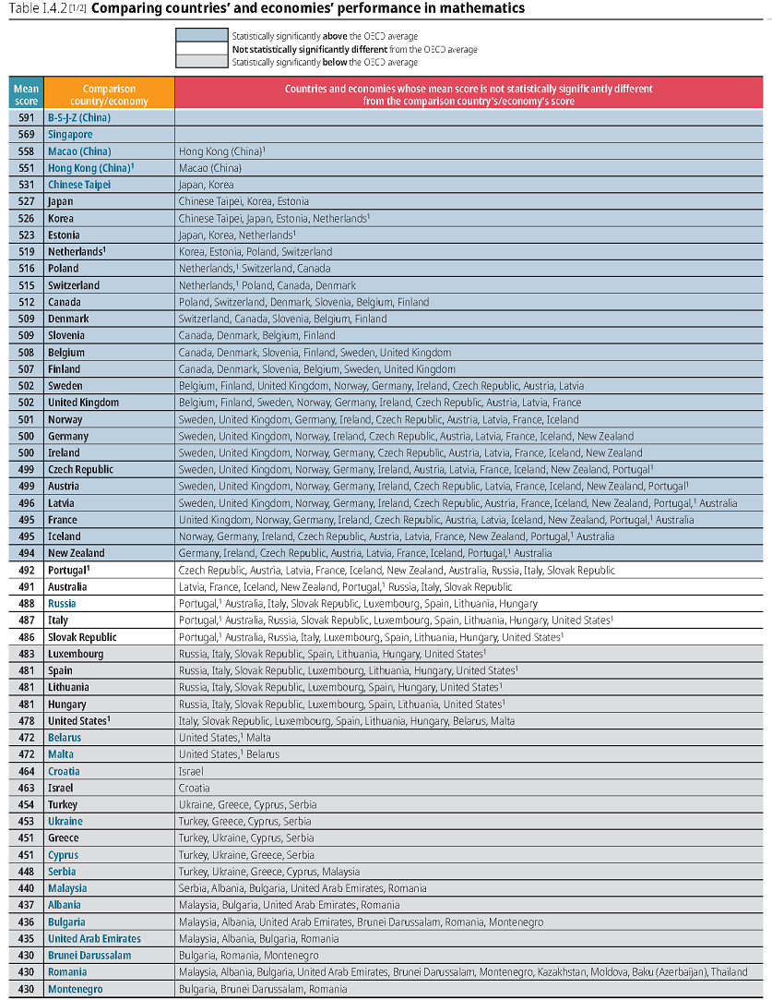

```{R, setup, include = F}
library(pacman)
p_load(here, tidyverse, xaringan, knitr, kableExtra, haven, broom, xaringanthemer, reshape2, car, modelsummary)

i_am("slides/EDUC643_10_categorical.rmd")


red_pink <- "#e64173"
turquoise = "#20B2AA"
orange = "#FFA500"
red = "#fb6107"
blue = "#3b3b9a"
green = "#8bb174"
grey_light = "#B3B3B3"
grey_mid = "#7F7F7F"
grey_dark = "grey20"
purple = "#6A5ACD"
slate = "#314f4f"

extra_css <- list(
  ".red"   = list(color = "red"),
  ".blue"  =list(color = "blue"),
  ".red-pink" = list(color= "#e64173"),
  ".gray" = list(color= "#B3B3B3"),
  ".purple" = list(color = "purple"),
  ".orange" = list(color = "#FFA500"),
  ".small" = list("font-size" = "90%"),
  ".large" = list("font-size" = "120%"),
  ".tiny" = list("font-size" = "75%"),
  ".tiny2" = list("font-size" = "50%"))


write_extra_css(css = extra_css, outfile = "my_custom.css")

options(htmltools.dir.version = FALSE)

hook_output <- knit_hooks$get("output")
knit_hooks$set(output = function(x, options) {
  lines <- options$output.lines
  if (is.null(lines)) {
    return(hook_output(x, options))  # pass to default hook
  }
  x <- unlist(strsplit(x, "\n"))
  more <- "..."
  if (length(lines)==1) {        # first n lines
    if (length(x) > lines) {
      # truncate the output, but add ....
      x <- c(head(x, lines), more)
    }
  } else {
    x <- c(more, x[lines], more)
  }
  # paste these lines together
  x <- paste(c(x, ""), collapse = "\n")
  hook_output(x, options)
})

knitr::opts_chunk$set(warning = FALSE,
                      message = FALSE,
                      echo = FALSE,
                      fig.align = "center",
                      fig.height = 6.5,
                      fig.width = 10)


```

# Roadmap
```{r, echo=F, out.width="90%"}
include_graphics("Roadmap4.jpg")

dibels <- read.csv(here("data/dibels.csv"))
dibels_long <- read.csv(here("data/dibels_long.csv"))

```
---
# Unit goals

- Describe the relationship between dichotomous and polychotomous variables and convert variables between these forms, as necessary
- Conduct a two-sample $t$-test
- Describe the relationship between a two-sample $t$-test and regressing a continuous outcome on a dichotomous predictor
- Estimate a regression with one dummy variable as a predictor and interpret the results (including when the reference category changes)
- Estimate a multiple regression model with several continuous and dummy variables and interpret the results
- Estimate an ANOVA model and interpret the within- and between-group variance
 + Do the same for an ANCOVA model, adjusting for additional continuous predictors
- Describe the similarities and differences of Ordinary-Least Squares regression analysis and ANOVA/ANCOVA, and when one would prefer one approach to another
- Describe potential Type I error problems that arise from multiple group comparisons and potential solutions to these problems, including theory, pre-registration, ANOVA and *post-hoc* corrections
- Describe the relationship between different modeling approaches with the General Linear Model family

---
class: middle, inverse

# Categorical variables

---
# Categorical variables
So far, we have only looked at General Linear Models (and their associated OLS regression estimating equations) involving continuous predictors. But what about .red-pink[**categorical predictors**]?

--

What are categorical predictors?
- Categorical predictors are ***predictors whose values denote categories***.

--
Of course, this begs the question...

---
# Categorical predictors

### Important distinctions and conventions:

.small[
.pull-left[
**Nominal predictors**
- These have *unordered* values
- E.g., gender, religion, political party
]

.pull-left[
**Ordinal predictors**
- These have *ordered* values
- E.g., grade, developmental stage, education level (?)
]
]

--

Another important distinction: .red-pink[**dichotomies**] (only 2 categories) vs. .red-pink[**polychotomies**] (>2 categories)

---
# Our (new!) motivating question
.small[A team of researchers based at the .green[**University of Oregon**] aimed to understand the effects of the COVID-19 pandemic on students' early literacy skills.<sup>1</sup>]
```{r}
include_graphics("dibels_team.png")
```

.small[Ann Swindells Professor in Special Education [Gina Biancarosa](https://education.uoregon.edu/directory/faculty/all/ginab), former UO doctoral students David Fainstein, Chris Ives, and Dave Furjanic, along with CTL Research Manager Patrick Kennedy, used data from assessments of 471,456 students on the Dynamic Indicators of Basic Early Literacy Skills (DIBELS) to analyze the extent to which students' Oral Reading Fluency (ORF) scores differed across four waves of DIBELS assessment prior-to and during the pandemic.]

.small[Their study is forthcoming at the *Elementary School Journal*.]

.footnote[[1] For various reasons, the pandemic is a ["lousy natural experiment"](https://www.educationnext.org/covid-19-pandemic-lousy-natural-experiment-for-studying-the-effects-online-learning/) for examining the effects of a particular policy response (e.g, virtual schooling). However, it is quite possible to seek to understand its global effects via just the type of analysis Furjanic et al. conducted.]

---
# Our data
```{r, echo=T}
str(dibels)
```

---
# Mean comparison
```{r, echo=T}
mean(dibels$pre)
mean(dibels$post)
```

--

Means are 4.5 words per-minute apart.

---
## Understanding the distributions

.pull-left[
**Pre-pandemic**
```{r}
boxplot(dibels$pre,
        ylim =c(0,170))
```
]

.pull-right[
**Post-pandemic onset**
```{r}
boxplot(dibels$post,
        ylim =c(0,170))
```
]

--

But, as you may by now have anticipated, we are interested in knowing how likely we are to have gotten such a difference by idiosyncrasy of sampling from a population of school-grades in which there was no difference.

--
Fortunately, we have just such a tool in our toolbox already. .blue[**What will the (asymptotic) distribution of means of repeatedly drawn samples from a given population be?**]

---
# Two-sample $t$-test
```{r, echo=T}
t.test(dibels$pre, dibels$post)  
# I'm allowing in this t-test for the possibility that my sample in 
# each group is of different sizes and has different variance. 
# These assumptions affect the precision of my estimates. In some 
# settings, particularly experimental ones, I can impose stricter 
# assumptions and get more precise estimates.
```

---
# Our old friend
We can now answer a lingering question from last term, and avoid having to make some torturous assumptions about what the "true" population mean is:
```{r}
who <- rio::import(here("data", "life_expectancy.csv")) %>% 
  janitor::clean_names() %>% 
  filter(year == 2015) %>%
  select(country, status, year, life_expectancy) %>% 
  rename(region = country) %>% 
  mutate(life_expectancy = round(life_expectancy, digits = 0))
```

```{r, echo=T}
t.test(who$life_expectancy[who$status=="Developing"], 
       who$life_expectancy[who$status=="Developed"])
# The square braces [] allow me to subset my data
# by the boolean operations within them
```

---
# Waves of data
```{r}
library(DT)
datatable(dibels[,c(1:4, 13:14)], fillContainer = FALSE, 
              options = list(pageLength = 9)) %>%
              formatRound("y1_boy_mean", digits=1) %>%
              formatRound("y1_moy_mean", digits=1) %>%
              formatRound("pre", digits=1) %>%
              formatRound("post", digits=1)
```

---
# Waves of data
```{r}
library(DT)
datatable(dibels[,c(1:4, 13:14)], fillContainer = FALSE, 
              options = list(pageLength = 6)) %>%
              formatRound("y1_boy_mean", digits=1) %>%
              formatRound("y1_moy_mean", digits=1) %>%
              formatRound("pre", digits=1) %>%
              formatRound("post", digits=1)
```

I actually have the same outcome stored across multiple variables.

--
.blue[**What is it?**]

--
This is a classic example of a phenomenon you will come to know and hate: the curse of .red-pink[**wide**] and .red-pink[**long**] data structures.

---
# Wide and long data
Various types of analyses will necessitate different data structures:

.pull-left[
**Long to wide**
```{r}
include_graphics("pivot_wider.png")
```
]

.pull-right[
**Wide to long**
```{r}
include_graphics("pivot_longer.png")
```
]

--

Understanding exactly how to do this will take repeated time and practice, and you will nearly always need to look up and remind yourself how to do it. Bookmark and get familiar with this vignette: [https://tidyr.tidyverse.org/articles/pivot.html](https://tidyr.tidyverse.org/articles/pivot.html)!

--

I'm going to show you the code to reshape your data (here from wide to long), but you don't need to be able to do this for assignments in this class. You should aim to understand substantively what is going on.

---
# Pivot wider
```{r, echo=T}
dibels_long <- dibels %>% 
                  pivot_longer(
                    cols = c("y1_boy_mean", "y1_moy_mean", 
                             "y2_boy_mean", "y2_moy_mean"),
                    names_to = "period",
                    names_pattern = "(.*)_mean",
                    values_to = "mean_orf")
dibels_long$period <- factor(dibels_long$period)
```

---
# Long DIBELS
```{r}
datatable(dibels_long[,c("sch_deid", "grade", "period", "mean_orf", "pre", "post")], fillContainer = FALSE, 
              options = list(pageLength = 9)) %>%
              formatRound("mean_orf", digits=1) %>%
              formatRound("pre", digits=1) %>%
              formatRound("post", digits=1)
```

---
# Dummy coding

The mean values for pre-pandemic and post-pandemic onset are no longer helpful:
```{r, echo=T}
dibels_long <- select(dibels_long, -c(pre, post))
```

--

But it will be helpful for us to be able to designate which observations refer to a time period before the pandemic, and which refer to a time period post-onset:
```{r, echo=T}
dibels_long <- mutate(dibels_long,
               post = ifelse(period=="y1_boy" | 
                             period=="y1_moy", 0, 1))
```

---
# Dummy variables

Dummy (or indicator variables) distinguish between categories, but offer no meaningful quantitative information ***on their own***.

By convention, the variable name corresponds to the category given by the value==1, e.g.:
$$post=1 \text{ if after pandemic onset}$$

$$post=0 \text{ if pre-pandemic}$$
The category given the value 0 is called the .red-pink[**reference category**]. 

Good data management practice: call the categorical variable the value implied by its substantive meaning when equal to 1 (i.e., "*post*" rather than "*pandemic*"; "*treat*" rather than "*condition*") so that you are clear on what 0 and 1 represent.

---
# Polychotomies
In fact, dummy coding will prove essential for categorical variables with more than two categories as well, especially those that are nominal (i.e., unordered):

```{r, echo=T}
table(dibels_long$school_titlei)
```

---
# Polychotomies
Here we have seven different levels of a school's Title I status. We can probably simplify these, but we need to be able to represent them using numerical values, when these levels don't inherently have a numerical structure.

--
So... we use **dummy coding**.

--
First, let's simplify the categories:

```{r, echo=T}
dibels_long <- dibels_long %>%
      mutate(title1 = case_when(school_titlei=="Missing" ~ "Missing",
                                school_titlei=="Not a Title I school" ~ "Not Title I",
                                school_titlei=="Title I schoolwide eligible-Title I targeted assistance program" |
                                school_titlei=="Title I schoolwide eligible school-No program" |
                                school_titlei=="Title I schoolwide school" ~ "Title I schoolwide",
                                school_titlei=="Title I targeted assistance eligible school-No program" |
                                school_titlei=="Title I targeted assistance school" ~ "Title I targeted"))
table(dibels_long$title1, exclude=NULL)
```
---
# Dummy coding

The most common process for representing categorical variables in regression is dummy coding. 

* Dummy coding essentially creates a new (dummy-coded) variable for each level.

|School Status      |D1   |D2   |D3 
|-------------------------------------
|Not Title I        |0    |0    |0    
|Title I schoolwide |1    |0    |0    
|Title I targeted   |0    |1    |0    
|Missing            |0    |0    |1    


* One group becomes the reference group (in this case "Not Title I").

* The dummy-coded variables are then coded "1" for their corresponding level, and 0 for all other levels.

---
# Dummy coding

In a sample dataset, we could conceive of the dummy coding scheme like this:

|School    |Title I status     |D1 (Schoolwide) |D2 (Targeted) |...
|------------------------------------------------------------------
|10001     |Not Title I        |0               |0             |...
|10002     |Title I schoolwide |1               |0             |...
|10003     |Title I targeted   |0               |1             |...
|10004     |Missing            |0               |0             |...
|10005     |Title I schoolwide |1               |0             |


Since "Not Title I" is our reference, we don't create a new column for it (it's implied by 0s in all other groups).

Hence, for $K$ categories in our original variable, we have $K-1$ dummy-coded variables. 

---
# Dummies in R
From our polychotomous categorical variable, we can hand-create dummies:
```{r, echo=T}
dibels_long <- dibels_long %>%
  mutate(title1_school = ifelse(title1=="Title I schoolwide", 1, 0)) %>%
  mutate(title1_target = ifelse(title1=="Title I targeted", 1, 0)) %>%
  mutate(title1_miss = ifelse(title1=="Missing", 1, 0))
```

But, R is actually really smart, so the most straightforward way is to turn our original variable into a factor and then let R automatically convert it into a series of dummies when we need them:
```{r, echo=T}
dibels_long$title1 <- factor(dibels_long$title1)
```

---
class: middle, inverse

# Categorical predictors in regression

---
## Categorical predictors in regression

In our standard multiple regression model, we have noted that we've made several important assumptions about our outcome $(Y_i)$ and residuals $(\varepsilon_i)$:
$$\color{red}{Y_i} = \beta_0 + \beta_1 X_{1i} + \beta_2 X_{2i} + ... + \beta_k X_{ki} + \color{red}{\varepsilon_i}$$

--
but, we haven't made any particular assumptions about the form of the $X$s. In fact, regression models can easily accommodate categorical variables (both dichotomous and polychotomous)!

---
# Pre/post in regression
We can now estimate whether there was a difference in ORF scores pre- and post-pandemic onset in regression:
```{r, echo=T}
fit1 <- lm(mean_orf ~ post, data=dibels_long)
summary(fit1)
```

---
# Pre/post in regression
```{r, echo=F, highlight.output=c(12)}
summary(fit1)
```
Our point estimate is identical to our [original two-sample $t$-test](https://daviddliebowitz.github.io/EDUC643_23W/slides/EDUC643_9_categorical.html#17), though our inference has changed slightly.


---
## Regression w. categorical predictors
```{r, fig.height=6}
set.seed(1234)
plot1 <- ggplot(dibels_long, aes(y=mean_orf, x=post, color=post)) +
            geom_jitter() +
            theme_minimal(base_size=16) +
            theme(legend.position = "none")
plot1
```
---
## Regression w. categorical predictors
```{r, fig.height=6}
set.seed(1234)
plot1 + geom_smooth(method='lm') +
        ggpubr::stat_regline_equation(data=dibels_long, aes(x=post, y=mean_orf), label.x=.75, label.y=85, size=10) 
```

--
.small[***y*-intercept**: estimated value of *Y* when dichotomous predictor=0]

.small[**slope**: estimated difference in *Y* between categories of predictor]

---
# Reference category
What happens if we change the reference category?
```{r, echo=T}
# Create a new dummy variable called "pre", coded
# as one if test is prior to pandemic onset
dibels_long <- mutate(dibels_long,
               pre = ifelse(period=="y1_boy" | 
                             period=="y1_moy", 1, 0))

# Fit the model
fit2 <- lm(mean_orf ~ pre, data=dibels_long)
```

---
# Reference category
What happens if we change the reference category?
```{r, output.lines = -(1:8), highlight.output=c(4:5, 9:11)}
summary(fit2)
```

- Sign of slope is reversed
- Y-intercept is value of new reference category
- SE and inference remain exact same
- Full model statistics are the same


---
# What about the waves?
Up until now, we've focused on a simple comparison of pre- and post-pandemic onset scores. But this glosses over the facts that:
.small[
- Students typically improve substantially over the course of the year (we're lumping these time points together)
- We aren't able to capture the dynamic ways in which performance may have evolved over the early parts of the pandemic
]

--

We can use our multiple wave collection (now captured in our categorical polychotomous variable ***period***) to address this.
```{r, echo=T}
table(dibels_long$period, exclude=NULL)
```

---
# Categorical predictors

.small[
.pull-left[
**Nominal predictors**
- These have *unordered* values
- E.g., gender, religion, political party, state of residence
- .red[**NEVER** include a nominal predictor directly in a regression model]
  + You end up with the problem of "country-ness" as a predictor
]

.pull-left[
**Ordinal predictors**
- These have *ordered* values
- E.g., grade, developmental stage, education level (?)
- .orange[**CAN** include an ordinal predictor directly in regression, but make sure this is what you want!]
  + Should you convert a political view scale (1=progressive, 2=liberal, 3=moderate, 4=conservative, 5=right-wing) to a series of dummies?
  + What about education (1=HS dropout, 2=HS grad, 3=some college, 4=college grad)?
]
]

---
# Polychotomies in regression
In a regression model, categorical predictors are typically entered in their dummy-coded format:

$$Y = \beta_0 + \beta_1 D_2 + \beta_2 D_3 + \beta_3 D_3+...+ \varepsilon$$
--

In our four-wave ORF regression, we can think of the equation like this:<sup>1</sup>

$$MEAN\_ORF_j = \beta_0 + \beta_1 Y1\_MOY_j + \beta_2 Y2\_BOY_j + \beta_3 Y2\_MOY_j + \varepsilon_j$$
.footnote[[1] Following convention, I'm subscripting this equation with "*j*" because our data does not represent individual observations (which we typically subscript with "*i*"), but mean values, aggregate at the school-grade level.]

--
.blue[**where did *Y1_BOY* (year 1, beginning of year) go?**]

--

.blue[**How should we interpret each of the coefficients?**]

--

.blue[**How should we interpret the intercept?**]


---
# Why does this work?
```{r}
ggplot(dibels_long, aes(x=period, y=mean_orf, color=period, fill=period, alpha=0.4)) +
   geom_boxplot() +
   xlab("Period") + ylab("Mean ORF score") +
   theme_minimal(base_size=16) +
   theme(legend.position = "none")
```
---
# Interpreting coefficients

```{r, output.lines = (9:18), highlight.output = 4, comment = NA}
fit3 <- lm(mean_orf ~ period, dibels_long)
summary(fit3)
```
.tiny[**On average, when measured in Fall 2019, grades in schools had a mean ORF score of 62.3**]

---
# Interpreting coefficients
```{r, output.lines = (9:18), highlight.output = 5, comment = NA}
summary(fit3)
```
.tiny[On average, when measured in Fall 2019, grades in schools had a mean ORF score of 62.3]

.tiny[**On average, when measured in Winter 2020, grades in schools had a mean ORF score of 87.9 (62.3 + 25.6)**]

---
# Interpreting coefficients
```{r, echo = F, output.lines = (9:18), highlight.output = 6, comment = NA}
summary(fit3)
```
.tiny[On average, when measured in Fall 2019, grades in schools had a mean ORF score of 62.3]

.tiny[On average, when measured in Winter 2020, grades in schools had a mean ORF score of 87.9 (62.3 + 25.6)]

.tiny[**On average, when measured in Fall 2020, grades in schools had a mean ORF score of 59.6 (62.3 + (-2.8))**]

---
# Interpreting coefficients
```{r, echo = F, output.lines = (9:18), highlight.output = 7, comment = NA}
summary(fit3)
```
.tiny[On average, when measured in Fall 2019, grades in schools had a mean ORF score of 62.3]

.tiny[On average, when measured in Winter 2020, grades in schools had a mean ORF score of 87.9 (62.3 + 25.6)]

.tiny[On average, when measured in Fall 2020, grades in schools had a mean ORF score of 59.6 (62.3 + (-2.8))]

.tiny[**On average, when measured in Winter 2021, grades in schools had a mean ORF score of 81.79 (62.3 + 19.5)**]

---
## Interpreting coefficient significance
Coefficient significance tests still test the null hypothesis $\beta_k = 0$, but **we are testing against the reference group** implicit in our intercept.

```{r, echo = F, output.lines = -c(1:8, 18:24), comment = NA}
summary(fit3)
```

.blue[**Which DIBELS test wave differs significantly from our reference group: "Y1_BOY"?**]

--

So, this is just a comparison of means, or a series of independent-sample $t$-tests!

---
# Changing reference category
.small[If we change the model's reference category with a polychotomous variable, we ***will*** change the parameter estimates and associated tests. Each refers to the estimated mean difference for that group and the reference category. There can be significant variation from one group (e.g., time period) to another, but not all groups are different from each other.]
```{r, echo=T, output.lines = -c(1:8)}
# I can specify directly in my call which group to serve as reference
summary(lm(mean_orf ~ relevel(period, ref="y2_boy"), data=dibels_long))
```

---
## Prediction with categorical variables
Using the coefficients from our output, we have the following fitted regression equation:

$$\hat{MEAN\_ORF}_{j} = 62.3 + 25.6 (Y1\_MOY_{j}) + (-2.8)(Y2\_BOY)_{j}) + 19.6(Y2\_MOY_{j})$$
.blue[**What is the predicted ORF for school grades in the middle of the 2020-21 school year?**]

--
$$\hat{MEAN\_ORF}_{j} = 62.3 + 25.6 (0) + (-2.8)(0) + 19.6(1)=62.3+19.6=81.9$$
For dummy coded variables, we just add the appropriate effects for the group we are interested in, or omit them if they are in our reference group.


---
# So many tests

|Reference group | Y1_BOY | Y1_MOY | Y2_BOY | Y2_MOY
|-------------------------------------------------------
|**Y1_BOY**      |        | 1      | 2      | 3
|**Y1_MOY**      | 4      |        | 5      | 6
|**Y2_BOY**      | 7      | 8      |        | 9
|**Y2_MOY**      | 10     | 11     | 12     |

.red[**DANGER**]: we're back in the land of multiple hypothesis testing, and we may be inadvertently committing .red-pink[**Type I error**]!

---
## Dangers of multiple hypothesis tests

If your goal is to find a "statistically significant" result, you will detect such a relationship 1 out of 20 times (on average).

Imagine rolling a die. .blue[What is the probability you roll a 1?]

--
$1/6 = 0.167$

--

Now, roll it twice, .blue[what is the probability **at least** one of your rolls is a 1?]

--
$1 - (5/6 * 5/6) = 0.306$

--

If you conduct enough tests, you'll detect a relationship eventually.

---
# Multiple tests in the wild

.pull-left[
- How many tests?
$$\frac{(n \text{ categories})(n \text{ categories} - 1)}{2}$$
- ~ 80 counties, so 3160 tests
]

.pull-right[
```{r}

```
]
---
# One fix

Instead of using $\alpha=0.05$ for each individual test, use $\alpha=0.05$ for the **family of tests** when we examine multiple contrasts to test a single hypothesis. 

.pull-left[
### Bonferroni method
Take a given $\alpha$-threshold and "split it" across the entire family of tests. Assuming $\alpha = 0.05$:

.small[
- For 2 tests, conduct each at 0.025 level;
- For 3 tests, conduct each at 0.0167 level; etc. ...
]

.small[Use this new threshold to identify the critical *t*-statistic given the number of degrees of freedom. For the PISA example this would be *p*=0.05/3160=0.000016]

.red-pink[*Other approaches exist! Bonferroni is an extremely conservative one--beware!*]
]

.pull-right[
As tests increase, so do critical $t$-values:

| # tests | # new $\alpha$ | $t$-statistic (df = $\infty$)
|-------------------------------------------------------------
| 1 | 0.0500 | 1.96
| 2 | 0.0250 | 2.24
| 3 | 0.0167 | 2.39
| 4 | 0.0125 | 2.50
| 5 | 0.0100 | 2.58
| 6 | 0.0083 | 2.64
| 10| 0.0050 | 2.81
| 20| 0.0025 | 3.02
| 50| 0.0010 | 3.29
|100| 0.0005 | 3.48

]
---
# Bonferroni correction in R
```{r, echo=T}
pairwise.t.test(dibels_long$mean_orf, dibels_long$period,
                p.adjust.method = "bonferroni")
```

--

We can see that our inference has become slightly weaker for our *Y1_BOY* vs. *Y2_BOY* comparison, though still smaller than most traditional thresholds. Note that the others have become weaker too, but they were so small to begin with that we don't see this change.

--
But perhaps, there are more general ways to address this same challenge!

---
class: middle, inverse

# ANOVA

---
# ANOVA

* .red-pink[**Analysis of variance (ANOVA)**] is a special case of the general linear model

* The primary goal of ANOVA is a comparison of means across different groups
  + $H_0: \mu_1 = \mu_2 = \mu_3... \mu_K$
  
* Although regression frameworks are more the norm across most disciplines, the ANOVA approach can be especially useful for:
  + Exploring and comparing the within- and between-group variation in the outcome
  + Simultaneously testing the main effects of categorical variables *(and avoiding some of the problems of multiple hypothesis testing)*

---
# Within and between
```{r, fig.height=5.75}
violin <-    ggplot(dibels_long, aes(x=period, y=mean_orf, fill=period, color=period, alpha=0.4)) +
                geom_violin() +
                stat_summary(fun = "mean",
                             geom = "crossbar", 
                             width = 0.5,
                             colour = "red") +
                theme_minimal(base_size=16) +
                theme(legend.position = "none")
violin
```

.footnote[Check out the podcast [Within & Between](http://www.withinandbetweenpod.com/) on quant methods and unpacking the hidden curriculum of academia hosted by Jessica Logan and Sara Hart (takes a developmental science perspective).]

--
.blue[**Can you describe the variability within- and between-test periods?**]


---
# Within and between
```{r, fig.height=5.75}
violin
```

.small[
Questions we might want to answer about group differences:
1. Are observed differences between groups "real"?
2. In what context can we place these differences to evaluate their magnitude?
]

---
# Within and between
.small[Let's imagine a slightly simpler example. Imagine three different data sets with a four-level categorical predictor and across each data set, the mean value of each category was the same.]
```{r, fig.height=5}
set.seed(1234)
# Make the little variability plot
p1 <- rnorm(50, mean=125, sd=7)
p2 <- rnorm(50, mean=110, sd=7)
p3 <- rnorm(50, mean=95, sd=7)
p4 <- rnorm(50, mean=80, sd=7)

df <- cbind(as.data.frame(c(p1, p2, p3, p4)))
df <- rename(df, mean_orf = "c(p1, p2, p3, p4)")
df <- rownames_to_column(df, "id")
df <- mutate(df, period = case_when(id %in% c(1:50) ~ "p1",
                                    id %in% c(51:100) ~ "p2",
                                    id %in% c(101:150) ~ "p3",
                                    id %in% c(151:200) ~ "p4"))

little <- ggplot(df, aes(x=period, y=mean_orf, color=period)) +
              geom_jitter(width=0.05, height=0) +
              labs("Little variability") +
              ylim(0, 225) +
              stat_summary(fun = "mean",
                                 geom = "crossbar", 
                                 width = 0.5,
                                 colour = "red") +
              theme_minimal(base_size=16) +
              theme(legend.position = "none")

# Make the mid variability plot
p1 <- rnorm(50, mean=125, sd=20)
p2 <- rnorm(50, mean=110, sd=20)
p3 <- rnorm(50, mean=95, sd=20)
p4 <- rnorm(50, mean=80, sd=20)

df2 <- cbind(as.data.frame(c(p1, p2, p3, p4)))
df2 <- rename(df2, mean_orf = "c(p1, p2, p3, p4)")
df2 <- rownames_to_column(df2, "id")
df2 <- mutate(df2, period = case_when(id %in% c(1:50) ~ "p1",
                                    id %in% c(51:100) ~ "p2",
                                    id %in% c(101:150) ~ "p3",
                                    id %in% c(151:200) ~ "p4"))

mid <- ggplot(df2, aes(x=period, y=mean_orf, color=period)) +
              geom_jitter(width=0.05, height=0) +
              labs("Moderate variability") +
              ylim(0, 225) +
              stat_summary(fun = "mean",
                                 geom = "crossbar", 
                                 width = 0.5,
                                 colour = "red") +
              theme_minimal(base_size=16) +
              theme(legend.position = "none")

# Make the wide variability plot
p1 <- rnorm(50, mean=125, sd=40)
p2 <- rnorm(50, mean=110, sd=40)
p3 <- rnorm(50, mean=95, sd=40)
p4 <- rnorm(50, mean=80, sd=40)

df3 <- cbind(as.data.frame(c(p1, p2, p3, p4)))
df3 <- rename(df3, mean_orf = "c(p1, p2, p3, p4)")
df3 <- rownames_to_column(df3, "id")
df3 <- mutate(df3, period = case_when(id %in% c(1:50) ~ "p1",
                                    id %in% c(51:100) ~ "p2",
                                    id %in% c(101:150) ~ "p3",
                                    id %in% c(151:200) ~ "p4"))

large <- ggplot(df3, aes(x=period, y=mean_orf, color=period)) +
              geom_jitter(width=0.05, height=0) +
              labs("Large variability") +
              ylim(0, 225) +
              stat_summary(fun = "mean",
                                 geom = "crossbar", 
                                 width = 0.5,
                                 colour = "red") +
              theme_minimal(base_size=16) +
              theme(legend.position = "none")

gridExtra::grid.arrange(little, mid, large, nrow = 1)
```


--
.blue[**How important are the differences in these group means across each dataset?**]

--
**Within-group variation provides important context for evaluationg magnitude of between-group variation!**

---
# Partitioning variance

In regression, we partition our total variance $SS_\text{total}$ into our $SS_\text{model}$ and $SS_\text{residual}$ :

$SS_\text{model}$ = Deviation of observed value from the predicted value $(Y_{i}-\hat{Y}_i)$

$SS_\text{residual}$ = Deviation of predicted value from the grand mean $(\hat{Y} - \bar{Y}_i)$

--

In ANOVA, we apply a similar but slightly different conceptual process.

---
# Partioning variance in ANOVA

In ANOVA, we separate variance into between-group and within-group variance:

$SS_\text{within}$ = Deviation of observed value from its group mean $(Y_{ik}-\bar{Y}_k)$

$SS_\text{between}$ = Deviation of group mean from the grand mean $(\bar{Y}_k - \bar{Y})$

--

$$SS_\text{total} = SS_\text{within} + SS_\text{between}$$


---
# Visualized variance partition
```{r}
set.seed(1234)
m <- lm(mean_orf ~ period, dibels_long)
dibels_long <- dibels_long %>% 
   group_by(period) %>% 
   mutate(group_mean = mean(mean_orf)) %>% 
   ungroup()
 
dib_samp <- dibels_long %>% 
   group_by(period) %>% 
   sample_n(20)
 
dib_samp$predict <- predict(m, dib_samp)
 
dib_samp$jitter_orf <-
   ave(as.numeric(dib_samp$period), 
       dib_samp$period, 
       FUN = function(x) x + rnorm(length(x), sd = .2))
 
dib_samp <- dib_samp %>% 
   mutate(jitmin = min(jitter_orf),
          jitmax = max(jitter_orf))
```


.pull-left[
```{r, fig.height=3, fig.width=5, echo = F}
set.seed(1234)
with_plot <- dib_samp %>% 
ggplot(aes(x = jitter_orf, xend = jitter_orf,
                  y = mean_orf, yend = predict)) +
     geom_segment(color = "green") +
     geom_point() +
     scale_x_continuous("Period", 
                        breaks = c(1,2,3,4),
                        labels = levels(dibels_long$period)) +
   geom_segment(aes(x = jitmin, xend = jitmax, y = predict, yend = predict),
                color = "darkgreen") +
   theme_minimal() +
   ggtitle("Within-Groups Variance")
 
with_plot
```

.small[We can represent the residual variance around the group means (here on just a random selection of 20 observations from each period). Just like the error term in our regression model, it is all the remaining variance our predictor (***period***) can't explain.]
]

.pull-right[
```{r, fig.height=3, fig.width=5, echo = F}
set.seed(1234)
btw_plot <- ggplot(dib_samp, aes(x = period, y = group_mean)) +
   geom_point(aes(x = as.numeric(period),
                    y = group_mean), color = "darkgreen") +
     geom_segment(aes(x = as.numeric(period),
                    xend = as.numeric(period),
                    y = group_mean,
                    yend = mean(dibels_long$mean_orf)),
                  linetype = 2) +
   geom_hline(yintercept = mean(dibels_long$mean_orf), color = "black", linetype = 2) +
       scale_x_continuous("Period", 
                        breaks = c(1, 2, 3, 4),
                        labels = levels(dibels_long$period)) +
   theme_minimal() +
   ggtitle("Between-Groups Variance")
 
btw_plot
```

.small[In addition to each individual observation's deviation from its group mean, each group's mean also deviates from the grand mean of Oral Reading Fluency.]
]


---
# ANOVA test statistic
When we conduct an ANOVA we are testing the significance of an $F$-statistic using the following formula:

$$\large F = \frac{MS_\text{between}}{MS_\text{within}}$$

The mean squares (MS) of between- and within-group variance is just the Sum of the Squares $(SS)$ for each group, divided by its degrees of freedom $(df)$:

.pull-left[
$$\large MS_w = \frac{SS_w}{df_w}$$
$$\large df_w = N-G$$

]
.pull-right[
$$\large MS_b = \frac{SS_b}{df_b}$$
$$\large df_b = G-1$$
]

where $w$ subscripts within, $b$ subscripts between, $N$ is the number of observations and $G$ the number of groups.

---
## ANOVA significance test

The null hypothesis of an ANOVA is about the ratio of between- to within-group variance.

Essentially, when we state $H_0: \mu_1 = \mu_2 = \mu_3... \mu_K$, we are asking if the mean square variance of the group means around the grand mean is greater than the mean square variance of observations around their group mean.

--
If the between-group variance were much larger than the within-group variance, then the $F$-statistic would exceed 1.

$$\large F = \frac{MS_\text{between}}{MS_\text{within}} = \frac{4.3}{1.5} = 2.87$$

If the between-group variance is equal to or smaller than the within-group variance, then our $F$-statistic will be $\le$ 1.

$$\large F = \frac{MS_\text{between}}{MS_\text{within}} = \frac{0.2}{1.5} = 0.13$$

---
# Calculating the $F$-statistic
Let's find our $F$-statistic for our ***period*** variable. 

#### Within-Group (Residual) Variance $MS_\text{Within}$
```{r, echo=T}
# total n - number of groups (4)
nrow(dibels_long)
df_within <- 21584 - 4

sum((dibels_long$mean_orf - dibels_long$group_mean)^2) / df_within
```


---
# Calculating the $F$-statistic
Let's find our $F$-statistic for our ***period*** variable. 

#### Between-Group Variance $MS_\text{Between}$
```{r, echo=T}
# number of groups (4) - 1
df_btw <- 4-1

sum((mean(dibels_long$mean_orf) - dibels_long$group_mean)^2) / df_btw
```

---
# Calculating the $F$-statistic

$$MS_\text{Between} = 1,068,298$$
$$MS_\text{Within} = 1,306$$

$$F = \frac{MS_\text{Between}}{MS_\text{Within}} = \frac{1,068,298}{1306} = 817.99$$ 
Our $F$-statistic is 818. Now that we see how it is calculated, let's fit an ANOVA in R to review the output and make an inference (note that we could now also consult an $F$-statistic lookup table to get the same info!).

---
# ANOVA in R
Because ANOVA is just a particular method of analyzing variance in GLMs, we can wrap the `anova` command around our `lm` model fit.

```{r, echo=T, highlight.output = c(5:6)}
fit3 <- lm(mean_orf ~ period, dibels_long)

anova(fit3)
```

.small[We can see all the information we calculated earlier. With a *p*-value] $<2.2 \times 10^{-16}$, .small[our *F*-statistic highly unlikely to be a product of a population in which the population means across the four waves of ORF administration were equal. Therefore we reject the null hypothesis and conclude that, on average in the population, the mean ORF scores differed significantly across the waves of assessment administration.]

 
---
# Variance decomposition

.large[
- In addition to using ANOVA to "batch test" group differences, as we've seen it can be a useful tool to decompose the variance of your outcome into between and within group variation
- We can, in fact, extend this analysis to understand how much of the variation in an individual's outcome occurs across **different** groups. For example:
    + What proportion of the variation in child outcomes occurs within classrooms, compared to schools, compared to neighborhoods?
    + Are differences in school funding greater between schools, between districts or between states?
- You can explore more about these topics in our HLM sequence (EDLD 628/629)
]


---
# ANOVA vs. regression

- Both are implementations of the General Linear Model
- A regression with dummy indicator variables is statistically identical to ANOVA
- The $F$-test in a regression model represents a test of the model's variance against the residual
- In ANOVA, we can have one or more $F$-tests where we "batch test" a group of coefficients
  + This can help avoid Type I errors (rejecting the null when it is in fact true)
  + ANOVA doesn't tell you anything about the magnitude of the difference...which seems important?
- Learning regression is the more general approach, of which ANOVA is a special implementation; by learning regression you have a more flexible tool kit
 

---
# Presenting our results
```{r, echo=T, results=F}
modelsummary(list(fit1, fit3),
            stars=T,
            vcov = "robust",
            gof_omit = "Adj.|AIC|BIC|Log|RMSE|RSE|Std.Err",
            coef_rename = c("post" = "Post-Pandemic Onset", 
                            "periody1_moy" = "Winter 2020",
                            "periody2_boy" = "Fall 2020",
                            "periody2_moy" = "Winter 2021"))
```

---
**Table 1.** Estimates of grade-level average Oral Reading Fluency (ORF) score across waves of DIBELS administration, 2019-2021
```{r, echo=F}
modelsummary(list(fit1, fit3),
            stars=T,
            vcov = "robust",
            gof_omit = "Adj.|AIC|BIC|Log|RMSE|RSE|Std.Err",
            coef_rename = c("post" = "Post-Pandemic Onset", 
                            "periody1_moy" = "Winter 2020",
                            "periody2_boy" = "Fall 2020",
                            "periody2_moy" = "Winter 2021"),
            notes=c("Cells report coefficients and heteroscedastic-robust standard errors in parentheses. Each observation is a school-grade-test       value."))

```

---
class: middle, inverse

# Multiple regression with categorical variables

---
# Mawwrr predictors

Now that we've learned the basic concept of multiple regression, it's a fairly simple task to add additional covariates (either continuous or categorical) to our equation.

.blue[**What theoretically justified covariates might be sensible to include? How would we make such a determination?**]

--

Preliminarily, let's look at three: *GRADE* and *SCHOOL_ENROLL*:

$$
\begin{aligned}
MEAN\_ORF_j = & \beta_0 + \beta_1 Y1\_MOY_j + \beta_2 Y2\_BOY_j + \beta_3 Y2\_MOY_j + \\
              & \beta_4 GRADE_j + \beta_5 SCHOOL\_ENROLL_j +...+ \varepsilon_j
\end{aligned}
$$
---
# Mawwrr predictors

$$
\begin{aligned}
MEAN\_ORF_j = & \beta_0 + \beta_1 Y1\_MOY_j + \beta_2 Y2\_BOY_j + \beta_3 Y2\_MOY_j + \\
              & \beta_4 GRADE_j + \beta_5 SCHOOL\_ENROLL_j +...+ \varepsilon_j
\end{aligned}
$$

Before fitting any models, .blue[**can we interpret what each of these coefficients will now represent?**]

--

.blue[**To what do I need to attend when specifying the predictor*GRADE* in my model?**]


---
# MR with categoricals
```{r, echo=T, output.lines=-c(1:8)}
fit4<-lm(mean_orf ~ period + as.factor(grade) + 
                    school_enroll, data=dibels_long)
summary(fit4)
```

---
```{r}
summary(fit4)
```
.small[
- Our R2 is now quite high
- Our intercept is now no longer directly interpretable
- The estimates on our coefficients have barely changed
]
---
# Show what you know
Use the .red-pink[**adjusted means**] to show your findings when your question predictor is categorical. Set all predictors to their sample means or to the value of the category and then compute the predicted value of your outcome at each level of your categorical question predictor:
```{r, echo=T}
mean(dibels_long$school_enroll)
prop.table(table(dibels_long$grade))
```

---
# Show what you know
Use the .red-pink[**adjusted means**] to show your findings when your question predictor is categorical. Set all predictors to their sample means or to the value of the category and then compute the predicted value of your outcome at each level of your categorical question predictor:

**For Y1_MOY:**
$$\scriptsize{\hat{MEAN\_ORF}_j = 16.06 + 25.56(1) + (-2.79)(0) + 19.45(0) + 38.95(0.25) + 60.29(0.19) + 81.96(0.15) + 82.74(0.14) + 0.003(337.33) =87.70}$$
**For Y2_BOY:**
$$\scriptsize{\hat{MEAN\_ORF}_j = 16.06 + 25.56(0) + (-2.79)(1) + 19.45(0) + 38.95(0.25) + 60.29(0.19) + 81.96(0.15) + 82.74(0.14) + 0.003(337.33) =59.35}$$
**For Y2_MOY:**
$$\scriptsize{\hat{MEAN\_ORF}_j = 16.06 + 25.56(0) + (-2.79)(0) + 19.45(1) + 38.95(0.25) + 60.29(0.19) + 81.96(0.15) + 82.74(0.14) + 0.003(337.33) =81.59}$$

--
**For Y1_BOY:**
$$\scriptsize{\hat{MEAN\_ORF}_j = 16.06 + 25.56(0) + (-2.79)(0) + 19.45(0) + 38.95(0.25) + 60.29(0.19) + 81.96(0.15) + 82.74(0.14) + 0.003(337.33) =62.14}$$

---
## Present in simple tabular format

**Table 1**. 

Mean Oral Reading Fluency score across different administrations of the DIBELS 8

| Wave              | Unadjusted  |  Adjusted
| ---------------------------------------------------
| Fall 2019         | 62.3        | 62.1
| Winter 2020       | 87.9        | 87.7
| Fall 2020         | 59.6        | 62.1
| Winter 2021       | 81.8        | 81.6
*Adjusted mean = adjusting for grade and school size.

---
# An aside
**If our question predictor were continuous, and we wanted to adjust for a categorical, how might we do so?**

--
**With just one other predictor?**

```{r, fig.height=6}
ggplot(data=dibels_long, aes(x=school_enroll, y=mean_orf)) +
                geom_point() + 
                geom_smooth(method='lm') +
                theme_minimal(base_size=16)

```

---
# An aside
**If our question predictor were continuous, and we wanted to adjust for a categorical, how might we do so? With just one other predictor?**

```{r, fig.height=6}
ggplot(dibels_long, aes(x=school_enroll, y=mean_orf, color=period)) +
            geom_point() + 
            geom_smooth(method='lm') +
            theme_minimal(base_size=16)
```

--
.blue[**What multiple regression assumption is being relaxed here?**]

---
# An aside
**If our question predictor were continuous, and we wanted to adjust for a categorical, how might we do so? With multiple predictors?**
```{r, echo=T}
df3 <- margins::margins(fit4,
            at = list(period=c("y1_boy", "y1_moy", 
                               "y2_boy", "y2_moy")))

# Use prototypical values in resulting dataset to show results
proto <-ggplot(data=df3, aes(x=school_enroll, y=fitted,color=period)) + 
   geom_smooth(method='lm') +
   xlab("School Enrollment") + ylab("Predicted ORF") +
   scale_color_discrete(name = "Period",
                       breaks=c("y1_boy", "y1_moy", 
                               "y2_boy", "y2_moy"),
                       labels=c("Fall 2019","Winter 2020",
                                "Fall 2020", "Winter 2021")) +
   theme_minimal(base_size=16)
```

---
# An aside
**If our question predictor were continuous, and we wanted to adjust for a categorical, how might we do so? With multiple predictors?**
```{r, fig.height=6.5}
proto
```


---
# Alongside previous results
```{r, echo=T, results=F}
modelsummary(list(fit3, fit4),
            stars=T,
            vcov = "robust",
            gof_omit = "Adj.|AIC|BIC|Log|RMSE|RSE|Std.Err",
            coef_rename = c("periody1_moy" = "Winter 2020",
                            "periody2_boy" = "Fall 2020",
                            "periody2_moy" = "Winter 2021",
                            "as.factor(grade)2" = "2nd Grade",
                            "as.factor(grade)3" = "3rd Grade",
                            "as.factor(grade)4" = "4th Grade",
                            "as.factor(grade)5" = "5th Grade",
                            "school_enroll" = "School Enrollment (#)"))
```

---
# Alongside previous results
```{r}
modelsummary(list(fit3, fit4),
            stars=T,
            vcov = "robust",
            gof_omit = "Adj.|AIC|BIC|Log|RMSE|RSE|Std.Err",
            coef_rename = c("periody1_moy" = "Winter 2020",
                            "periody2_boy" = "Fall 2020",
                            "periody2_moy" = "Winter 2021",
                            "as.factor(grade)2" = "2nd Grade",
                            "as.factor(grade)3" = "3rd Grade",
                            "as.factor(grade)4" = "4th Grade",
                            "as.factor(grade)5" = "5th Grade",
                            "school_enroll" = "School Enrollment (#)"))

```

---
## Alongside previous results: alternative
```{r}
row <- tribble(~term, ~Bivariate, ~Multivariate,
               "<b>Covariates?</b>", "<b>No</b>", "<b>Yes</b>")
attr(row, 'position') <- c(9)
modelsummary(list(fit3, fit4),
            stars=T,
            vcov = "robust",
            gof_omit = "Adj.|AIC|BIC|Log|RMSE|RSE|Std.Err",
            coef_omit = "grade|school_enroll",
            coef_rename = c("periody1_moy" = "Winter 2020",
                            "periody2_boy" = "Fall 2020",
                            "periody2_moy" = "Winter 2021"),
            add_rows = row
            )

```

---
# Putting into words

> 
---
class: middle, inverse

# ANCOVA

---
# ANCOVA

- .red-pink[**Analysis of covariance (ANCOVA)**] is an extension of ANOVA and multiple regression
- It is also a part of the broader family of General Linear Models
- The model relates categorical predictors to a continuous outcome, adjusting for the effects of other covariates
  + Note: you may see in some (older) sources the statement that ANCOVA models can only adjust for the effects of other categorical covariates. This is not true as long as you are careful to specify your categorical covariates as dummy indicators
- The null hypothesis is still the same as ANOVA $(\mu_1 = \mu_2 = \mu_K)$.


---
# ANCOVA results
We can examine whether there are differences in the ORF scores by when students sat for the test, while adjusting for students' grade level and their school's size
```{r, echo=T}
anova(fit4)
```

--
- As before, we reject the null and conclude that there is a difference, on average in the population, between waves of the ORF administration, *adjusting for the effects of students' grade and school size*
- However, our $F$-statistic is now **MUCH** bigger
- We've dramatically shrunk the RSS (28,193,461 vs. 6,431,752)

---
# ANOVA v. ANCOVA
Let's contrast an ANOVA with an ANCOVA test:

```{r, echo=T}
anova(fit3, fit4)
```

- In our basic ANOVA, our residual SS was 28,193,461 (it still is now). Now we see the residual SS for our ANCOVA fit is 6,431,752, or meaningfully (and statistically significantly smaller)
- Our variance has been "reorganized" with the addition of **school_enroll**.
- We can compare the two model fits with a new $F$-statistic that assesses whether one explains more of the variance ("is a better fit") than the other. It is.


---
# ANCOVA v. MR
We can also compare our ANCOVA output to our regression output and see our dummy-coded, "unbatched" analysis: 
```{r, output.lines=-c(1:8)}
summary(fit4)
```

---
### [Common statistical tests are linear models](https://lindeloev.github.io/tests-as-linear/)

```{r, out.height="90%"}
include_graphics("glm.png")
```

---
## It was the GLM the whole time...
```{r}
include_graphics("glm_scooby.png")
```


---
### Putting categorical predictors together

1. Regression models can easily include dichotomous and polychotomous predictors
  - Can be used for either nominal or ordinal predictors with sensible planning around dummy variables and the omitted reference category
2. All assumptions are about Y at particular values of X (or Xs)—no assumptions about the distribution of the predictors
3. The same toolkit we’ve developed for continuous predictors can be used for dichotomous and polychotomous predictors (including hypothesis tests, correlations and plots)
4. Be aware that when you introduce many categorical predictors you are implicitly engaging in multiple hypothesis testing
  - ANOVA/ANCOVA can help you address this, but be careful not to focus on just interpreting $p$-values
5. ANOVA/ANCOVA are just special cases of multiple regression
  - Can be useful to avoid problems of multiple hypothesis testing and understanding within- and between-variation
  - Can tell you little to nothing about the magnitude of group differences


---
class: middle, inverse
# Synthesis and wrap-up

---
# Goals for the unit

- Describe the relationship between dichotomous and polychotomous variables and convert variables between these forms, as necessary
- Conduct a two-sample $t$-test
- Describe the relationship between a two-sample $t$-test and regressing a continuous outcome on a dichotomous predictor
- Estimate a regression with one dummy variable as a predictor and interpret the results (including when the reference category changes)
- Estimate a multiple regression model with several continuous and dummy variables and interpret the results
- Estimate an ANOVA model and interpret the within- and between-group variance
 + Do the same for an ANCOVA model, adjusting for additional continuous predictors
- Describe the similarities and differences of Ordinary-Least Squares regression analysis and ANOVA/ANCOVA, and when one would prefer one approach to another
- Describe potential Type I error problems that arise from multiple group comparisons and potential solutions to these problems, including theory, pre-registration, ANOVA and *post-hoc* corrections
- Describe the relationship between different modeling approaches with the General Linear Model family


---
# To-Dos

### Reading: 
- **Finish by Feb. 16**: LSWR Chapter 14 and 16.6

### Assignment 3:
- Due Feb. 14, 11:59pm (**note extension**)

### Assignment 4:
- Due Feb. 28, 11:59pm
