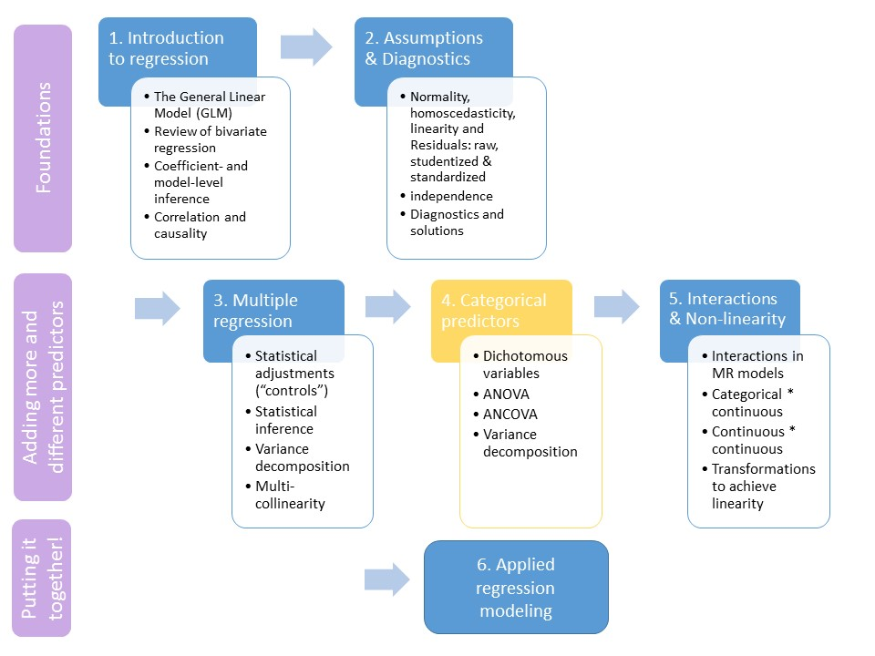
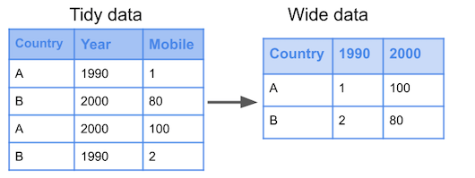
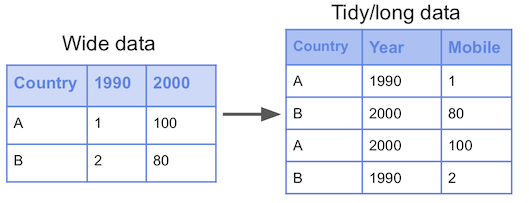
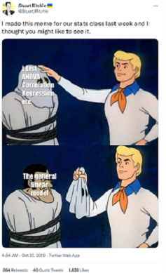

```{R, setup, include = F}
library(pacman)
p_load(here, tidyverse, xaringan, knitr, kableExtra, haven, broom, xaringanthemer, reshape2, car)

i_am("slides/EDUC643_10_categorical.rmd")


red_pink <- "#e64173"
turquoise = "#20B2AA"
orange = "#FFA500"
red = "#fb6107"
blue = "#3b3b9a"
green = "#8bb174"
grey_light = "#B3B3B3"
grey_mid = "#7F7F7F"
grey_dark = "grey20"
purple = "#6A5ACD"
slate = "#314f4f"

extra_css <- list(
  ".red"   = list(color = "red"),
  ".blue"  =list(color = "blue"),
  ".red-pink" = list(color= "#e64173"),
  ".gray" = list(color= "#B3B3B3"),
  ".purple" = list(color = "purple"),
  ".orange" = list(color = "#FFA500"),
  ".small" = list("font-size" = "90%"),
  ".large" = list("font-size" = "120%"),
  ".tiny" = list("font-size" = "70%"),
  ".tiny2" = list("font-size" = "50%"))


write_extra_css(css = extra_css, outfile = "my_custom.css")

options(htmltools.dir.version = FALSE)

hook_output <- knit_hooks$get("output")
knit_hooks$set(output = function(x, options) {
  lines <- options$output.lines
  if (is.null(lines)) {
    return(hook_output(x, options))  # pass to default hook
  }
  x <- unlist(strsplit(x, "\n"))
  more <- "..."
  if (length(lines)==1) {        # first n lines
    if (length(x) > lines) {
      # truncate the output, but add ....
      x <- c(head(x, lines), more)
    }
  } else {
    x <- c(more, x[lines], more)
  }
  # paste these lines together
  x <- paste(c(x, ""), collapse = "\n")
  hook_output(x, options)
})

knitr::opts_chunk$set(warning = FALSE,
                      message = FALSE,
                      echo = FALSE,
                      fig.align = "center",
                      fig.height = 6.5,
                      fig.width = 10)


```

# Roadmap
```{r, echo=F, out.width="90%"}


dibels <- read.csv(here("data/dibels.csv"))
dibels_long <- read.csv(here("data/dibels_long.csv"))

```
---
# Unit goals

- Describe the relationship between dichotomous and polychotomous variables and convert variables between these forms, as necessary
- Conduct a two-sample $t$-test
- Describe the relationship between a two-sample $t$-test and regressing a continuous outcome on a dichotomous predictor
- Estimate a regression with one dummy variable as a predictor and interpret the results (including when the reference category changes)
- Estimate a multiple regression model with several continuous and dummy variables and interpret the results
- Estimate an ANOVA model and interpret the within- and between-group variance
 + Do the same for an ANCOVA model, adjusting for additional continuous predictors
- Describe the similarities and differences of Ordinary-Least Squares regression analysis and ANOVA/ANCOVA, and when one would prefer one approach to another
- Describe potential Type I error problems that arise from multiple group comparisons and potential solutions to these problems, including theory, pre-registration, ANOVA and *post-hoc* corrections
- Describe the relationship between different modeling approaches with the General Linear Model family

---
class: middle, inverse

# Categorical variables

---
# Categorical variables
So far, we have only looked at General Linear Models (and their associated OLS regression estimating equations) involving continuous predictors. But what about .red-pink[**categorical predictors**]?

--

What are categorical predictors?
- Categorical predictors are ***predictors whose values denote categories***.

--
Of course, this begs the question...

---
# Categorical predictors

### Important distinctions and conventions:

.small[
.pull-left[
**Nominal predictors**
- These have *unordered* values
- E.g., gender, religion, political party
]

.pull-left[
**Ordinal predictors**
- These have *ordered* values
- E.g., grade, developmental stage, education level (?)
]
]

--

Another important distinction: .red-pink[**dichotomies**] (only 2 categories) vs. .red-pink[**polychotomies**] (>2 categories)

---
# Our (new!) motivating question
.small[A team of researchers based at the .green[**University of Oregon**] aimed to understand the effects of the COVID-19 pandemic on students' early literacy skills.<sup>1</sup>]
```{r}

```

.small[Ann Swindells Professor in Special Education [Gina Biancarosa](https://education.uoregon.edu/directory/faculty/all/ginab), former UO doctoral students David Fainstein, Chris Ives, and Dave Furjanic, along with CTL Research Manager Patrick Kennedy, used data from assessments of 471,456 students on the Dynamic Indicators of Basic Early Literacy Skills (DIBELS) to analyze the extent to which students' Oral Reading Fluency (ORF) scores differed across four waves of DIBELS assessment prior-to and during the pandemic.]

.small[Their study is forthcoming at the *Elementary School Journal*.]

.footnote[[1] For various reasons, the pandemic is a ["lousy natural experiment"](https://www.educationnext.org/covid-19-pandemic-lousy-natural-experiment-for-studying-the-effects-online-learning/) for examining the effects of a particular policy response (e.g, virtual schooling). However, it is quite possible to seek to understand its global effects via just the type of analysis Furjanic et al. conducted.]

---
# Our data
```{r, echo=T}
str(dibels)
```

---
# Mean comparison
```{r, echo=T}
mean(dibels$pre)
mean(dibels$post)
```

--

Means are 4.5 words per-minute apart.

---
## Understanding the distributions

.pull-left[
**Pre-pandemic**
```{r}
boxplot(dibels$pre,
        ylim =c(0,170))
```
]

.pull-right[
**Post-pandemic onset**
```{r}
boxplot(dibels$post,
        ylim =c(0,170))
```
]

--

But, as you may by now have anticipated, we are interested in knowing how likely we are to have gotten such a difference by idiosyncrasy of sampling from a population of school-grades in which there was no difference.

--
Fortunately, we just such a tool in our toolbox already. .blue[**What will the (asymptotic) distribution of means of repeatedly drawn samples from a given population be?**]

---
# Two-sample $t$-test
```{r, echo=T}
t.test(dibels$pre, dibels$post)  
# I'm allowing in this t-test for the possibility that my sample in 
# each group is of different sizes and has different variance. 
# These assumptions affect the precision of my estimates. In some 
# settings, particularly experimental ones, I can impose stricter 
# assumptions and get more precise estimates.
```

---
# Our old friend
We can now answer a lingering question from last term, and avoid having to make some torturous assumptions about what the "true" population mean is:
```{r}
who <- rio::import(here("data", "life_expectancy.csv")) %>% 
  janitor::clean_names() %>% 
  filter(year == 2015) %>%
  select(country, status, year, life_expectancy) %>% 
  rename(region = country) %>% 
  mutate(life_expectancy = round(life_expectancy, digits = 0))
```

```{r, echo=T}
t.test(who$life_expectancy[who$status=="Developing"], 
       who$life_expectancy[who$status=="Developed"])
# The square braces [] allow me to subset my data
# by the boolean operations within them
```

---
# Waves of data
```{r}
library(DT)
datatable(dibels[,c(1:4, 13:14)], fillContainer = FALSE, 
              options = list(pageLength = 9)) %>%
              formatRound("y1_boy_mean", digits=1) %>%
              formatRound("y1_moy_mean", digits=1) %>%
              formatRound("pre", digits=1) %>%
              formatRound("post", digits=1)
```

---
# Waves of data
```{r}
library(DT)
datatable(dibels[,c(1:4, 13:14)], fillContainer = FALSE, 
              options = list(pageLength = 6)) %>%
              formatRound("y1_boy_mean", digits=1) %>%
              formatRound("y1_moy_mean", digits=1) %>%
              formatRound("pre", digits=1) %>%
              formatRound("post", digits=1)
```

I actually have the same outcome stored across multiple variables.

--
.blue[**What is it?**]

--
This is a classic example of a phenomenon you will come to know and hate: the curse of .red-pink[**wide**] and .red-pink[**long**] data structures.

---
# Wide and long data
Various types of analyses will necessitate different data structures:

.pull-left[
**Long to wide**
```{r}

```
]

.pull-right[
**Wide to long**
```{r}

```
]

--

Understanding exactly how to do this will take repeated time and practice, and you will nearly always need to look up how to do it. Bookmark and get familiar with this vignette: [https://tidyr.tidyverse.org/articles/pivot.html](https://tidyr.tidyverse.org/articles/pivot.html)!

--

I'm going to show you the code to do it, but you don't need to understand nor be able to do this for our purposes.

---
# Pivot wider
```{r, echo=T}
dibels_long <- dibels %>% 
                  pivot_longer(
                    cols = c("y1_boy_mean", "y1_moy_mean", 
                             "y2_boy_mean", "y2_moy_mean"),
                    names_to = "period",
                    names_pattern = "(.*)_mean",
                    values_to = "mean_orf")
dibels_long$period <- factor(dibels_long$period)
```

---
# Long DIBELS
```{r}
datatable(dibels_long[,c("sch_deid", "grade", "period", "mean_orf", "pre", "post")], fillContainer = FALSE, 
              options = list(pageLength = 9)) %>%
              formatRound("mean_orf", digits=1) %>%
              formatRound("pre", digits=1) %>%
              formatRound("post", digits=1)
```

---
# Dummy coding

The mean values for pre-pandemic and post-pandemic onset are no longer helpful:
```{r, echo=T}
dibels_long <- select(dibels_long, -c(pre, post))
```

--

But it will be helpful for us to be able to designate which observations refer to a time period before the pandemic, and which refer to a time period post-onset:
```{r, echo=T}
dibels_long <- mutate(dibels_long,
               post = ifelse(period=="y1_boy" | 
                             period=="y1_moy", 0, 1))
```

---
# Dummy variables

Dummy (or indicator variables) distinguish between categories, but offer no meaningful quantitative information ***on their own***.

By convention, the variable name corresponds to the category given by the value==1, e.g.:
$$post=1 \text{ if after pandemic onset}$$

$$post=0 \text{ if pre-pandemic}$$
The category given the value 0 is called the .red-pink[**reference category**]. Good data management practice: call the categorical variable the value implied by its substantive meaning when equal to 1 (i.e., "*post*" rather than "*pandemic*"; "*treat*" rather than "*condition*").

---
# Polychotomies
In fact, dummy coding will prove essential for categorical variables with more than two categories as well, especially those that are nominal (i.e., unordered):

```{r, echo=T}
table(dibels_long$school_titlei)
```

---
# Polychotomies
Here we have seven different levels of school's Title I status. We can probably simplify these, but we need to be able to represent them using numerical values, when these levels don't inherently have a numerical structure.

--
So... we use **dummy coding**.

--
First, let's simplify the categories:

```{r, echo=T}
dibels_long <- dibels_long %>%
      mutate(title1 = case_when(school_titlei=="Missing" ~ "Missing",
                                school_titlei=="Not a Title I school" ~ "Not Title I",
                                school_titlei=="Title I schoolwide eligible-Title I targeted assistance program" |
                                school_titlei=="Title I schoolwide eligible school-No program" |
                                school_titlei=="Title I schoolwide school" ~ "Title I schoolwide",
                                school_titlei=="Title I targeted assistance eligible school-No program" |
                                school_titlei=="Title I targeted assistance school" ~ "Title I targeted"))
table(dibels_long$title1, exclude=NULL)
```
---
# Dummy coding

The most common process for representing categorical variables in regression is dummy coding. 

* Dummy coding essentially creates a new (dummy-coded) variable for each level.

|School Status      |D1   |D2   |D3 
|-------------------------------------
|Not Title I        |0    |0    |0    
|Title I schoolwide |1    |0    |0    
|Title I targeted   |0    |1    |0    
|Missing            |0    |0    |1    


* One group becomes the reference group (in this case "Not Title I").

* The dummy-coded variables are then coded "1" for their corresponding level, and 0 for all other levels.

---
# Dummy coding

In a sample dataset, we could visualize the dummy coding scheme like this:

|School    |Title I status     |D1 (Schoolwide) |D2 (Targeted) |...
|------------------------------------------------------------------
|10001     |Not Title I        |0               |0             |...
|10002     |Title I schoolwide |1               |0             |...
|10003     |Title I targeted   |0               |1             |...
|10004     |Missing            |0               |0             |...
|10005     |Title I schoolwide |1               |0             |


Since "Not Title I" is our reference, we don't create a column (its implied by 0s in all other groups).

Hence, for $K$ categories in our original variable, we have $K-1$ dummy-coded variables. 

---
# Dummies in R
From our polychotomous categorical variable, we can hand-create dummies:
```{r, echo=T}
dibels_long <- dibels_long %>%
  mutate(title1_school = ifelse(title1=="Title I schoolwide", 1, 0)) %>%
  mutate(title1_target = ifelse(title1=="Title I targeted", 1, 0)) %>%
  mutate(title1_miss = ifelse(title1=="Missing", 1, 0))
```

But, R is actually really smart, so the most straightforward way is to turn our original variable into a factor and then let R automatically convert it into a series of dummies when we need:
```{r, echo=T}
dibels_long$title1 <- factor(dibels_long$title1)
```

---
class: middle, inverse

# Categorical predictors in regression

---
## Categorical predictors in regression

In our standard multiple regression model, we have noted that we've made several strong assumptions about our outcome $(Y_i)$ and residuals $(\varepsilon_i)$:
$$\color{red}{Y_i} = \beta_0 + \beta_1 X_{1i} + \beta_2 X_{2i} + ... + \beta_k X_{ki} + \color{red}{\varepsilon_i}$$

--
but, we haven't made any assumptions about the form of the $X$s. In fact, regression models can easily accommodate categorical variables (both dichotomous and polychotomous)!

---
# Pre/post in regression
We can now estimate whether there was a difference in ORF scores pre- and post-pandemic onset in regression:
```{r, echo=T}
fit1 <- lm(mean_orf ~ post, data=dibels_long)
summary(fit1)
```

---
# Pre/post
```{r, echo=F}
summary(fit1)
```
Our point estimate is identical to our [original two-sample $t$-test](https://daviddliebowitz.github.io/EDUC643_23W/slides/EDUC643_9_categorical.html#17), though our inference has changed slightly.


---
## Regression w. categorical predictors
```{r, fig.height=6}
set.seed(1234)
plot1 <- ggplot(dibels_long, aes(y=mean_orf, x=post, color=post)) +
            geom_jitter() +
            theme_minimal(base_size=16) +
            theme(legend.position = "none")
plot1
```
---
## Regression w. categorical predictors
```{r, fig.height=6}
set.seed(1234)
plot1 + geom_smooth(method='lm') +
        ggpubr::stat_regline_equation(data=dibels_long, aes(x=post, y=mean_orf), label.x=.75, label.y=85, size=10) 
```

--
.small[***y*-intercept**: estimated value of *Y* when dichotomous predictor=0]

.small[**slope**: estimated difference in *Y* between categories of predictor]

---
# Reference category
What happens if we change the reference category?
```{r, echo=T}
dibels_long <- mutate(dibels_long,
               pre = ifelse(period=="y1_boy" | 
                             period=="y1_moy", 1, 0))
fit2 <- lm(mean_orf ~ pre, data=dibels_long)
```

---
# Reference category
What happens if we change the reference category?
```{r, output.lines = -(1:8)}
summary(fit2)
```
.small[
- Sign of slope is reversed
- Y-intercept is value of reference category
- SE and inference remain exact same
]

---
# What about the waves?
Up until now, we've focused on a simple comparison of pre- and post-pandemic onset scores. But this glosses over the facts that:
.small[
- Students typically improve substantially over the course of the year (we're lumping these time points together)
- We aren't able to capture the dynamic ways in which performance may have evolved over the early parts of the pandemic
]

--

We can use our multiple wave collection (now captured in our categorical polychotomous variable *period*) to address this.
```{r, echo=T}
table(dibels_long$period, exclude=NULL)
```

---
# Categorical predictors

.small[
.pull-left[
**Nominal predictors**
- These have *unordered* values
- E.g., gender, religion, political party, state of residence
- .red[**NEVER** include a nominal predictor directly in a regression model]
  + You end up with the problem of "country-ness" as a predictor
]

.pull-left[
**Ordinal predictors**
- These have *ordered* values
- E.g., grade, developmental stage, education level (?)
- .orange[**CAN** include an ordinal predictor directly in regression, but make sure this is what you want!]
  + Should you convert a political view scale (1=progressive, 2=liberal, 3=moderate, 4=conservative, 5=libertarian) to a series of dummies?
  + What about education (1=HS dropout, 2=HS grad, 3=some college, 4=college grad)?
]
]

---
# Polychotomies in regression
In a regression model, categorical predictors are typically entered in their dummy-coded format.

$$\hat{Y} = \beta_0 + \beta_1 D_2 + \beta_2 D_3 + \beta_3 D_3+...+\varepsilon$$
--

In our four-wave ORF regression, we can think of the equation like this:

$$MEAN\_ORF_j = \beta_0 + \beta_1 Y1\_MOY_j + \beta_2 Y2\_BOY_j + \beta_3 Y2\_MOY_j + \varepsilon_j$$

--
.blue[**where did *Y1_BOY* (year 1, beginning of year) go?**]

--

.blue[**How should we interpret each of the coefficients?**]

--

.blue[**How should we interpret the intercept?**]


---
# Why does this work?
```{r}
ggplot(dibels_long, aes(x=period, y=mean_orf, color=period, fill=period, alpha=0.4)) +
   geom_boxplot() +
   xlab("Period") + ylab("Mean ORF score") +
   theme_minimal(base_size=16) +
   theme(legend.position = "none")
```
---
# Interpreting coefficients

```{r, output.lines = (9:18), highlight.output = 4, comment = NA}
fit3 <- lm(mean_orf ~ period, dibels_long)
summary(fit3)
```
.tiny[**On average, when measured in Fall 2019, grades in schools had a mean ORF score of 62.3**]

---
# Interpreting coefficients
```{r, output.lines = (9:18), highlight.output = 5, comment = NA}
summary(fit3)
```
.tiny[On average, when measured in Fall 2019, grades in schools had a mean ORF score of 62.3]

.tiny[**On average, when measured in Winter 2020, grades in schools had a mean ORF score of 87.9 (62.3 + 25.6)**]

---
# Interpreting coefficients
```{r, echo = F, output.lines = (9:18), highlight.output = 6, comment = NA}
summary(fit3)
```
.tiny[On average, when measured in Fall 2019, grades in schools had a mean ORF score of 62.3]

.tiny[On average, when measured in Winter 2020, grades in schools had a mean ORF score of 87.9 (62.3 + 25.6)]

.tiny[**On average, when measured in Fall 2020, grades in schools had a mean ORF score of 59.6 (62.3 + (-2.8))**]

---
# Interpreting coefficients
```{r, echo = F, output.lines = (9:18), highlight.output = 7, comment = NA}
summary(fit3)
```
.tiny[On average, when measured in Fall 2019, grades in schools had a mean ORF score of 62.3]

.tiny[On average, when measured in Winter 2020, grades in schools had a mean ORF score of 87.9 (62.3 + 25.6)]

.tiny[On average, when measured in Fall 2020, grades in schools had a mean ORF score of 59.6 (62.3 + (-2.8))]

.tiny[**On average, when measured in Winter 2021, grades in schools had a mean ORF score of 81.79 (62.3 + 19.5)**]

---
## Interpreting coefficient significance
Coefficient significance tests still test the null hypothesis $\beta_k = 0$, but **we are testing against the reference group** implicit in our intercept.

```{r, echo = F, output.lines = -c(1:8, 18:24), comment = NA}
summary(fit3)
```

.blue[**Which DIBELS test wave differs significantly from our reference group - "Y1_BOY"?**]

--

So, this is just a comparison of means, or a series of independent-sample $t$-tests!

---
# Changing reference category
If we change the model's reference category with a polychotomous variable, we will change the parameter estimates and associated tests. Each refers to the estimated mean difference for that group and the reference category. There can be significant variation from one group (e.g., time period) to another, but not all groups are different from each other.
```{r, echo=T, output.lines = -c(1:8)}
summary(lm(mean_orf ~ relevel(period, ref="y2_boy"), data=dibels_long))
```

---
## Prediction with categorical variables
Using the coefficients from our output, we have the following fitted regression equation:

$$\hat{MEAN\_ORF}_{j} = 62.3 + 25.6 (Y1\_MOY_{j}) + (-2.8)(Y2\_BOY)_{j}) + 19.6(Y2\_MOY_{j})$$
.blue[**What is the predicted ORF for school grades in the middle of the 2020-21 school year?**]

--
$$\hat{MEAN\_ORF}_{j} = 62.3 + 25.6 (0) + (-2.8)(0) + 19.6(1)=62.3+19.6=81.9$$
For dummy coded variables, we just add the appropriate effects for the group we are interested in, or omit them if they are in our reference group.


---
# So many tests

|Reference group | Y1_BOY | Y1_MOY | Y2_BOY | Y2_MOY
|-------------------------------------------------------
|**Y1_BOY**      |        | 1      | 2      | 3
|**Y1_MOY**      | 4      |        | 5      | 6
|**Y2_BOY**      | 7      | 8      |        | 9
|**Y2_MOY**      | 10     | 11     | 12     |

.red[**DANGER**]: we're back in the land of multiple hypothesis testing, and we may be inadvertently committing .red-pink[**Type I error**]!

---
## Dangers of multiple hypothesis tests

If your goal is to find a "statistically significant" result, you will detect such a relationship 1 out of 20 times (on average).

Imagine rolling a die. .blue[What is the probability you roll a 1?]

--
$1/6 = 0.167$

--

Now, roll it twice, .blue[what is the probability **at least** one of your rolls is a 1?]

--
$1 - (5/6 * 5/6) = 0.306$

--

If you conduct enough tests, you'll detect a relationship eventually.

---
# One fix

Instead of using $\alpha=0.05$ for each individual test, use $\alpha=0.05$ for the **family of tests** when we examine multiple contrasts to test a single hypothesis. 

.pull-left[
### Bonferroni method
Take a given $\alpha$-threshold and "split it" across the entire family of tests. Assuming $\alpha = 0.05$:
- For 2 tests, conduct each at 0.025 level;
- For 3 tests, conduct each at 0.0167 level; etc. ...

Use this new threshold to identify the critical $t$-statistic given the number of degrees of freedom.

.red-pink[*Other approaches exist! Bonferroni is an extremely conservative one--beware!*]
]

.pull-right[
As tests increase, so do critical $t$-values:

| # tests | # new $\alpha$ | $t$-statistic (df = $\infty$)
|-------------------------------------------------------------
| 1 | 0.0500 | 1.96
| 2 | 0.0250 | 2.24
| 3 | 0.0167 | 2.39
| 4 | 0.0125 | 2.50
| 5 | 0.0100 | 2.58
| 6 | 0.0083 | 2.64
| 10| 0.0050 | 2.81
| 20| 0.0025 | 3.02
| 50| 0.0010 | 3.29
|100| 0.0005 | 3.48

]
---
# Bonferroni correction in R
```{r, echo=T}
pairwise.t.test(dibels_long$mean_orf, dibels_long$period,
                p.adjust.method = "bonferroni")
```

--

We can see that our inference has become slightly weaker for our *Y1_BOY* vs. *Y2_BOY* comparison, though still smaller than most traditional thresholds.

--
But perhaps, there are more general ways to address this same challenge!

---
class: middle, inverse

# ANOVA

---
# ANOVA

* Analysis of variance, or ANOVA, is a special case of the general linear model.

* The primary goal of ANOVA is a comparison of means across different groups.
  + $H_0: \mu_1 = \mu_2 = \mu_3... \mu_K$
  
* Although regression frameworks are more the norm across most disciplines, the ANOVA approach can be useful for:
  + Testing the main effects of categorical variables
  + Exploring their associated variance in the outcome

---
## ANOVA vs. Regression

* A regression with dummy indicator variables is mathematically identical to ANOVA.

* The F-test in a regression model represents a test of the model's variance against the residual.

* In ANOVA, we can have one or more F-tests where we "batch test" a group of coefficients.
  + Example: Assuming we had multiple variables in our model, we could test the main effect of marital status against the residual rather than examine each individual coefficient.


---
## Partitioning Variance

In regression, we partition our total variance $SS_\text{total}$ into our $SS_\text{model}$ and $SS_\text{error}$.

$SS_\text{model}$ = Deviation of observed value from the predicted value $(Y_{i}-\hat{Y}_i)$.

 $SS_\text{error}$ = Deviation of predicted value from the grand mean $(\hat{Y} - \bar{Y}_i)$.

--

In ANOVA, we apply a similar but slightly different conceptual process.
---
## Partioning Variance in ANOVA

In ANOVA, we separate variance into between-group and within-group variance.

$SS_\text{within}$ = Deviation of observed value from its group mean $(Y_{ik}-\bar{Y}_k)$.

$SS_\text{between}$ = Deviation of group mean from the grand mean $(\bar{Y}_k - \bar{Y})$.

--

$$SS_\text{total} = SS_\text{within} + SS_\text{between}$$


---
```{r}
# 
# m <- lm(BMI ~ marital_status, do2)
# 
# do2 <- do2 %>% 
#   group_by(marital_status) %>% 
#   mutate(group_mean = mean(BMI)) %>% 
#   ungroup()
# 
# do_samp <- do2 %>% 
#   group_by(marital_status) %>% 
#   sample_n(20)
# 
# do_samp$predict <- predict(m, do_samp)
# 
# do_samp$jitter_marit <-
#   ave(as.numeric(do_samp$marital_status), 
#       do_samp$marital_status, 
#       FUN = function(x) x + rnorm(length(x), sd = .2))
# 
# do_samp <- do_samp %>% 
#   mutate(jitmin = min(jitter_marit),
#          jitmax = max(jitter_marit))
# 
# ```
# 
# .pull-left[
# ```{r, fig.height=3, fig.width=5, echo = F}
# with_plot <- do_samp %>% 
# ggplot(aes(x = jitter_marit, xend = jitter_marit,
#                  y = BMI, yend = predict)) +
#     geom_segment(color = "green") +
#     geom_point() +
#     scale_x_continuous("Marital Status", 
#                        breaks = c(1,2,3,4),
#                        labels = levels(do2$marital_status)) +
#   geom_segment(aes(x = jitmin, xend = jitmax, y = predict, yend = predict),
#                color = "darkgreen") +
#   ylim(0, 40) +
#   theme_minimal() +
#   ggtitle("Within-Groups Variance")
# 
# with_plot
```

This shows the residual variance around the group means. Just like the error term, it is all the remaining variance our predictor can't explain.
]

.pull-right[
```{r, fig.height=3, fig.width=5, echo = F}
# btw_plot <- ggplot(do_samp, aes(x = marital_status, y = group_mean)) +
#   geom_point(aes(x = as.numeric(marital_status) + 0.5,
#                    y = group_mean), color = "darkgreen") +
#     geom_segment(aes(x = as.numeric(marital_status),
#                    xend = as.numeric(marital_status),
#                    y = group_mean,
#                    yend = mean(do2$BMI)),
#                  linetype = 2) +
#   geom_hline(yintercept = mean(do2$BMI), color = "black", linetype = 2) +
#       scale_x_continuous("Marital Status", 
#                        breaks = c(1, 2, 3, 4),
#                        labels = levels(do2$marital_status)) +
#   ylim(0, 40) +
#   theme_minimal() +
#   ggtitle("Between-Groups Variance")
# 
# btw_plot
```

This shows the group effect of marital status against the grand mean.
]


---
## ANOVA Test Statistic

When we conduct an ANOVA we are testing the significance of an F statistic using the following formula:

$$\large F = \frac{MS_\text{between}}{MS_\text{within}}$$

The mean squares (MS) of between- and within-group variance is just their Sums of Squares divided by their degrees of freedom.

.pull-left[
$$\large MS_w = \frac{SS_w}{df_w}$$
$$\large df_w = N-G$$

]
.pull-right[
$$\large MS_b = \frac{SS_b}{df_b}$$
$$\large df_b = G-1$$
]
---
## ANOVA Significance Test

The null hypothesis of an ANOVA regards the ratio of between- to within-group variance.

Essentially, we are asking if the mean square variance of the group means around the grand mean is significantly greater than the mean square variance of observations around their group mean.
--
If the between-group variance were much larger than the within-group variance, than the F-statistic would exceed 1.

$$\large F = \frac{MS_\text{between}}{MS_\text{within}} = \frac{4.3}{1.5} = 2.87$$

If the between-group variance is equal to or much smaller than the within-group variance, than our F statistic will be $\le$ 1.

$$\large F = \frac{MS_\text{between}}{MS_\text{within}} = \frac{0.2}{1.5} = 0.13$$

---
## Calculating the F-Statistic

Let's find our F-statistic for our marital status variable. 

```{r, echo = F}
#do2$predicted_BMI <- predict(m, do2)
```

#### Within-Group (Residual) Variance $MS_\text{Within}$
```{r}
# total n - number of groups (4)
#df_within <- 1079 - 4

#sum((do2$BMI - do2$group_mean)^2) / df_within
```

#### Between-Group Variance $MS_\text{Between}$
```{r}
# number of groups (4) - 1
#df_btw <- 4-1

#sum((mean(do2$BMI) - do2$group_mean)^2) / df_btw
```

---
## Calculating the F-Statistic

$$MS_\text{Between} = 41.76$$
$$MS_\text{Within} = 37.12$$

$$F = \frac{MS_\text{Between}}{MS_\text{Within}} = \frac{41.76}{37.12} = 1.125$$ 
Our F-statistic is 1.125. Now that we see how it is calculated, let's run an ANOVA in R to get our p-value and review the output.

---
## ANOVA Output

Because ANOVA is just a particular method of analyzing variance in GLMs, we can wrap `anova` around our `lm` model.

```{r, highlight.output = 6}
# m1 <- lm(BMI ~ marital_status, do2)
# car::Anova(m1, type = 3)
```
Here we can see all the information for the residual and marital status we calculated earlier. Only the p-value is new!

--

With a p-value of .34, our F-statistic is not that unusual. Therefore we fail to reject the null hypothesis. The marital status group means do not significantly differ in terms of BMI.


---
class: middle, inverse

# ANCOVA

---
# ANCOVA

* Analysis of covariance (ANCOVA) is an extension of ANOVA.
* Essentially, it is the an ANOVA that controls for the effects of other **continuous** independent variables.
* The null hypothesis is still the same as ANOVA $(\mu_1 = \mu_2 = \mu_K)$.

Sample Research Question: What is the difference in BMI among different marital status groups, **after controlling for age?**

---
## ANCOVA as Regression

Research Question: What is the difference in BMI among different marital status groups, **after controlling for age?**


In a regression equation, categorical variables would still be represented as a dummy-coded variable. We are just adding an additional $\beta$ for our covariate.

--

$$BMI_i = \beta_0 + \beta_1\text{Marital Status}_i + \beta_2\text{Age}_i + \epsilon_i$$

--

$$BMI_i = \beta_0 + \beta_1\text{Single_Commited}_i + \beta_2\text{Engaged}_i + \beta_3\text{Married}_i + \beta_4\text{Age}_i + \epsilon_i$$
--

Now we have to remember to qualify our interpretations given our covariates, or control variables.

$\beta_3$: The predicted difference in BMI between a single male and a married male, after controlling for age.

---
## ANCOVA


---
## ANCOVA Output

Now that we have an additional covariate in the model, we can expect a different residual sums of squares.

```{r, highlight.output = 8,}


```

* In our basic ANOVA, our residual SS was 39,907. Now we see the residual is 39,224. 

* Our variance has been "reorganized" with the addition of `age_year`. 

---
## ANCOVA Output

```{r, highlight.output = c(6, 8)}

```

* Our F-test for marital status still regards the relationship between its SS and the residual SS, but we have now accounted for the variance associated with age.

* Still, our resulting F-value is not significant (p = 0.28), meaning marital status does not significantly account for BMI after controlling for age.

* On the other hand, the main effect of age is significant (p < .001)

---
## Regression Output

We can compare our ANCOVA output to our regression output and see our dummy-coded, "unbatched", analysis of marital status effects. 

```{r, echo = F, highlight.output = c(12, 13, 14), comment = NA}

```
---

# Variance decomposition

* ANOVA (and ANCOVA) are typically used as methods for analyzing variance associated with group or categorical effects.

* Repeated Measures ANOVA is a similar process, but we define our "groups" as conditions within an individual.
  + e.g., Baseline, Treatment 1, Treatment 2

* ANOVA can be particularly useful for analyzing a regression model's terms, rather than its individual coefficients.


---
## It was the GLM the whole time...
```{r}

```


---
## Putting categorical predictors together


---
class: middle, inverse
# Synthesis and wrap-up

---
# Goals for the unit

- Describe the relationship between dichotomous and polychotomous variables and convert variables between these forms, as necessary
- Conduct a two-sample $t$-test
- Describe the relationship between a two-sample $t$-test and regressing a continuous outcome on a dichotomous predictor
- Estimate a regression with one dummy variable as a predictor and interpret the results (including when the reference category changes)
- Estimate a multiple regression model with several continuous and dummy variables and interpret the results
- Estimate an ANOVA model and interpret the within- and between-group variance
 + Do the same for an ANCOVA model, adjusting for additional continuous predictors
- Describe the similarities and differences of Ordinary-Least Squares regression analysis and ANOVA/ANCOVA, and when one would prefer one approach to another
- Describe potential Type I error problems that arise from multiple group comparisons and potential solutions to these problems, including theory, pre-registration, ANOVA and *post-hoc* corrections
- Describe the relationship between different modeling approaches with the General Linear Model family


---
# To-Dos

### Reading: 
- **Finish by Feb. 16**: LSWR Chapter 14 and 16.6

### Assignment 3:
- Due Feb. 14, 11:59pm (**note extension**)

### Assignment 4:
- Due Feb. 28, 11:59pm
