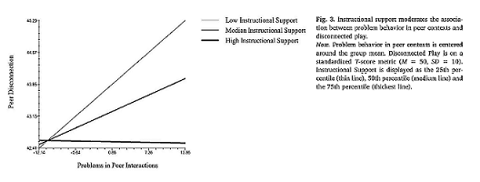

```{R, setup, include = F}
library(pacman)
p_load(here, tidyverse, xaringan, knitr, kableExtra, haven, broom, xaringanthemer, reshape2, car, modelsummary)

i_am("slides/EDUC643_13_interactions.Rmd")


red_pink <- "#e64173"
turquoise = "#20B2AA"
orange = "#FFA500"
red = "#fb6107"
blue = "#3b3b9a"
green = "#8bb174"
grey_light = "#B3B3B3"
grey_mid = "#7F7F7F"
grey_dark = "grey20"
purple = "#6A5ACD"
slate = "#314f4f"

extra_css <- list(
  ".red"   = list(color = "red"),
  ".blue"  =list(color = "blue"),
  ".red-pink" = list(color= "#e64173"),
  ".gray" = list(color= "#B3B3B3"),
  ".purple" = list(color = "purple"),
  ".orange" = list(color = "#FFA500"),
  ".green" = list(color = "#8bb174"),
  ".small" = list("font-size" = "90%"),
  ".large" = list("font-size" = "120%"),
  ".tiny" = list("font-size" = "75%"),
  ".tiny2" = list("font-size" = "50%"))


write_extra_css(css = extra_css, outfile = "my_custom.css")

options(htmltools.dir.version = FALSE)

hook_output <- knit_hooks$get("output")
knit_hooks$set(output = function(x, options) {
  lines <- options$output.lines
  if (is.null(lines)) {
    return(hook_output(x, options))  # pass to default hook
  }
  x <- unlist(strsplit(x, "\n"))
  more <- "..."
  if (length(lines)==1) {        # first n lines
    if (length(x) > lines) {
      # truncate the output, but add ....
      x <- c(head(x, lines), more)
    }
  } else {
    x <- c(more, x[lines], more)
  }
  # paste these lines together
  x <- paste(c(x, ""), collapse = "\n")
  hook_output(x, options)
})

knitr::opts_chunk$set(warning = FALSE,
                      message = FALSE,
                      echo = FALSE,
                      fig.align = "center",
                      fig.height = 6.5,
                      fig.width = 10)


```

# Roadmap
```{r, echo=F, out.width="90%"}
include_graphics("Roadmap5.jpg")

dibels_long <- read.csv(here("data/dibels_long.csv"))

dibels_long <- dibels_long %>%
      mutate(title1 = case_when(school_titlei=="Missing" ~ "Missing",
                                school_titlei=="Not a Title I school" ~ "Not Title I",
                                school_titlei=="Title I schoolwide eligible-Title I targeted assistance program" |
                                school_titlei=="Title I schoolwide eligible school-No program" |
                                school_titlei=="Title I schoolwide school" ~ "Title I schoolwide",
                                school_titlei=="Title I targeted assistance eligible school-No program" |
                                school_titlei=="Title I targeted assistance school" ~ "Title I targeted"))

dibels_long$title1 <- factor(dibels_long$title1,
                             levels=c("Not Title I", "Title I schoolwide", "Title I targeted", "Missing"))


```

---
# Goals of the unit

- Describe the main effects assumption and how this assumption can be relaxed using the statistical interaction model
- Describe in writing and verbally the concept of statistical interaction
- Estimate and interpret regression models with interactions between categorical and continuous predictors
- Estimate and interpret regression models with interactions between categorical and continuous predictors
- Estimate and interpret regression models with interactions between continuous predictors
- Visualize interaction effects graphically
- Describe statistical power and Type II error challenges resulting from interactions

.gray[
- Describe in writing and verbally the assumptions we violate when we fit a non-linear relationship with a linear model
- Transform non-linear relationships into linear ones by using logarithmic scales 
- Estimate regression models using logarithmic scales and interpret the results
- Estimate models with quadratic and higher-order polynomial terms (special kinds of interactions)
- Select between transformation options
]


---
# Our motivating question
.small[A team of researchers based at the .green[**University of Oregon**] aimed to understand the effects of the COVID-19 pandemic on students' early literacy skills.<sup>1</sup>]
```{r}
include_graphics("dibels_team.png")
```

.small[Ann Swindells Professor in Special Education [Gina Biancarosa](https://education.uoregon.edu/directory/faculty/all/ginab), former UO doctoral students David Fainstein, Chris Ives, and Dave Furjanic, along with CTL Research Manager Patrick Kennedy, used data from assessments of 471,456 students across 1,684 schools on the Dynamic Indicators of Basic Early Literacy Skills (DIBELS) to analyze the extent to which students' Oral Reading Fluency (ORF) scores differed across four waves of DIBELS assessment prior-to and during the pandemic.]

.small[Their study is forthcoming at the *Elementary School Journal*.]

.footnote[[1] For various reasons, the pandemic is a ["lousy natural experiment"](https://www.educationnext.org/covid-19-pandemic-lousy-natural-experiment-for-studying-the-effects-online-learning/) for examining the effects of a particular policy response (e.g, virtual schooling). However, it is quite possible to seek to understand its global effects via just the type of analysis Furjanic et al. conducted.]

---
# Our answer to-date
```{r}
fit3 <- lm(mean_orf ~ period, dibels_long)
fit4<-lm(mean_orf ~ period + as.factor(grade) + 
                    school_enroll, data=dibels_long)

row <- tribble(~term, ~Bivariate, ~Multivariate,
               "<b>Covariates?</b>", "<b>No</b>", "<b>Yes</b>")
attr(row, 'position') <- c(9)
modelsummary(list(fit3, fit4),
            stars=T,
            vcov = "robust",
            gof_omit = "Adj.|AIC|BIC|Log|RMSE|RSE|Std.Err",
            coef_omit = "grade|school_enroll",
            coef_rename = c("periody1_moy" = "Winter 2020",
                            "periody2_boy" = "Fall 2020",
                            "periody2_moy" = "Winter 2021"),
            add_rows = row,
            notes=c("Cells report coefficients and heteroscedastic-robust standard errors in parentheses. Each observation is a school-grade-test value. Covariates include grade-level and total school enrollment."))
```

---
# Might differ by context?
```{r}
fit3 <- lm(mean_orf ~ period, dibels_long)
fit4<-lm(mean_orf ~ period + as.factor(grade) + 
                    school_enroll, data=dibels_long)

row <- tribble(~term, ~Bivariate, ~Multivariate,
               "<b>Covariates?</b>", "<b>No</b>", "<b>Yes</b>")
attr(row, 'position') <- c(9)
modelsummary(list(fit3, fit4),
            stars=T,
            vcov = "robust",
            gof_omit = "Adj.|AIC|BIC|Log|RMSE|RSE|Std.Err",
            coef_omit = "grade|school_enroll",
            coef_rename = c("periody1_moy" = "Winter 2020",
                            "periody2_boy" = "Fall 2020",
                            "periody2_moy" = "Winter 2021"),
            add_rows = row,
            notes=c("Cells report coefficients and heteroscedastic-robust standard errors in parentheses. Each observation is a school-grade-test value. Covariates include grade-level and total school enrollment."))
```

---
# Some definitions

.large[.red-pink[**Statistical interactions**]]
- When the relationship between one predictor variable and the outcome differs by the level of another predictor
- A statistical term

.large[.red-pink[**Moderation effects**]]
- A substantive interpretation of the statistical interaction
- In practice, used interchangeably with interactions

--

.large[.red-pink[**Mediation effects**]]
- A third variable that "explains" why or how one predictor variable is related to the outcome
- Question predictor related to the mediator variable, which in turn is related to the outcome
- Requires some strong assumptions to interpret as "mediation" or "mechanism" that are highly dependent on research design
- We'll return to this in our final unit (*not what we're talking about now*)


---
# Statistical interactions abound

**Teacher-child interaction quality moderates social risks of problem behavior<sup>1</sup>**

> "We found a negative interaction between early peer context problems and classroom instructional support in the prediction of disconnected play. In classrooms with low instructional quality, children who displayed early problem behavior in peer contexts displayed higher disconnected play in the spring. However, in classrooms with higher instructional support, this association was weakened" (pg. 9)

```{r}

```

.footnote[[1] Bulotsky-Hearer, R., Fernandez, V., Bichay-Awadalla, K., Bailey, J. Futterer, J. & Qi, C. (2020). Teacher-child interaction quality moderates social risks associated with problem behavior in preschool classroom contexts. *Journal of Applied Developmental Psychology, 67*, 101103.]


---
# Main effects model
```{r, fig.height=5.5}
fit4<-lm(mean_orf ~ period + frpl_prop, data=dibels_long)
df4 <- margins::margins(fit4,
            at = list(period=c("y1_boy", "y1_moy", 
                               "y2_boy", "y2_moy")))

# Use prototypical values in resulting dataset to show results
proto1 <- ggplot(data=df4, aes(x=frpl_prop, y=fitted, color=period)) + 
                geom_smooth(method='lm') +
                xlab("Proportion receiving FRPL") + ylab("Predicted ORF") +
                ylim(35, 110) +
                scale_color_discrete(name = "Period",
                                    breaks=c("y1_boy", "y1_moy", 
                                            "y2_boy", "y2_moy"),
                                    labels=c("Fall 2019","Winter 2020",
                                             "Fall 2020", "Winter 2021")) +
                theme_minimal(base_size=16)

proto1
```
**Parallel lines**: Fitted lines are parallel because the main effects model assumes that the effect of each predictor is identical and independent of the values of all other other predictors in the model.

---
# Interaction model
```{r, fig.height=5.5}
fit5<-lm(mean_orf ~ period*frpl_prop, data=dibels_long)
df5 <- margins::margins(fit5,
            at = list(period=c("y1_boy", "y1_moy", 
                               "y2_boy", "y2_moy")))

# Use prototypical values in resulting dataset to show results
proto2 <- ggplot(data=df5, aes(x=frpl_prop, y=fitted, color=period)) + 
                geom_smooth(method='lm') +
                xlab("Proportion receiving FRPL") + ylab("Predicted ORF") +
                ylim(35, 110) +
                scale_color_discrete(name = "Period",
                                    breaks=c("y1_boy", "y1_moy", 
                                            "y2_boy", "y2_moy"),
                                    labels=c("Fall 2019","Winter 2020",
                                             "Fall 2020", "Winter 2021")) +
                theme_minimal(base_size=16)

proto2
```
**Unparallel lines**: Fitted lines are **not** assumed parallel because the interaction model allows the effect of each predictor to differ by the values of other predictor(s) in the model.

---
# Some distinctions

.pull-left[
**Ordinal interaction**
.small[
- Direction of predictor's effect consistent across moderator's levels, but **magnitude** differs
]
```{r}
ggplot() + 
  geom_abline(aes(intercept=1, slope=1.00001), color=red_pink) + 
  geom_abline(aes(intercept=1.5, slope=4), color=turquoise) +
  annotate('text', label = "High Instructional Support", x = 16, y = 10, color = red_pink, size = 6) +
  annotate('text', label = "Low Instructional Support", x = 10, y=25, color=turquoise, size=6) +
  xlab("Problem behavior") + ylab("Peer disconnectedness") +
  xlim(1,20) + ylim(1,40) +
  theme_minimal(base_size=20) +
  theme(legend.position = "none")
```
]

.pull-left[
**Disordinal interaction**
.small[
- **Direction** of predictor's relationship with outcome differs across moderator's levels
]
```{r}
ggplot() + 
  geom_abline(aes(intercept=30, slope=-1), color=red_pink) + 
  geom_abline(aes(intercept=10, slope=1.5), color=turquoise) +
  annotate('text', label = "Chaotic ECE", x = 16, y = 10, color = red_pink, size = 6) +
  annotate('text', label = "Caring ECE", x = 15, y=25, color=turquoise, size=6) +
  xlab("Time in childcare") + ylab("Externalizing behavior") +
  xlim(1,20) + ylim(1,40) +
  theme_minimal(base_size=20) +
  theme(legend.position = "none")
```
]

--

These are somewhat arbitrary distinctions, as all non-parallel lines eventually intersect. However, the key is to constrain your interpretation **within the range of your data**.

--

Other interactions terms you may encounter: ***synergistic interaction***, ***buffering interaction***. These are subject- and discipline-specific.


---
# Additional research questions

.large[
1. How did students' Oral Reading Fluency (ORF) trajectories differ pre- and post-pandemic-onset?
   + Main effects model
2. To what extent did differences in students' ORF trajectories pre- and post-pandemic-onset differ by the proportion of students receiving free- or reduced-price lunch (FRPL) in their schools?
   + Interaction model: categorical X continuous
3. To what extent did differences in students' ORF trajectories pre- and post-pandemic-onset differ by the Title I status of their schools?
   + Interaction model: categorical x categorical
4. To what extent do students' average ORF scores differ by the rate of FRPL-receipt and enrollment in their schools?
   + Interaction model: continuous X continuous
]

---
class: middle, inverse

# Interactions: categorical and continuous

---
# Period as predictor
```{r, echo=T}
summary(lm(mean_orf ~ period, dibels_long))
```

---
# *FRPL_PROP* as predictor
```{r, echo=T}
summary(lm(mean_orf ~ frpl_prop, dibels_long))
```
---
# Both
```{r, echo=T}
summary(lm(mean_orf ~ period + frpl_prop, dibels_long))
```

---
# Testing for an interaction

1\. **Create a cross-product term**, which is the product (the interaction) of the two predictors whose interaction you want to test
  + We can create this term by hand or we can ask R to do this for us within our estimating equation

2\. **Include the cross-product in a multiple-regression model** ***alongside the constituent main effects*** of the variables that make up the cross-product term

$$MEAN\_ORF_j = \beta_0 + \beta_1 FRPL_j + \beta_2 PERIOD_j  + \color{red}{\beta_3 FRPL \times PERIOD_j} + \varepsilon_j$$
      
  + R will automatically do this if we specify our interaction term appropriately
  + For now, assume you should **always** include the main effects (e.g., $FRPL_j$ and $PERIOD_j$). Way down the line, there are cases where it might make sense to not do this.

3\. Test $H_0$: $\beta_{\text{cross-product}}=0$

---
# What will parameters mean?

$$MEAN\_ORF_j = \beta_0 + \beta_1 FRPL_j + \color{green}{\beta_2 PERIOD_j}  + \color{red}{\beta_3 FRPL \times PERIOD_j} + \varepsilon_j$$
$\color{green}{\beta_2}$ tells us the difference in the **intercept** when FRPL=0. I.e., how did ORF scores differ at different time periods for schools with no students receiving FRPL.

$\color{red}{\beta_3}$ tells us the difference in the **slope**. I.e., how did ORF scores differ for different levels of FRPL-receipt in a school, at different time periods across the different waves of the assessments

---
# Estimating in R
```{r, echo=T, output.lines=-c(1:8)}
summary(lm(mean_orf ~ period * frpl_prop, dibels_long))
```

---
# Estimating in R
```{r, echo=T, output.lines=-c(1:8), highlight.output=c(5:7)}
summary(lm(mean_orf ~ period * frpl_prop, dibels_long))
```

---
# Estimating in R
```{r, echo=T, output.lines=-c(1:8), highlight.output=c(8)}
summary(lm(mean_orf ~ period * frpl_prop, dibels_long))
```

---
# Estimating in R
```{r, echo=T, output.lines=-c(1:8), highlight.output=c(9:11)}
summary(lm(mean_orf ~ period * frpl_prop, dibels_long))
```

--
.red-pink[**Do not interpret main effects or interactions by themselves!**]

---
**For Fall 2019:**
$$
\begin{aligned}
\hat{MEAN\_ORF}_j = & \color{red}{78.3} + \color{red}{(-34.1)*FRPL} + 28.4(0) + (-3.6)*(0) + 23.0*(0) + \\
                    & (-6.1)*FRPL \times (0) + 1.7*FRPL \times (0) + (-7.5)*FRPL \times (0) \\
                  = & 78.3 - 34.1*FRPL
\end{aligned}
$$

--

**For Winter 2020:**
$$
\begin{aligned}
\hat{MEAN\_ORF}_j = & \color{red}{78.3} + \color{red}{(-34.1)*FRPL} + \color{red}{28.4(1)} + (-3.6)*(0) + 23.0*(0) + \\
                    & \color{red}{(-6.1)*FRPL \times (1)} + 1.7*FRPL \times (0) + (-7.5)*FRPL \times (0) \\
                  = & 106.7 - 40.2*FRPL
\end{aligned}
$$

--

**For Fall 2020:**
$$
\begin{aligned}
\hat{MEAN\_ORF}_j = & \color{red}{78.3} + \color{red}{(-34.1)*FRPL} + 28.4(0) + \color{red}{(-3.6)*(1)} + 23.0*(0) + \\
                    & (-6.1)*FRPL \times (0) + \color{red}{1.7*FRPL \times (1)} + (-7.5)*FRPL \times (0) \\
                  = & 74.7 - 32.4*FRPL
\end{aligned}
$$

--

**For Winter 2021:**
$$
\begin{aligned}
\hat{MEAN\_ORF}_j = & \color{red}{78.3} + \color{red}{(-34.1)*FRPL} + 28.4(0) + (-3.6)*(0) + \color{red}{23.0*(1)} + \\
                    & (-6.1)*FRPL \times (0) + 1.7*FRPL \times (0) + \color{red}{(-7.5)*FRPL \times (1)} \\
                  = & 101.3 - 41.6*FRPL
\end{aligned}
$$
--
.red-pink[**Until we do the math, we only know whether interactions are statistically different, but not by how much!**]


---
# Show results
```{r, echo=T}
fit5 <- lm(mean_orf ~ period * frpl_prop, data=dibels_long)
df5 <- margins::margins(fit5,
            at = list(period=c("y1_boy", "y1_moy", 
                               "y2_boy", "y2_moy")))

# Use prototypical values in resulting dataset to show results
proto2 <- ggplot(data=df5, aes(x=frpl_prop, y=fitted, color=period)) + 
          geom_smooth(method='lm') +
          xlab("Proportion receiving FRPL") + ylab("Predicted ORF") +
          ylim(35, 110) +
          scale_color_discrete(name = "Period",
                              breaks=c("y1_boy", "y1_moy", 
                                      "y2_boy", "y2_moy"),
                              labels=c("Fall 2019","Winter 2020",
                                       "Fall 2020", "Winter 2021")) +
          theme_minimal(base_size=16)

```

---
# Show results
```{r}
proto2
```

---
# Another way?
```{r}
summary(lm(mean_orf ~ frpl_prop, data=subset(dibels_long, period=="y1_boy")))
```

---
# Another way?
```{r}
summary(lm(mean_orf ~ frpl_prop, data=subset(dibels_long, period=="y2_moy")))
```

---
## Value (and perils) of interaction

1. As we'll see momentarily, interaction models can be fit whether one (or more) of the predictors are dichotomous or continuous 
2. Interaction models provide an easy statistical test of whether the slopes differ across groups (or across levels of a continuous predictor)
3. Interaction models keep the sample intact (you don’t need to break it down into many different groups)
   + Has some implementation advantages, but the purported statistical power advantages have been historically misunderstood and overstated
   + For more on this, check out Andrew Gelman's, ["You need 16 times the sample size to estimate an interaction than to estimate a main effect"](https://statmodeling.stat.columbia.edu/2018/03/15/need-16-times-sample-size-estimate-interaction-estimate-main-effect/)
4. Can be quite hard to clearly interpret
   + Visualization critical to communicate


---
class: middle, inverse

# Interactions: categorical and categorical

---
# What are our categories?

```{r, echo=T}
table(dibels_long$title1, exclude=NULL)
dibels_long %>% group_by(title1) %>% summarize(mean= mean(mean_orf))
```

---
# Title I as predictor
```{r, echo=T}
summary(lm(mean_orf ~ title1, dibels_long))
```

---
# Both
```{r, echo=T}
summary(lm(mean_orf ~ period + title1, dibels_long))
```

---
# Interaction
```{r, echo=T, output.lines=-c(1:8)}
summary(lm(mean_orf ~ period * title1, dibels_long))
```

---
# Interpretation

.blue[**You try!**]

Construct an equation of the form:

$$
\begin{aligned}
\hat{MEAN\_ORF}_j = & \beta_0 + \beta_1 P_2 + \beta_2 P_3 + \beta_4 P_4 +  \\
                    & \beta_5 T_2 + \beta_6 T_3 + \beta_7 T_4 + \\
                    & \beta_8 P_2 \times T_2 + \beta_9 P_2 \times T_3 + \beta_{10} P_2 \times T_4 + \\
                    & \beta_{11} P_3 \times T_2 + \beta_{12} P_3 \times T_3 + \beta_{13} P_3 \times T_4 + \\
                    & \beta_{14} P_4 \times T_2 + \beta_{15} P_4 \times T_3 + \beta_{16} P_4 \times T_4 \\
\end{aligned}
$$
with the coefficients from the previous slide and determine the fitted equation comparing Title I schoolwide schools in Winter 2021 to Title I schoolwide schools in Fall 2019.

---
# Visualization
```{r, echo=T}
# Let's just focus on ORF changes in first fall of pandemic

fit6 <- lm(mean_orf ~ period * title1, dibels_long)
df6 <- margins::margins(fit6,
       at = list(period=c("y2_boy", "y2_moy"),
       title1 = c("Not Title I", "Title I schoolwide", 
                  "Title I targeted", "Missing")))

# Show results for each category
categ <- ggplot(data=df6, 
            aes(x=period, y=fitted, 
                ymin=fitted-1.96*se.fitted, ymax=fitted+1.96*se.fitted, 
                group=title1, color=title1)) + 
          geom_pointrange(position=position_dodge(width=0.2)) +
          ylab("Predicted ORF") + xlab(" ") +
          scale_x_discrete(labels= c("y2_boy" = "Fall 2020",
                                     "y2_moy" = "Winter 2021")) +
          ylim(0, 110) +
          theme_minimal(base_size=16) +
          theme(legend.title = element_blank())
```

---
# Visualization
```{r}
categ
```

---
# Visualization
```{r}
categ + geom_line(position=position_dodge(width=0.2))
```

--
.tiny[For simplicity just focusing on primary question predictor interacted with one other variable (moderator). Could include multiple covariates and/or three-way interactions.]

--
.tiny[.red-pink[**Warning!**] It gets complicated (and underpowered) fast!]

---
class: middle, inverse

# Interactions: continuous and continuous

---
# School enrollment as predictor
```{r, echo=T}
summary(lm(mean_orf ~ school_enroll, dibels_long))
```

---
# Both
```{r, echo=T}
summary(lm(mean_orf ~ frpl_prop + school_enroll, dibels_long))
```

---
# Interaction
```{r, echo=T}
summary(lm(mean_orf ~ frpl_prop * school_enroll, dibels_long))
```

---
# Prototypical values?

.blue[**How could we choose meaningful values to demonstrates the differing relationship?**]

--

```{r, echo=T}
quantile(dibels_long$school_enroll, probs = seq(0, 1, 0.1))
```

--

Maybe at roughly the 10<sup>th</sup>, median (50<sup>th</sup>), and 90<sup>th</sup> percentiles?

--
Say 120, 326 and 600 students?

---
## Displaying continuous interactions
```{r, echo=T}
fit7 <- lm(mean_orf ~ frpl_prop * school_enroll, dibels_long)

df7 <- margins::margins(fit7,
            at = list(school_enroll=c(120, 326, 600)))

# Use prototypical values in resulting dataset to show results
cont <- ggplot(data=df7, aes(x=frpl_prop, y=fitted, 
                             color=as.factor(school_enroll))) +
          geom_smooth(method='lm') +
          xlab("Proportion receiving FRPL") + ylab("Predicted ORF") +
          ylim(35, 100) +
          scale_color_discrete(name = "School Enrollment",
                              breaks=c(120, 326, 600),
                              label=c("~10th pctile (120 stu.)", 
                                      "Median (326 stu.)", 
                                      "~90th pctile (600 stu.)")) +
          theme_minimal(base_size=16)
```

---
## Displaying continuous interactions
```{r}
cont
```


---
class: middle, inverse
# Synthesis and wrap-up

---
### Synthesize interactions

- **Statistical interactions are ubiquitous**
  + An interaction tells us that the relationship between one predictor and the outcome differs by levels of another
  + The standard regression model, which initially assumes that there are no interactions (the main effects assumption), can be easily modified to accommodate their presence
  + Many substantive theories suggest that relationships will be interactive
- **Test for a statistical interaction by including a cross-product term**
  + The cross-product is literally the product of the two constituent variables
  + In incorporating an interaction (moderation) term, be careful about:
        - Removing the main effects
        - Statistical power
  + Graph out the fitted model to ensure correct interpretation
        - Explore the `sjPlot` package for more ways to visualize interactions
- **More learning (beyond course)**
  + Centering and/or standardizing variables can aid with interpretation
  + The `contrast` and `emtrends` functions in the `emmeans` package can quickly test for whether fitted values at different levels of predictor and moderator are significantly different
- **Predictors can interact with themselves** (next sub-unit: non-linearities)  


---
# Goals of the unit

- Describe the main effects assumption and how this assumption can be relaxed using the statistical interaction model
- Describe in writing and verbally the concept of statistical interaction
- Estimate and interpret regression models with interactions between categorical and continuous predictors
- Estimate and interpret regression models with interactions between categorical and continuous predictors
- Estimate and interpret regression models with interactions between continuous predictors
- Visualize interaction effects graphically
- Describe statistical power and Type II error challenges resulting from interactions

.gray[
- Describe in writing and verbally the assumptions we violate when we fit a non-linear relationship with a linear model
- Transform non-linear relationships into linear ones by using logarithmic scales 
- Estimate regression models using logarithmic scales and interpret the results
- Estimate models with quadratic and higher-order polynomial terms (special kinds of interactions)
- Select between transformation options
]


---
# To-Dos

### Reading: 
- **Finish by Feb. 27**: LSWR Chapter 16.2

### Assignment 3:
- Due Feb. 26, 11:59pm

### Assignment 4 (last one!!!):
- Just on interactions (not non-linearity)
- Due Mar. 8, 11:59pm
