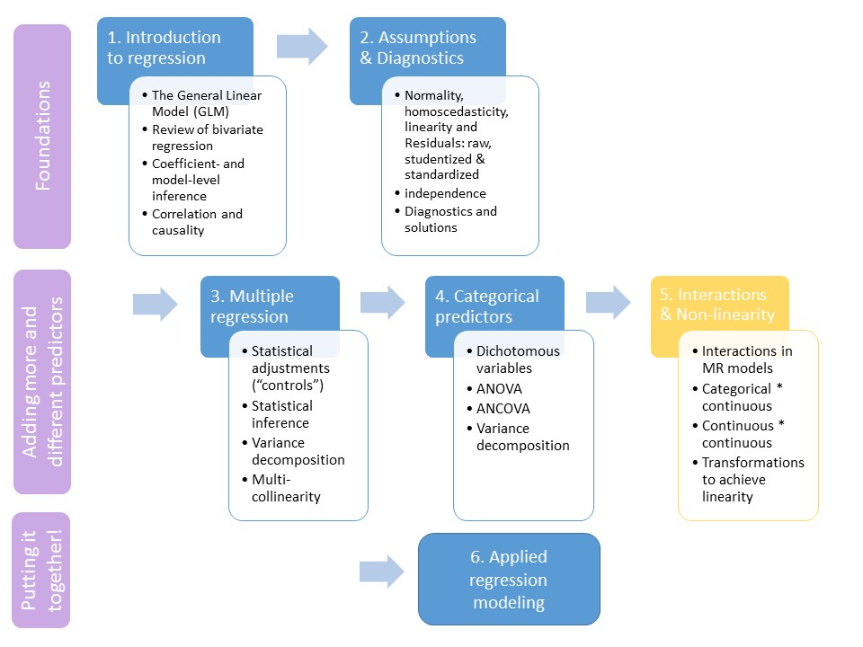
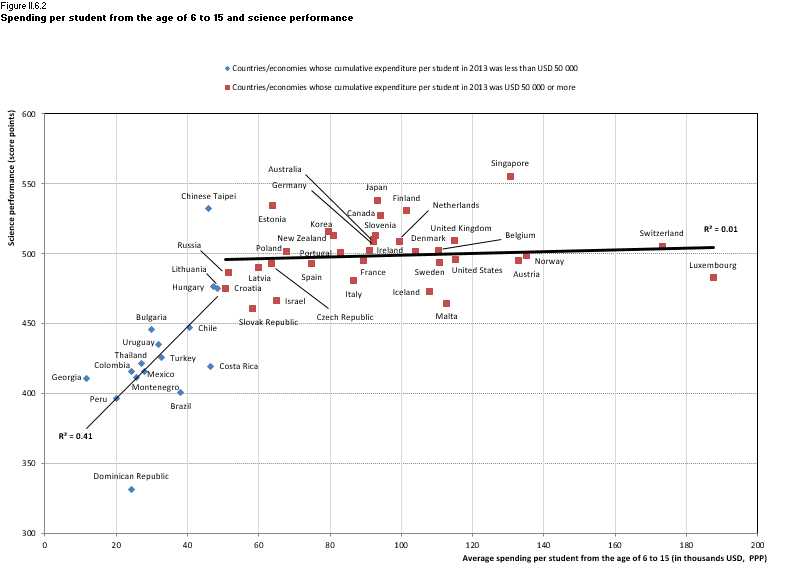
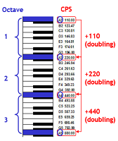
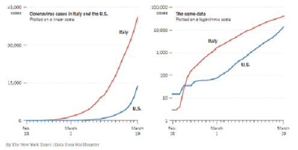
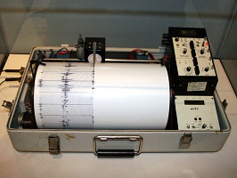
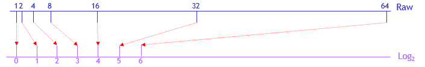
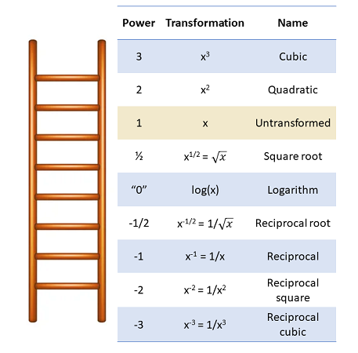
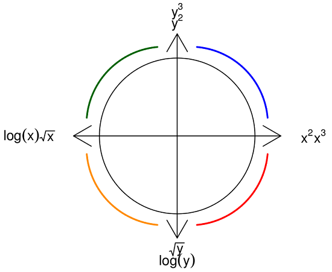

```{R, setup, include = F}
library(pacman)
p_load(here, tidyverse, xaringan, knitr, kableExtra, haven, broom, xaringanthemer, reshape2, car, modelsummary)

i_am("slides/EDUC643_16_nonlinearity.Rmd")


red_pink <- "#e64173"
turquoise = "#20B2AA"
orange = "#FFA500"
red = "#fb6107"
blue = "#3b3b9a"
green = "#8bb174"
grey_light = "#B3B3B3"
grey_mid = "#7F7F7F"
grey_dark = "grey20"
purple = "#6A5ACD"
slate = "#314f4f"

extra_css <- list(
  ".red"   = list(color = "red"),
  ".blue"  =list(color = "blue"),
  ".red-pink" = list(color= "#e64173"),
  ".gray" = list(color= "#B3B3B3"),
  ".purple" = list(color = "purple"),
  ".orange" = list(color = "#FFA500"),
  ".small" = list("font-size" = "90%"),
  ".large" = list("font-size" = "120%"),
  ".tiny" = list("font-size" = "75%"),
  ".tiny2" = list("font-size" = "60%"))


write_extra_css(css = extra_css, outfile = "my_custom.css")

options(htmltools.dir.version = FALSE)

hook_output <- knit_hooks$get("output")
knit_hooks$set(output = function(x, options) {
  lines <- options$output.lines
  if (is.null(lines)) {
    return(hook_output(x, options))  # pass to default hook
  }
  x <- unlist(strsplit(x, "\n"))
  more <- "..."
  if (length(lines)==1) {        # first n lines
    if (length(x) > lines) {
      # truncate the output, but add ....
      x <- c(head(x, lines), more)
    }
  } else {
    x <- c(more, x[lines], more)
  }
  # paste these lines together
  x <- paste(c(x, ""), collapse = "\n")
  hook_output(x, options)
})

knitr::opts_chunk$set(warning = FALSE,
                      message = FALSE,
                      echo = FALSE,
                      fig.align = "center",
                      fig.height = 6.5,
                      fig.width = 10)


```

# Roadmap
```{r, echo=F, out.width="90%"}



```

---
# Goals of the unit

- Describe in writing and verbally the assumptions we violate when we fit a non-linear relationship with a linear model
- Transform non-linear relationships into linear ones by using logarithmic scales 
- Estimate regression models using logarithmic scales and interpret the results
- Estimate models with quadratic and higher-order polynomial terms (special kinds of interactions)
- Select between transformation options

---
class: middle, inverse

# Non-linearity

---
# $ and learning
```{r}
pisa <- read.csv(here("data/pisa.csv")) %>% select(c("Country", "total_spending", "read_score"))
pisa$total_spending <- as.numeric(gsub(",", "", pisa$total_spending))

lin <- ggplot(pisa, aes(total_spending, read_score)) + 
          geom_point() +
          theme(panel.background = element_rect(fill = 'lightblue', colour = 'lightblue'),
          plot.background = element_rect(fill = "lightblue"),
          panel.grid.major = element_blank(), panel.grid.minor = element_blank(),
          axis.line = element_line(size = .6, colour = "black")) +
          ylim(300, 600) +
          ylab("PISA reading score (2018)") + xlab("Total spending, age 6-15 ($)") + 
          scale_x_continuous(label=scales::comma)
lin
```

---
# $ and learning
```{r}
lin + 
      geom_smooth(method='lm', se=F)
```

---
# $ and learning
```{r}
lm_eqn <- function(pisa){
    m <- lm(read_score ~ total_spending, pisa);
    eq <- substitute(italic(y) == a + b %.% italic(x)*","~~italic(r)^2~"="~r2, 
         list(a = format(unname(coef(m)[1]), digits = 2),
              b = format(unname(coef(m)[2]), digits = 2),
             r2 = format(summary(m)$r.squared, digits = 3)))
    as.character(as.expression(eq))
}

lin + 
      geom_smooth(method='lm', se=F) +
      geom_text(x = 275000, y = 500, label = lm_eqn(pisa), parse=TRUE)
```

--
.small[***If assumptions hold***, each $10,000 diff in total spending associated, on average, with 4.3 scale score point difference in reading scores.]

--
.small[.blue[**But do they?**]]

---
# Linear?
```{r, echo=T, fig.height=4}
# Fit the model
fit <- lm(read_score ~ total_spending, data=pisa)
# Generate residual vs fitted plot
pisa$resid <- resid(fit)
pisa$fitted <- fitted(fit)
ggplot(pisa, aes(fitted, resid)) + geom_point() +
  geom_hline(yintercept = 0, color = "red", linetype="dashed")
```

---
```{r}

```

---
# Make it nice

--
```{r}
library(ggflags)
library(countrycode)
pisa$iso2 <- countrycode::countrycode(pisa$Country, "country.name", "iso2c")
    pisa$iso2 <- tolower(pisa$iso2)

flag <- ggplot(pisa, aes(total_spending, read_score)) + 
    geom_point() + geom_flag(aes(country=iso2), show.legend=F) +
    theme(panel.background = element_rect(fill = 'lightblue', colour = 'lightblue'),
          plot.background = element_rect(fill = "lightblue"),
          panel.grid.major = element_blank(), panel.grid.minor = element_blank(),
          axis.line = element_line(size = .6, colour = "black")) +
    ylim(300,600) +
    ylab("PISA reading score") + xlab("Total spending, age 6-15 ($)") + 
    scale_x_continuous(label=scales::comma)

flag
```

--
At low levels of spending the relationship between ***total_spending*** and ***read_score*** has a big magnitude. At higher levels of spending, it seems much more modest (negative?).

---
# Piecewise
```{r}
flag +
    geom_smooth(method='lm', data=subset(pisa, total_spending<50000), se=F, color='black') +
    geom_smooth(method='lm', data=subset(pisa, total_spending>=50000), se=F, color='black')
```

---
# Piecewise
```{r}
flag +
    geom_smooth(method='lm', data=subset(pisa, total_spending<50000), se=F, color='black') +
    geom_smooth(method='lm', data=subset(pisa, total_spending>=50000), se=F, color='black', linetype='dotted') +
    geom_smooth(method='lm', data=subset(pisa, total_spending>=50000 & iso2!="qa"), se=F, color='black')
```
---
# Piecewise
```{r}
flag +
    geom_smooth(method='lm', data=subset(pisa, total_spending<50000), color='black') +
    geom_smooth(method='lm', data=subset(pisa, total_spending>=50000), color='black', linetype='dotted') +
    geom_smooth(method='lm', data=subset(pisa, total_spending>=50000 & iso2!="qa"), color='black')
```

---
# Piecewise
While it is true, as we've said before that .red-pink[*locally all relationships are linear*], we've identified some emerging issues:

.small[
- Cut points arbitrary and these choices may substantially alter nature of observed relationship
- With large data "eyeballing" linear sub-segments impossible
- Increasing loss of power (larger standard errors and confidence intervals, greater influence of outliers)
- .red-pink[**Overfitting**] risks increase
  + Analysis conforms to particularly to your specific data, but generalizes poorly to population of inference
]

--
```{r, fig.height=3}
flag + 
  geom_smooth(se=F, span=.1)
```

--
**Solutions**: transformations and polynomials

---
class: middle, inverse

## Logarithmic transformations in X

---
# Log transformations

- We can posit a .red-pink[**non-linear relationship**] between X and Y *in the population*
- Any non-linear relationship implies that the relationship between X and Y is relative to a particular value of X and/or Y, not absolute (the slope is non-constant)
- .red-pink[**Transformations**] (i.e., spreading out in some cases and compressing in others the values of our X and Y variables) allow us to fit non-linear relationships within the existing machinery of the general linear model

---
# Log transformations in life

.pull-left[
```{r}

```
$\uparrow$ .small[1 octave = doubling of cycles-per-second]

```{r}

```
]

.pull-right[
```{r}

```
.tiny2[
| Seismic-wave amplitude  | Location              | Richter Scale
|------------------------------------------------------------------
| 1,000,000               | Christchurch, 2010    | 6.0
| 10,000,000              | Port-au-Prince, 2010  | 7.0
| 100,000,000             | Sichuan, 2008         | 8.0
| 1,000,000,000           | Sumatra, 2004         | 9.0
]
$\uparrow$ .small[1 Richter = 10x] $\uparrow$ .small[SWA]
]

---
# A log `r emo::ji("wood")` you say??

Logs are the function we can perform to "undo" raising a number to a power. If a number is equal to a base raised to a power $(x = base^{power})$, then a logarithim of a given base is the number you would have to raise to that power to get $x$:

.pull-left[
**Exponents**

$10 = 10^1$

$100=10^2$

$1,000 = 10^3$

$10,000 = 10^4$

$100,000 = 10^5$
]

.pull-right[
**Logarithms**

$\text{log}_{10}(10)=1$

$\text{log}_{10}(100)=2$

$\text{log}_{10}(1,000)=3$

$\text{log}_{10}(100,000)=4$

$\text{log}_{10}(100,000)=5$
]

--

Each 1 unit increase in a base-10 logarithm represents a 10-fold increase in $x$.

--
Can have logarithms of different base.

---
# A log `r emo::ji("wood")` you say??

Logs are the function we can perform to "undo" raising a number to a power. If a number is equal to a base raised to a power $(x = base^{power})$, then a logarithim of a given base is the number you would have to raise to that power to get $x$:

.pull-left[
**Exponents**

$2 = 2^1$

$4 = 2^2$

$8 = 2^3$

$16 = 2^4$

$32 = 2^5$
]

.pull-right[
**Logarithms**

$\text{log}_{2}(2)=1$

$\text{log}_{2}(4)=2$

$\text{log}_{2}(8)=3$

$\text{log}_{2}(16)=4$

$\text{log}_{2}(32)=5$
]


--

Each 1 unit increase in a base-2 logarithm represents a doubling of $x$.

--

Can say this as: “Log base 2 of 32 is 5” or “Log base 10 of 1,000 is 3”

---
# Understanding logs

```{r}

```

--

**Some key concepts:**
- Taking logs spreads out the distance between small (closer to 0) values and compresses the distance between large (further from zero) values.
- Log base anything(1) is = 0
- Log base anything(0) is undefined (can't raise anything to a power and get 0)
- Log base anything>0(negative number) is undefined (technically a complex number)
- Taking logs is a .red-pink[**monotonic**] transformation; doesn’t change the order of any of the underlying raw values


---
# $ and scores?
Let's try transforming our X variable (*total_spending*) on a logarithmic scale; can do this directly in our plot:
```{r, echo=T}
log_flag <- flag +
              xlab("Total spending, age 6-15 (Log10 $)") +
              scale_x_log10(breaks=c(10000, 50000, 100000, 300000), 
                            label=scales::comma)
```

---
# $ and scores?
Let's try transforming our X variable (*total_spending*) on a logarithmic scale; can do this directly in our plot:
```{r}
log_flag
```

---
# $ and scores?
Let's try transforming our X variable (*total_spending*) on a logarithmic scale; can do this directly in our plot:
```{r}
log_flag +
    geom_smooth(method='lm')
```

---
## Regress read on $\text{log}_{10}(spend)$
```{r, echo=T}
summary(lm(read_score ~ log10(total_spending), data=pisa))
```

---
# Conceptually

.pull-left[
```{r}
lin + 
      geom_smooth(method='lm', se=F) +
      geom_text(x = 275000, y = 500, label = lm_eqn(pisa), parse=TRUE)
```
$$\hat{READ}_j = 428+0.00043 \times SPEND_j$$

]

.pull-right[
```{r}
log_eqn <- function(pisa){
    m <- lm(read_score ~ log10(total_spending), pisa);
    eq <- substitute(italic(y) == a + b %.% italic(x)*","~~italic(r)^2~"="~r2, 
         list(a = format(unname(coef(m)[1]), digits = 2),
              b = format(unname(coef(m)[2]), digits = 2),
             r2 = format(summary(m)$r.squared, digits = 3)))
    as.character(as.expression(eq))
}

log <- ggplot(pisa, aes(total_spending, read_score)) + 
          geom_point() +
          theme(panel.background = element_rect(fill = 'lightblue', colour = 'lightblue'),
          plot.background = element_rect(fill = "lightblue"),
          panel.grid.major = element_blank(), panel.grid.minor = element_blank(),
          axis.line = element_line(size = .6, colour = "black")) +
          ylim(300, 600) +
          ylab("PISA reading score (2018)") + xlab("Total spending, age 6-15 (Log10 $)") + 
          scale_x_log10(breaks=c(10000, 50000, 100000, 300000), label=scales::comma) +
          geom_smooth(method='lm', se=F) +
          geom_text(x = 5.4, y = 500, label = log_eqn(pisa), parse=TRUE)
log
```

$$10^{\hat{READ}_j} = 10^{-78.03} + SPEND_{j}^{112.74}$$

$$\hat{READ}_j = -78.03 + 112.74 \times \text{log}_{10}(SPEND_j)$$

]

--

- In ed/dev psych this kind of curve is called “learning curve”; represents standard rate of learning
- More broadly, increasing exponential decay or diminishing marginal returns

---
# Interpret
```{r, fig.height=4.5}
log_flag +
    geom_smooth(method='lm') +
    geom_text(x = 5.4, y = 490, label = log_eqn(pisa), parse=TRUE)
```

**Some alternative ways to describe this relationship:**
.tiny[
- Average reading scores in the population of countries sitting for the 2018 PISA reading test were 112.7 points higher for every ten-fold increase in cumulative educational spending on children aged 6-15.
- As cumulative education spending on children aged 6-15 is ten times higher, reading scores in the population of countries sitting for the 2018 PISA reading test were 112.7 points higher, on average.
- We predict that two countries that spend an order of magnitude (e.g., $10,000 vs. $100,00) apart on cumulative educational expenditures on children aged 6-15 will have PISA reading scores 112.7 points apart.
]

---
class: middle, inverse

# Log transformations in Y

## aka Exponential growth curve

---
# GDP and PPE
```{r}
oecd <- readxl::read_excel(here("data/oecd_2022.xlsx")) %>% filter(country!="Luxembourg" & country!="Ireland")

oecd$iso2 <- countrycode::countrycode(oecd$country, "country.name", "iso2c")
    oecd$iso2 <- tolower(oecd$iso2)

ppe <- ggplot(oecd, aes(x=gdp, y=ppe)) + 
    geom_point() + geom_flag(aes(country=iso2), show.legend=F) +
    theme(panel.background = element_rect(fill = 'lightblue', colour = 'lightblue'),
          plot.background = element_rect(fill = "lightblue"),
          panel.grid.major = element_blank(), panel.grid.minor = element_blank(),
          axis.line = element_line(size = .6, colour = "black")) +
    ylab("Total expenditure on primary to tertiary ed per student") + xlab("GDP per capita") + 
    ylim(2000, 23000) +
    scale_x_continuous(label=scales::comma)

ppe
```

---
# GDP and PPE
```{r}
ppe +
  geom_smooth(method='lm')
```

---
# An alternative model

The relationship of GDP and PPE are relative to their respective values. The relationship has a higher magnitude when GDP per capita is smaller and a smaller magnitude when GDP per capita is smaller.

--
Can use a log transformation to capture the non-absolute (non-constant) nature of the slope:

$$PPE_j = \beta_0 * 2^{(\beta_1 GDP_j + \varepsilon)}$$

$$\text{log}_2(PPE_j) = \text{log}_2 \beta_0 + \beta_1 GDP_j + \varepsilon$$
---
# Interpreting this

Can interpret log outcomes as percent changes because:
$$Y_1 = \beta_0 2^{\beta_1 X_1}$$
$$Y_2 = \beta_0 2^{\beta_1(X+1)} = \beta_0 2^{\beta_1 X} 2^{\beta_1}$$

$$\frac{Y_2}{Y_1} = \frac{\beta_0 2^{\beta_1 X} 2^{\beta_1}}{\beta_0 2^{\beta_1 X}} = 2^{\beta_1}$$

So, $Y_2$ is $2^{\beta_1}$ times larger than $Y_1$!

--
Depends on key properties of logs:
- log(xy) = log(x) + log(y)
- $\text{log}(x^p)$ = p*log(x)

--

.red-pink[**Percent growth rate**] = $\large 100(2^{\beta_1} - 1)$

.small[Regress log(Y) on X and substitute the estimated slope into the equation for the percent growth rate to obtain the estimated percent growth rate per unit change in X.]

$Y_2 = 2^{\beta_1} Y_1$ is the same thing as saying the percent growth rate is $100(2^{\beta_1} - 1)$


---
# Visualized Y transformation
```{r, echo=T}
oecd$log2ppe <- log2(oecd$ppe)

log_ppe <- ggplot(oecd, aes(x=gdp, y=log2ppe))

```

---
# Visualized Y transformation
```{r}
log_ppe +  
    geom_point() + geom_flag(aes(country=iso2), show.legend=F) +
    theme(panel.background = element_rect(fill = 'lightblue', colour = 'lightblue'),
          plot.background = element_rect(fill = "lightblue"),
          panel.grid.major = element_blank(), panel.grid.minor = element_blank(),
          axis.line = element_line(size = .6, colour = "black")) +
    ylab("Log2 total expenditure per student") + xlab("GDP per capita") + 
    scale_x_continuous(label=scales::comma) +
    ylim(12, 15) +
    geom_smooth(method='lm')
```

---
## Regress $\text{log}_{2}(ppe)$ on gdp
```{r, echo=T, output.lines=-c(1:4)}
summary(lm(log2(ppe) ~ gdp, oecd))
```

--
**Percent growth rate**: $100(2^{0.000039} - 1) = 0.0027\%$ ; for each $1 more of GDP per person, PPE is 0.0027% higher; or for each $1,000 more of GDP per person, PPE is 2.7% higher

---
# Interpreting log Y results
```{r, fig.height=4.5}
log_ppe +  
    geom_point() + geom_flag(aes(country=iso2), show.legend=F) +
    theme(panel.background = element_rect(fill = 'lightblue', colour = 'lightblue'),
          plot.background = element_rect(fill = "lightblue"),
          panel.grid.major = element_blank(), panel.grid.minor = element_blank(),
          axis.line = element_line(size = .6, colour = "black")) +
    ylab("Log2 total expenditure per student") + xlab("GDP per capita") + 
    scale_x_continuous(label=scales::comma) +
    ylim(12, 15) +
    geom_smooth(method='lm')
```
$$\text{log}_2 (\hat{PPE}_j) = 11.8 + 0.000039 * GDP_j$$

> Per capita gross domestic product (GDP) is a strong predictor of yearly per-student expenditure from primary through tertiary education. In particular, if we compare two countries whose GDPs differ by $1,000, we would predict that the wealthier country would have per pupil expenditure that is 2.7 ***percent*** higher than the country with the smaller economy.

---
class: middle, inverse

# Log-log transformations

## aka proportional growth


---
# Which `r emo::ji("wood")` to harvest?

- Could theoretically select a log of any base to transform outcome or predictor or both to a linear relationship
- Much more sensible to restrict yourself to base_10, base_2 or the .red-pink[**natural log**]; comes from Euler's number $(e)$
  
$$e = \lim_{n \to \infty}(1 + \frac{1}{n})^n \approx 2.718281828459...$$ 

- .red-pink[**Natural log**]: $\text{log}_{2.718...}(x) = \text{log}_e(x) = \text{ln}(x)$

---
# All the countries
```{r}
oecd2 <- readxl::read_excel(here("data/oecd_2022.xlsx"))

oecd2$iso2 <- countrycode::countrycode(oecd2$country, "country.name", "iso2c")
    oecd2$iso2 <- tolower(oecd2$iso2)

ggplot(oecd2, aes(x=gdp, y=ppe)) + 
    geom_point() + geom_flag(aes(country=iso2), show.legend=F) +
    theme(panel.background = element_rect(fill = 'lightblue', colour = 'lightblue'),
          plot.background = element_rect(fill = "lightblue"),
          panel.grid.major = element_blank(), panel.grid.minor = element_blank(),
          axis.line = element_line(size = .6, colour = "black")) +
    ylab("Total expenditure on primary to tertiary ed per student") + xlab("GDP per capita") + 
    scale_x_continuous(label=scales::comma)
```

---
# Log-log transformations
```{r, echo=T}
oecd2$lngdp <- log(oecd2$gdp)
oecd2$lnppe <- log(oecd2$ppe)

ln_ppe <- ggplot(oecd2, aes(x=lngdp, y=lnppe))
```

---
# Log-log transformations
```{r}
ln_ppe +
    geom_point() + geom_flag(aes(country=iso2), show.legend=F) +
    theme(panel.background = element_rect(fill = 'lightblue', colour = 'lightblue'),
          plot.background = element_rect(fill = "lightblue"),
          panel.grid.major = element_blank(), panel.grid.minor = element_blank(),
          axis.line = element_line(size = .6, colour = "black")) +
    ylab("Ln(Expenditure per student)") + xlab("Ln(GDP per capita)") + 
    geom_smooth(method='lm')
```

---
## Regress $\text{ln}(ppe)$ on $\text{ln}(gdp)$
```{r, echo=T, output.lines=-c(1:4)}
summary(lm(log(ppe) ~ log(gdp), oecd2))
```

--
$$\hat{LnPPE}_j = -0.39 + 0.91 * LnGDP_j$$

---
# Interpreting this

Can interpret log-log relationships in percent terms. $\color{red}{\beta_1}$ .red-pink[**represents the % change in Y per 1% change in X.**]


.pull-left[
.small[**Postulated model:**]
- $Y = \beta_0 X^{\beta_1}e^{\varepsilon}$
- $\text{ln}(Y) = \text{ln}(\beta_0 X^{\beta_1}e^{\varepsilon})$
- $\text{ln}(Y) = \text{ln}(\beta_0) + \text{ln}(X^{\beta_1}) + \text{ln}(e^{\varepsilon})$
- $\text{ln}(Y) = \text{ln}(\beta_0) + \beta_1 \text{ln}(X) + \varepsilon$
]

.pull-right[
.small[**Imagine $Y_1$ and $Y_2$ are 1% (or 0.01) apart**:]
- $Y_1 = \beta_0 X^{\beta_1}$
- $Y_2 = \beta_0(1.01X)^{\beta_1} = \beta_0 X^{\beta_1}(1.01)^{\beta_1}$
- $\frac{Y_2}{Y_1} = \frac{\beta_0 X^{\beta_1}}{\beta_0 X^{\beta_1}} = (1.01)^{\beta_1}$

So $Y_2$ is $(1.01)^{\beta_1}$ times larger than $Y_1$
]

--

Regress ln(Y) on ln(X) and the slope estimate is the estimated percent difference in Y per 1 percent difference in X

---
# Interpret log-log relationship
```{r, echo=T, output.lines=-c(1:4), output.highlight=8}
summary(lm(log(ppe) ~ log(gdp), oecd2))
```

--
"1 percent change in GDP predicts 0.91 percent change in PPE"

---
# Interpret log-log relationship
```{r, fig.height=4.5}
ln_ppe +
    geom_point() + geom_flag(aes(country=iso2), show.legend=F) +
    theme(panel.background = element_rect(fill = 'lightblue', colour = 'lightblue'),
          plot.background = element_rect(fill = "lightblue"),
          panel.grid.major = element_blank(), panel.grid.minor = element_blank(),
          axis.line = element_line(size = .6, colour = "black")) +
    ylab("Ln(Expenditure per student)") + xlab("Ln(GDP per capita)") + 
    geom_smooth(method='lm')
```
$$\text{ln}(\hat{PPE}_j) = \text{ln}(\beta_0) + \beta_1 \text{ln}(GDP_j) + \varepsilon$$
> We predict that, on average, comparing two countries with GDP per capita separated by 1 percent the wealthier country will spend 0.91 percent more on its pupils across primary through tertiary education. 

---
## "Forbidden" log transformations
So far, we've been dealing with situations in which all the variables we needed to transform were non-zero. In fact this is often not the case:
```{r, fig.height=5}
do <- read_spss(here("data/male_do_eating.sav")) %>% 
    select(OE_frequency, EDEQ_restraint, EDS_total,
           BMI, age_year, income_group) %>%
    mutate(EDS_total = ifelse(EDS_total==-99, NA, EDS_total)) %>%
    drop_na()
do <- rownames_to_column(do, "id")
ggplot(data=do, aes(OE_frequency)) + geom_bar()
```

--
Many other instances: counts of behaviors, individual income, absences, scale scores, etc.

---
## "Forbidden" log transformations

Traditional approach: 
- Add a small "starter" value to all raw values (+1, +0.1, +0.01, +0.001, etc.)
- Take log of this .red-pink[**"zero-inflated"**] variable

.red[**DO NOT DO THIS!!!**]

- Value selected for starter and proportion of 0s in your data can results in wildly inconsistent coefficient estimates
- You'll address this issue in EDUC 645 with Poisson regression

---
```{r, fig.height=5}
set.seed(123)
x <- seq(0, 100)
y1 <- log2(x) + rnorm(length(x), 0, 0.5)
y2 <- x^3 + rnorm(length(x), 0, 25000)
y3 <- 8*log(23*x-31) - 16 + rnorm(length(x), 0, 1)
quad <- cbind.data.frame(x, y1, y2, y3)

g1 <- ggplot(quad, aes(x, y1)) +
          geom_point() +
          theme_minimal(base_size = 14) +
          theme(axis.title.x = element_blank(), axis.title.y = element_blank(), axis.text.y = element_blank()) +
          ggtitle("Diminishing marginal returns")

g2 <- ggplot(quad, aes(x, y2)) +
          geom_point() +
          theme_minimal(base_size = 14) +
          theme(axis.title.x = element_blank(), axis.title.y = element_blank(), axis.text.y = element_blank()) +
          ggtitle("Exponential growth")

g3 <- ggplot(quad, aes(x, y3)) +
          geom_point() +
          theme_minimal(base_size = 14) +
          theme(axis.title.x = element_blank(), axis.title.y = element_blank(), axis.text.y = element_blank()) +
          ggtitle("Proportional growth")

```

.pull-left[
```{r, fig.height=3, fig.width=4}
g1
```
.small[
- Regress Y on log(X)
- $Y = \hat{\beta_0} + \hat{\beta_1}\text{log}(X)$
- "every doubling (or whatever base) of X associated with $\hat{\beta_1}$ diff in Y"
]
]

.pull-right[
```{r, fig.height=3, fig.width=4}
g2
```
.small[
- Regress log(Y) on X
- $\text{log}(Y) = \hat{\beta_0} + \hat{\beta}_1 X$
- Every 1 unit diff in X associated with $100(e^{\hat{\beta_1}} - 1)$ % diff in Y
]
]

--
```{r, fig.height=2.75, fig.width=5}
g3
```
.small[
- Regress log(Y) on log(X)
- $\text{log}(Y) = \hat{\beta_0} + \hat{\beta_1}\text{log}(X)$
- Every 1% diff in X associated with $\hat{\beta_1}$ percent diff in Y
]


---
class: middle, inverse

# Quadratic terms: a special kind of interaction


---
# Quadratic model
```{r, fig.height=4}
set.seed(123)
x <- seq(-100, 100)
y1 <- x^2 + rnorm(length(x), 0, 1000)
y2 <- 2 + 1.2*x - 0.1*x^2 + rnorm(length(x), 0, 400)
quad <- cbind.data.frame(x, y1, y2)


g1 <- ggplot(quad, aes(x, y1)) +
          geom_point() +
          theme_minimal(base_size = 14) +
          theme(axis.title.x = element_blank(), axis.title.y = element_blank(), axis.text.y = element_blank()) 
g2 <- ggplot(quad, aes(x, y2)) +
          geom_point() +
          theme_minimal(base_size = 14) +
          theme(axis.title.x = element_blank(), axis.title.y = element_blank(), axis.text.y = element_blank()) 


gridExtra::grid.arrange(g1, g2, nrow = 1)
```

Effects of a predictor can differ by that predictor:
$$Y = \beta_0 + \beta_1 X_1 + \beta_2 (X_1 * X_1) + \varepsilon$$

$$Y = \beta_0 + \beta_1 X_1 + \beta_2 X_1^2) + \varepsilon$$

--

Can point upwards or downwards, but **all quadratic relationships are .red-pink[non-monotic]; the relationship both rises and falls (or falls and rises)**

---
# A quadratic relationship
```{r}
flag
```

--

.blue[**Which direction will the quadratic line of best fit point?**]

---
# A quadratic relationship
```{r}
flag + 
  geom_smooth(method='lm', formula = y ~ x + poly(x, 2), se=F)

```

---
# A quadratic relationship
```{r}
flag + 
  geom_smooth(method='lm', formula = y ~ x + poly(x, 2))

```

--
We can represent quadratic fits mathematically in generic form: $y = \beta_0 + \beta_1 x + \beta_3 x^2$.

--
.blue[**Challenge: what signs will each of the three coefficients take for the above relationship?**]

---
# Fitting the quadratic
```{r, echo=T, output.lines=-c(1:4)}
summary(lm(read_score ~ poly(total_spending, 2), pisa))
```

--
Fitted equation: $\hat{read} = 460.0 + 177.7 * spend - 253.8 * spend^2$. 

--
.blue[**How do our model fit statistics compare to the linear version?**]

---
# Stay within the lines!

.pull-left[
```{r}
set.seed(123)
x <- seq(0, 100)
y1 <- x^2 + rnorm(length(x), 0, 1000)
quad <- cbind.data.frame(x, y1)


ggplot(quad, aes(x, y1)) +
          geom_point() +
          theme_minimal(base_size = 14) +
          theme(axis.title.x = element_blank(), axis.title.y = element_blank(), axis.text.y = element_blank())
```
]

.pull-right[
- Don't extrapolate the shape of the parabola to the left of the y-axis
- Shouldn't assume the y values will be higher to the left of the y-axis
]

---
class: middle, inverse

# Higher-order polynomials

---
# Cubics
.small[We needn't restrict ourselves to transformations to normality to only quadratic relationships. Many relationships, for example are cubic (third-power) in nature. Particularly true when there are measurement issues in the tails and/or floor/ceiling effects.]

.pull-left[
**Strong cubic**
```{r}
set.seed(123)
x <- seq(-100, 100)
y1 <- x^3 + rnorm(length(x), 0, 1000)
quad <- cbind.data.frame(x, y1)

ggplot(quad, aes(x, y1)) +
          geom_point() +
          theme_minimal(base_size = 20) +
          theme(axis.title.x = element_blank(), axis.title.y = element_blank(), axis.text.y = element_blank()) 
```
]

--

.pull-right[
**Our DIBELS data**
```{r}
dibels <- read.csv(here("data/dibels.csv"))
ggplot(dibels, aes(y1_boy_mean, y2_moy_mean)) +
        theme_minimal(base_size = 16) +
        geom_point(alpha=0.1) +
        geom_smooth(method='lm', formula = y ~ poly(x, 3))
```
]

--

$$\hat{W20\_ORF} = 62.3 + 2230*F19\_ORF + 4.2*F19\_ORF^2 - 182.0 * F19\_ORF^3$$


---
# Other approaches

.pull-left[
.small[
There are an infinite number of potentially effective transformations:
- Squares, cubes, quartic, quintics, ...
- Square roots, cube roots, fourth roots, ...
- Logarithms (of any base), antilogarithms
- Inverses
- Trigonometric functions
- Hyperbolic functions
- Combinations of above...
]
]

.pull-right[
.small[
Approaches to achieve local linearity:
- Splines
- Local estimated scatterplot smoothing (LOESS)
]
]

--

**Some emerging issues:**
```{r, fig.height=3.5}
flag +
    geom_smooth(method='lm', formula = y ~ splines::bs(x))
```

---
class: middle, inverse
# Synthesis and wrap-up


---
# Different approaches

.pull-left[
**Empirical approach**
.small[
- Notice presence of non-linearity in relationship
- Find an *ad-hod* transformation of either the predictor, the outcome, or both that renders the relationship linear
- Use OLS in the transformed world, and conduct inference there
- De-transform fitted model to produce sensible plots
]
]

--

.pull-right[
**Theory-driven approach**
.small[
- Use theory or knowledge from prior research to postulate a non-linear model
- Use non-linear regression (`nls` or other estimation packages) (part of the Generalized Linear Model family) to fit the postulated trend in the real world and conduct inference there
- Interpret parameter estimates directly
- **We are not learning how to do this, but worth exploring yourself**
]
]

---
# The Ladder and the Bulge

.pull-left[
.red-pink[**Tukey's Ladder**]
```{r}

```
]

.pull-right[
.red-pink[**Tukey's Bulge**]
```{r}

```
]

---
## Putting non-linearity together
.small[
- **Remember to check your linearity assumption**
   + Use bivariate scatter plots
   + Use residual and Q-Q plots to diagnose
- **Make sensible transformations**
   + Logarithmic, inverse, root and other functions can allow a return to a world of linearity and permit you to use the GLM tools of OLS to estimate non-linear relationships
   + Best to use transformations that are the most straightforward to interpret
   + Use Tukey's Bulge to guide what kind of transformation you will attempt
   + There is no one "right" transformation for a given data shape
   + Start with transforming x before y
   + Do **NOT** use a "start" to log transform data that includes 0s
   + Inspect scatter plots post-transformation to check for success in linearizing
      - With large data, can be hard to see; consider binscatter options (by hand or `binsreg`)
- **Predictors can interact with themselves**
   + Quadratic and cubic models provide a flexible strategy for fitting non-linear models, especially those that cannot be linearized by logarithms
   + Be careful about overfitting and model instability with polynomials of order >3!
   + Quadratics and logs will often produce similar fitted lines; quadratic allows direct statistical test for non-linearity, logarithm may fit with theory better and/or can be more readily interpretable
]
---
# Goals of the unit

- Describe in writing and verbally the assumptions we violate when we fit a non-linear relationship with a linear model
- Transform non-linear relationships into linear ones by using logarithmic scales 
- Estimate regression models using logarithmic scales and interpret the results
- Estimate and interpret models with quadratic and higher-order polynomial terms (special kinds of interactions)
- Select between transformation options

---
# To-Dos

### Assignment 5:
- Due March 8, 11:59p

### Final
- Due March 23, 12:01p

### Re- (late) submissions
- Everything due March 17, 9:00a (no exceptions)
- Assignments with scores <10.8 only
- Earn up to 10.8
