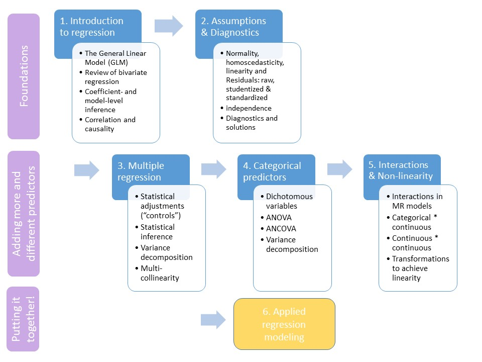

```{R, setup, include = F}
library(pacman)
p_load(here, tidyverse, xaringan, knitr, kableExtra, xaringanthemer, modelsummary)

i_am("slides/EDUC643_19_modeling.rmd")


red_pink <- "#e64173"
turquoise = "#20B2AA"
orange = "#FFA500"
red = "#fb6107"
blue = "#3b3b9a"
green = "#8bb174"
grey_light = "#B3B3B3"
grey_mid = "#7F7F7F"
grey_dark = "grey20"
purple = "#6A5ACD"
slate = "#314f4f"

extra_css <- list(
  ".red"   = list(color = "red"),
  ".blue"  =list(color = "blue"),
  ".red-pink" = list(color= "#e64173"),
  ".gray" = list(color= "#B3B3B3"),
  ".purple" = list(color = "purple"),
  ".orange" = list(color = "#FFA500"),
  ".small" = list("font-size" = "90%"),
  ".large" = list("font-size" = "120%"),
  ".tiny" = list("font-size" = "75%"),
  ".tiny2" = list("font-size" = "60%"))


write_extra_css(css = extra_css, outfile = "my_custom.css")

options(htmltools.dir.version = FALSE)

hook_output <- knit_hooks$get("output")
knit_hooks$set(output = function(x, options) {
  lines <- options$output.lines
  if (is.null(lines)) {
    return(hook_output(x, options))  # pass to default hook
  }
  x <- unlist(strsplit(x, "\n"))
  more <- "..."
  if (length(lines)==1) {        # first n lines
    if (length(x) > lines) {
      # truncate the output, but add ....
      x <- c(head(x, lines), more)
    }
  } else {
    x <- c(more, x[lines], more)
  }
  # paste these lines together
  x <- paste(c(x, ""), collapse = "\n")
  hook_output(x, options)
})

knitr::opts_chunk$set(warning = FALSE,
                      message = FALSE,
                      echo = FALSE,
                      fig.align = "center",
                      fig.height = 6.5,
                      fig.width = 10)


```
# Roadmap
```{r, echo=F, out.width="90%"}

```
---
# Unit goals

- Translate research questions into question predictors, covariates, outcomes and rival hypothesis predictors
- Develop work processes to address real life data which contain large number of predictors
- Build a logical and sequential taxonomy of fitted regression models
- Distinguish between model building and reporting, including best practices for research transparency, replicability and integrity
- Present results in publication-ready tables and figures
- Write compelling and scientifically accurate interpretation of results
- Describe power and limits of quantitative research

---
class: middle, inverse

# Taxonomies of regression models

---
## Automated model building strategies

1. All possible model subsets
2. Forward selection
   + start with **no** predictors and add them so that each maximally increases the $R^2$ statistic at that step
3. Backwards elimination
   + start with **all** predictors and drop them so that each minimally decreases the $R^2$ at that step
4. Stepwise regression
   + forward selection with backwards "glances" based on whether each subsequently added predictor is "significant"
   
--

**Probably a poor idea to use any of these:**
  + rely on functional form of starting variables being correct
  + don't consider interactions
  + don't honor principles such as including main effects with interactions
  + "black box"

> All models are wrong, but some are useful  - George E.P. Box


---
## Confirmatory vs. exploratory analysis

Automated model building strategies are tools of confirmatory hypothesis testing. Their goal is generate accurate estimates of $\hat{\beta}$. 

--
Again, these automated model building approaches are generally to be avoided.

--

There are a different set of modern automated model building approaches in the machine-learning family of techniques (neural networks, tree-based methods, penalized regression [ridge, LASSO, elastic net]). The goal of these approaches is **not** to generate accurate estimates of $\hat{\beta}$ but rather to improve the precision of the estimation of $\hat{Y}$. These sorts of algorithmic, automated approaches are just fine for this purpose. 

--

**Key distinction:**

.large[.purple[OLS vs. machine learning =]] $\Large \color{purple}{\hat{\beta}}$ .purple[vs.] $\Large \color{purple}{\hat{Y}}$

---
# Swimming in data

Let's review how we've approached assignments in this class:
1. Describe the measures of central tendency and distribution of outcome and predictor(s)
2. Examine scatterplots of the outcome vs. each predictor, transforming to achieve linearity as necessary
3. Examine estimated correlation matrix and/or heatmap to foreshadow concerns about multicollinearity
4. Thoughtfully fit a sequence of OLS estimates, starting with the bivariate relationship and progressing to a multivariate one
5. Examine the series to select a "preferred" model that provides the best model fit, comports to the theorized set of important adjustments you would like to make, and accurately summarizes the findings

--

**BUT** with more than 5 or 6 covariates, model building (steps 3 and 4) becomes unwieldly...

--
.blue[**what do we do??!!?**]
> The hallmark of good science is that it uses models and "theory" but never believes them  - Martin Wilk


---
# Conceptual simplification
.small[Before starting analysis, place variables into five conceptual groups based on knowledge of the substantive topic you are investigating, prior theory, and your research questions(s):]
.pull-left[
.tiny[
1. **Outcome(s)**
2. **Question predictor(s)**
3. **Key covariates**
    - Variables that are clearly strong determinants of the outcome (e.g., grade level and DIBELS score)
4. **Additional covariates**
    - Other covariates that may be related to outcome and/or predictor, but may also be closely correlated to "key" covariates and/or each other (e.g., sesavgall and lninc50avgall)
5. **Rival hypothesis ("mediator") predictor(s)**
    - If relevant, these are variables that may explain most or all of the relationship between predictor and outcome (e.g, real estate tax base)
]
]

--
.pull-right[
.tiny[
1. Determine need for **transformation** of variables
   + Start with $x$ transformations, unless outcome v. question predictor relationship requires $y$ transformation
2. Pre-determine which **interactions** you will test, ***based on theory***
3. Start by estimating **bivariate relationship** between predictor and outcome
4. Construct **correlation matrix** of all variables, pay attention to high degree of multi-collinearity between all covariates and predictor/outcome
   + If multi-collinearity exists with additional covariates and key covariates, could exclude these for parsimony
5. **Add key covariates**, assessing whether primary question predictor coefficient changes
6. **Add additional covariates**, again assessing whether primary question predictor coefficient changes
7. Check **rival hypothesis ("mediator")** predictors
]
]

> .small[**Occam’s Razor**: *entia non sunt multiplicanda praeter necessitatem* ("entities must not be multiplied beyond necessity" *or* "the simplest explanation is usually the best one")  - William of Occam]

---
# Mediation analysis
.small[A third variable that "explains" why or how one predictor variable is related to the outcome]

```{r, fig.height=3}
dag1 <- ggdag::dagify(y ~ x + a,
                       a ~ x,
                     exposure = "x",
                     outcome = "y",
                     labels = c("x" = "Beef",
                         "y" = "Divorce",
                         "a" = "Year"),
                coords = list(x = c(x = 1, a = 2, y = 3),
                              y = c(x = 2, a = 3, y = 2))
                              )
ggdag::ggdag_status(dag1, use_labels = "label", text=F, text_size=6) +
  ggdag::theme_dag() + 
  guides(fill = F, color=F)
```

--

.small[
**Steps:**
1. Estimate relationship between primary question predictor and outcome
2. Check that potential rival hypothesis predictor ("mediator") is related to outcome
3. Add mediator to multiple regression model, check whether coefficient on primary question predictor is substantially attenuated or goes to zero
4. State that this is evidence that the relationship between the question predictor and outcome is "mediated" by the third variable  
   + aka, it is only indirectly related to the outcome via the third variable
   + aka, the rival hypothesis is the actual explanation for the relationship
   + aka, the third variable is the "mechanism" via which the first relationship occurs
]

---
# Mediation analysis
```{r, fig.height=2.5}
dag2 <- ggdag::dagify(y ~ x,
                     exposure = "x",
                     outcome = "y",
              labels = c("x" = "1/4 mile time",
                         "y" = "MPG"),
              coords = list(x = c(x=1, y=3),
                            y = c(x=2, y=2))
                            )
ggdag::ggdag(dag2, use_labels = "label", text=F, text_size = 6) +
  ggdag::theme_dag() + 
   guides(fill = F, color=F)
```

```{r, echo=T, output.lines = -c(1:8)}
summary(lm(mpg ~ qsec, data=mtcars))
```

---
# Mediation analysis
```{r, fig.height=2.5}
dag3 <- ggdag::dagify(y ~ x + a,
                       a ~ x,
                     exposure = "x",
                     outcome = "y",
                     labels = c("x" = "1/4 mile time",
                         "y" = "MPG",
                         "a" = "Engine type"),
                coords = list(x = c(x = 1, a = 2, y = 3),
                              y = c(x = 2, a = 3, y = 2))
                              )
ggdag::ggdag_status(dag3, use_labels = "label", text=F, text_size=6) +
  ggdag::theme_dag() + 
  guides(fill = F, color=F)
```

```{r, echo=T, output.lines=-c(1:8)}
summary(lm(mpg ~ qsec + vs, data=mtcars))
```

---
## Problems with mediation analysis
```{r, fig.height=5}
dag4 <- ggdag::dagify(y ~ x + a + b,
                       a ~ x + b,
                       b ~ x,
                     exposure = "x",
                     outcome = "y",
                     labels = c("x" = "1/4 mile time",
                         "y" = "MPG",
                         "a" = "Engine type",
                         "b" = "Weight"),
                coords = list(x = c(x = 1, a = 2, b = 1.5, y = 3),
                              y = c(x = 2, a = 3, b = 4, y = 2))
                              )
ggdag::ggdag_status(dag4, use_labels = "label", text=F, text_size=6) +
  ggdag::theme_dag() + 
  guides(fill = F, color=F)
```

--
.small[If your "mediator" is correlated with any other variable (observed or unobserved), then it is **not** the case that the mediator is the mechanism by which your predictor is "indirectly" related to your outcome. This is true both for mediation analysis in the OLS framework as well as with Structural Equation Modeling (SEM).]

--
.small[.red[**Proceed with caution!**] More to examine in SEM I/II (EDLD 633/634).]

---
# Reproducibility and integrity

1. Develop an analysis plan before touching your data
2. This can involve actual pre-registration (ideal) or simply a starting strategy to analyze your data
3. It is ok to deviate from pre-registration, but this needs to be clearly documented and stated in your manuscript
   + In experimental settings, there may still be reasons to deviate from pre-registration plan, but deviating is probably less acceptable
4. All data management and analysis steps should be present in your scripts and produce identical results to your manuscript. See guidance from [Social Science Data Editors](https://social-science-data-editors.github.io/guidance/)
   + In my opinion, it is still acceptable to do some post-hoc formatting of these results, but YMMV
5. .red-pink[**Remember, your goal is not to get stars!**]

---
# "Controlling for race" [sic]

To date, you may have noticed that despite the presence of school-level indicators of the proportion of students from different racial/ethnic backgrounds in our worked examples (e.g., DIBELS, NERD$), we have not used these variables. This is because .red-pink[**an indiscriminate use of ethno-racial variables in quantitative analysis can produce problematic interpretations and reify social injustice.**]

--

At the same time, there exists (in my opinion) some misconceived guidance floating around that one should *never* "control for race."

--

What is certainly true is that we should not just use any variable as a covariate because it's there and might explain some of our outcome variation (the "kitchen sink" approach).

---
# A QuantCrit perspective

.small[
> "*Model selection*: Think about why you are choosing certain variables to include in your model. A model can tell you how much variation is ‘explained’ by the variables you included, but it will not select the variables for you and each variable is not hermetically sealed from the rest of the world. For example, a model might include variables that control for Socio-economic Status (SES) and/or prior achievement. Remember that SES and prior achievement do not exist independent of racism. Students of color are generally overrepresented in lowresourced schools and tracks, and students in under-resourced schools have less experienced teachers, lower expectations, few role-models, among other inhibiting circumstances (Heitzeg, 2016; Brown, 2014). Thus, when you control for prior achievement and/or SES you can also think of it in a sense as ‘controlling’ for racist systems. In the UK, quantitative research that controls for ‘prior achievement’ at the age of eleven has been criticized for essentially disguising the effects of racism in early years education and elementary schooling and presenting it as if it is a deficit of the individual child, rather than an effect of the system (CRRE, 2021; Gillborn 2010)." <br> <br> - Castillo, W. & Gillborn, D. (2022). How to "QuantCrit": Practices and questions for education data researchers and users. (EdWorkingPapers: 22-546). Retrieved from Annenberg Institute at Brown University.
]


---
# Group-level variables

The estimates of the relationship between the average ethnic and racial composition of a unit and an outcome of interest should be properly interpreted as the ***global effects of social inequality***.

Adjusting for group-level ethnic and racial composition of a unit should be properly understand as an effort to examine the relationship of a particular "treatment" and a given outcome, ***independent of the ways in which this outcome differs across racial groups, which is a function of the global ways in which society privileges some groups at the expense of others***. 

--

Once we adjust for these group-level variables, the main effect of the treatment can be interpreted as the .pink-red[**"average treatment effect,"**] independent of different outcome levels across socially defined groups. 

--
If we want to understand the potentially different effects of the "treatment" for units with different group compositions, we can either subset our data or use interaction models.

--

Generally, if we keep in mind the correct interpretation of our results, these are appropriate adjustments to incorporate.

---
# Individual variables

.small[
Adjusting for an individual's race/ethnicity (or other identity-based characteristic) requires a thoughtful consideration of intent and interpretation (by yourself and others). 

**As a primary question predictor:**
- Coefficients on individual identity characteristics have **no causal interpretation** (we cannot assign individuals to a different racial identity)
- These coefficients may contain **descriptive information** on the global effects of membership in this racially minoritized group
   + May contain information about direct discrimination and other factors generating this "statistical discrimination" (e.g., unequal education opportunities across racial identities)
- Consider how others may interpret these estimates in ways different than your intent
   + Can easily be interpreted as evidence of individual-level identity-based differences without considering the unobserved societal-level factors driving them (aka, discrimination)
]

---
# Individual variables

.small[
Adjusting for an individual's race/ethnicity (or other identity-based characteristic) requires a thoughtful consideration of intent and interpretation (by yourself and others). 


**As a covariate:**
- Adjusting for the identity-based covariates can be a helpful mechanism to understand the average effect of a particular treatment
   + E.g., if we want to understand the effects of high-dosage tutoring on students' academic achievement, but we want to account for the fact that some children are systematically excluded from high-quality ECE and as a result have lower baseline test scores, this approach can be helpful
- However, including an identity-based covariate without incorporating moderation tests (interactions) may mask meaningful differences in the efficacy of the treatment
- Can lead to sloppy thinking by not centering race as the primary mechanism behind the outcome and instead relegating it to a table footnote
]

---
class: middle, inverse

# Result presentation

---
# A NERD$ taxonomy
```{r}
nerds <- read.csv(here("data/nerds.csv"))

# Recoding level and locale to factor variables
nerds$level <- as.factor(nerds$level) %>%
                      relevel(ref="Elementary")
nerds$locale <- as.factor(nerds$locale)
nerds <- nerds %>% mutate(rural = ifelse(locale=="Rural", 1, 0))
```

.pull-left[
.small[
**Outcome:** *ppe*

**Question Predictor:** *frpl*

**Key covariate:** *enroll*
]
]

.pull-right[
.small[
**Add'l covariates:** *sesavgall*, *lnincavgall*, *level*

**Rival hypothesis:** *rurality*
]
]

--

```{r, echo=T}
fit1 <- lm(ppe ~ frpl, nerds)

fit2 <- lm(ppe ~ frpl + I(frpl^2), nerds)

fit3 <- lm(ppe ~ frpl + I(frpl^2) + enroll, nerds)

fit4 <- lm(ppe ~ frpl + I(frpl^2) + enroll + sesavgall + lninc50avgall+
                  as.factor(level), nerds)

fit5 <- lm(ppe ~ frpl + I(frpl^2) + rural + enroll + sesavgall + 
                  lninc50avgall + as.factor(level), nerds)

fit6 <- lm(ppe ~ frpl * rural + I(frpl^2) * rural + enroll + sesavgall+
                  lninc50avgall + as.factor(level), nerds)
```

---
# Linear?

.pull-left[
```{r, echo=T, fig.width=5, fig.height=3.5}
ggplot(nerds, aes(frpl, ppe)) +
 geom_point() + theme_minimal()
```
]

--

.pull.right[
```{r, echo=T, fig.width=5, fig.height=3.5, results=F}
binsreg::binsreg(y=nerds$ppe, 
                 x=nerds$frpl)
```
]

---
# A complete table
```{r, echo=T, results=F}
row <- tribble(~term, ~Bivariate, ~Bivariate, ~Bivariate, ~Multivariate,~Multivariate,~Multivariate,
               "<b>Addtl. Covariates?</b>", "<b>No</b>", "<b>No</b>", "<b>No</b>", "<b>Yes</b>", "<b>Yes</b>", "<b>Yes</b>")
# Tell which position it should go
attr(row, 'position') <- c(13)

modelsummary(list(fit1, fit2, fit3, fit4, fit5, fit6),
             estimate = "{estimate}{stars}",
             statistic = "std.error",
             fmt=2,
             vcov = "robust",
             gof_omit = "Adj.|AIC|BIC|Log|RMSE|RSE|Std.Err",
             coef_map = c("frpl" = "FRPL",
                             "I(frpl^2)" = "FRPL<sup>2</sup>",
                             "enroll" = "Tot. Enrol.",
                             "rural" = "Rural",
                             "frpl:rural" = "Rural x FRPL",
                             "rural:I(frpl^2)" = "Rural x FRPL<sup>2</sup>"),
             add_rows = row,
             escape=F,
             notes = c("<i>Notes</i>: +<i>p</i><0.1, *<i>p</i><0.05, **<i>p</i><0.01, ***<i>p</i><0.001. Cells report coefficients
             and heteroscedastic-robust standard errors in parentheses. Each observation is one school. Additional covariates in 
             Model 4-6 are grade-band level of school, avg. SES status, and median log-income."))
```

---
.tiny[
**Table 1.** *Taxonomy of fitted regression models explaining school-level per-pupil expenditure in Oregon, 2018-19*
```{r}
row <- tribble(~term, ~Bivariate, ~Bivariate, ~Bivariate, ~Multivariate,~Multivariate,~Multivariate,
               "<b>Addtl. Covariates?</b>", "<b>No</b>", "<b>No</b>", "<b>No</b>", "<b>Yes</b>", "<b>Yes</b>", "<b>Yes</b>")
# Tell which position it should go
attr(row, 'position') <- c(13)


modelsummary(list(fit1, fit2, fit3, fit4, fit5, fit6),
             estimate = "{estimate}{stars}",
             statistic = "std.error",
             fmt=2,
             vcov = "robust",
             gof_omit = "Adj.|AIC|BIC|Log|RMSE|RSE|Std.Err",
             coef_map = c("frpl" = "FRPL",
                             "I(frpl^2)" = "FRPL<sup>2</sup>",
                             "enroll" = "Tot. Enrol.",
                             "rural" = "Rural",
                             "frpl:rural" = "Rural x FRPL",
                             "rural:I(frpl^2)" = "Rural x FRPL<sup>2</sup>"),
             add_rows = row,
             escape=F,
             notes = c("<i>Notes</i>: +<i>p</i><0.1, *<i>p</i><0.05, **<i>p</i><0.01, ***<i>p</i><0.001. Cells report coefficients
             and heteroscedastic-robust standard errors in parentheses. Each observation is one school. Covariates in Model 4-6 are 
             grade-band level of school, avg. SES status, and median log-income.")
             )

```
]


---
# A complete figure
```{r, echo=T}
df1 <- margins::cplot(fit5,
                x="frpl", dx="ppe",
                what="prediction",
                data=nerds[nerds[["rural"]]==0,],
                draw=F)
df2 <- margins::cplot(fit5,
                x="frpl", dx="ppe",
                what="prediction",
                data=nerds[nerds[["rural"]]==1,],
                draw=F)

proto <- ggplot() +
                geom_line(data=df1, aes(x=xvals, y=yvals), color="deeppink") +
                geom_ribbon(data=df1, aes(x=xvals, ymin=lower, ymax=upper), fill="deeppink", alpha=0.3, linetype=0) +
                geom_line(data=df2, aes(x=xvals, y=yvals), color="cornflowerblue") +
                geom_ribbon(data=df2, aes(x=xvals, ymin=lower, ymax=upper), fill="cornflowerblue", alpha=0.3, linetype=0) +
          xlab("Proportion receiving FRPL") + ylab("Predicted PPE") +
          annotate('text', x=0.9, y=12500, label="Non-rural", color="deeppink", size=6) +
          annotate('text', x=0.9, y=16500, label="Rural", color="cornflowerblue", size=6) +
          theme_minimal(base_size=16)
```

---
.small[**Figure 1.** *The predicted relationship between school-level poverty and per-pupil expenditure in Oregon, 2018-19*]
```{r}
proto
```

.tiny[*Notes*: fitted lines generated from Model 5 in Table 1, which includes adjustments for school enrollment, rurality, school level, avg. SES status and median log-income. Shaded areas are 95% confidence intervals using heteroscedastic-robust standard errors.]

---
# Interpreting these results (I)

.small[
> Schools with more students from low-income families do spend more on their education, but schools with the highest levels of family poverty do not receive substantially more funding than the typical school in Oregon. As we highlight in Table 1, while there is a linear relationship (Model 1) between the proportion of free- and reduced-price lunch (FRPL) recipient students in a school and its average per-pupil expenditure, there also exists a strong quadratic relationship (Model 2). Given that school size is typically a determinant of per-pupil expenditure, we explicitly adjust for this variable in Model 3. Our primary relationship is robust to the inclusion of school enrollment (Model 3), as well as to other covariates that we might consider as predictive of school spending, such as school level, average socio-economic status and median income of families residing within the district (Model 4). 
]

.small[
> Our findings about the relationship between free- and reduced-price lunch rates and per-pupil expenditure are not a product of differences in FRPL proportions by school rurality. The school finance literature consistently documents that remote and rural schools spend, on average, more per student because of the challenges of providing the school offer in a small community with limited economies of scale. While it is the case in our data, that, adjusting for other factors, rural schools spend substantially more per student ($1,747) than schools in other locales, the inclusion of school location does not meaningfully shift our overall estimate of the relationship between PPE and FRPL (Model 5), nor do we detect statistically significatant moderating effects (Model 6). Thus, for parsimony, we adopt Model 5 as our preferred specification.
]

---
# Interpreting these results (II)

.small[
> While a relatively large proportion of schools educate an overwhelmingly low-family-income student body, these schools experiencing concentrations of poverty do not receive meaningfully more funding than schools educating far fewer low-family-income students. Because the quadratic terms in Model 5 can be challenging to directly interpret, in Figure 1, we present prototypical plots of the predicted relationship between school FRPL proportions and per-pupil expenditure for schools in rural and non-rural communities, adjusting for the other covariates in our model. As is evident, there is a positive (and relatively large magnitude) relationship between FRPL and PPE for schools with comparatively few students receiving FRPL. In non-rural schools that educate close to zero students receiving FRPL, our model predicts that per-student PPE will be roughly $10,000. The median school in our data enrolls a student body in which 51 percent receive FRPL. In non-rural schools, this translates to a predicted per-pupil expenditure of roughly $13,500. Thus, the difference in PPE between schools in the 1<sup>st</sup> and 50<sup>th</sup> percentiles is around $3,500.
]

.small[
> However, the relationship between FRPL and PPE is much flatter in schools with more low-family-income students. Our model predicts that in non-rural schools in which essentially all of their students receive FRPL, the average PPE is only around $600 more ($14,100). We return to further interpretation of these results in our conclusion.
]

---
# Organizing your paper

Distinguish between how you conduct your analysis and how you present your results. A well organized paper will include:

1. **Introduction**: in which you present an overview of your argument and the research questions you will address; in some disciplines you will preview your findings
2. **Motivation/Literature Review**: in which you motivate your work by "standing on the shoulders of giants"
3. **Method**: in which you describe your data, sample, present descriptive statistics, and describe your analytic strategy (and its attendant assumptions)
4. **Results**: in which you present your results in clear, stand-alone tables and figures that are each interpreted in turn (depending on discipline "interpreting" can mean simply stating the magnitude of the results and the tests you have conducted or can involve more substantive interpretation)
5. **Discussion and Conclusion**: in which you synthesize your findings, note the limitations of your analysis, and discuss what results might mean for policy/practice

--

Your Results section is not a diary of everything you did (e.g., don't walk your reader through every examination of residual plots in your checks for linearity). 

--

.small[*To reiterate*: for your final, you *won't* have a literature review and you *will* present your covariate correlation matrix and your residual plots as a mechanism to show your learning.]

---
# Some more tips

1. Decide on your central displays (figures and tables) and use this to organize your results section
2. Think about how the sequence of results you present will walk your reader through your primary results, assumption tests, robustness checks, heterogeneity and/or mechanisms analyses
3. Writing up your results helps solidify, and sometimes modify, the central message you communicate in your abstract/introduction. Re-writing is essential!
4. Think of alternative ways of presenting your results and iterate!
5. There are some tools to write a complete APA-formatted paper in RMarkdown (see {papaja}), but my recommendation is to export your figures/tables to Excel, Word or $\LaTeX$ and compose in Word or $\LaTeX$.

---
# To-Dos

### Final
- Due March 23, 12:01p

### Re- (late) submissions
- Everything due .red[**March 20, 12:01p**] (no exceptions, **but note change**)
- Assignments with scores <10.8 only
- Earn up to 10.8

---
# Closing thoughts

