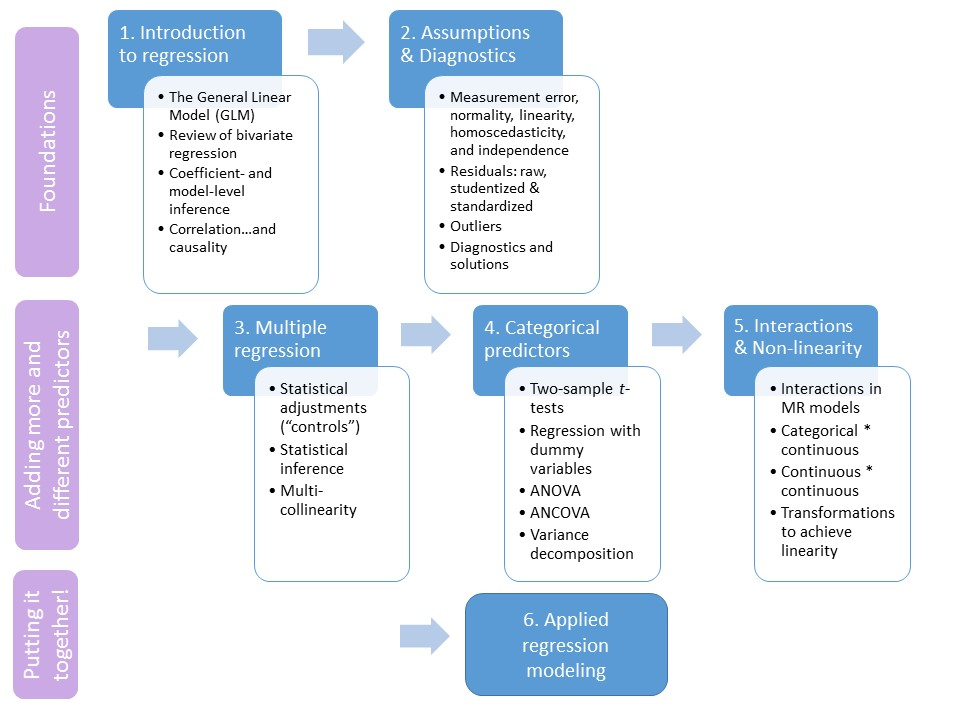

```{R, setup, include = F}
library(pacman)

p_load(here, tidyverse, xaringan, knitr, kableExtra, haven, broom, xaringanthemer)


i_am("slides/EDUC643_1_intro.rmd")

red_pink <- "#e64173"
turquoise = "#20B2AA"
orange = "#FFA500"
red = "#fb6107"
blue = "#3b3b9a"
green = "#004F39"
grey_light = "#B3B3B3"
grey_mid = "#7F7F7F"
grey_dark = "grey20"
purple = "#6A5ACD"
slate = "#314f4f"

extra_css <- list(
  ".red"   = list(color = "red"),
  ".blue"  =list(color = "blue"),
  ".red-pink" = list(color= "#e64173"),
  ".green" = list(color = "#004F39"),
  ".gray" = list(color= "#B3B3B3"),
  ".purple" = list(color = "purple"),
  ".small" = list("font-size" = "90%"),
  ".large" = list("font-size" = "120%"),
  ".tiny" = list("font-size" = "70%"),
  ".tiny2" = list("font-size" = "50%"))

write_extra_css(css = extra_css, outfile = "my_custom.css")


# Knitr options
opts_chunk$set(
  comment = "#>",
  fig.align = "center",
  fig.height = 6.75,
  fig.width = 10.5,
  warning = F,
  message = F
)
opts_chunk$set(dev = "svg")
options(device = function(file, width, height) {
  svg(tempfile(), width = width, height = height)
})
options(knitr.table.format = "html")


hook_output <- knit_hooks$get("output")
knit_hooks$set(output = function(x, options) {
  lines <- options$output.lines
  if (is.null(lines)) {
    return(hook_output(x, options))  # pass to default hook
  }
  x <- unlist(strsplit(x, "\n"))
  more <- "..."
  if (length(lines)==1) {        # first n lines
    if (length(x) > lines) {
      # truncate the output, but add ....
      x <- c(head(x, lines), more)
    }
  } else {
    x <- c(more, x[lines], more)
  }
  # paste these lines together
  x <- paste(c(x, ""), collapse = "\n")
  hook_output(x, options)
})

```
# Roadmap

```{r, echo=F, out.width="90%"}

```

---
## Goals of EDUC quant sequence

- Develop the basic quantitative skills necessary to conduct applied data analysis
 + The full-year sequence (EDUC 641 $\rightarrow$ EDUC 643 $\rightarrow$ EDUC 645) prepares you to make valuable contributions to a research team
 + Not all the skills you will need (and not the only courses you should take), particularly for those interested in analysis-heavy positions, or becoming an applied quantitative doctoral-level researcher
 + Foundations of statistics, methods and data science

- Understand the (in)appropriate application of those skills
 + "Building a toolbox, not a cookbook"
 + Evaluate the credibility of published research
 + Understand the affordances, limitations and dangers of quantitative analysis

--

.small[.blue[This is a re-designed and modernized core quantitative sequence at the COE. We welcome your feedback!

Given the relative new-ness of these courses, there are likely to be hiccups. We are committed to solving them, but we ask for your grace in allowing us to do so.]]

---
# EDUC pedagogical orientation


- Analysis follows research design that emerges from substantive questions
- Students learn statistical analysis by doing statistical analysis
- Create an inclusive, supportive environment in which we learn from each other
- Balance support and academic stretch across a variety of levels of prior experience and comfort with quantitative analysis
- *We started with an assumption of no prior background in mathematics, programming, statistics or research*


--

We assume that you enter this course (EDUC 643) with the ability to:
- Create an RStudio project, read in a dataset in csv format, filter rows, select columns, understand structure of data, recode variables, assess missingness, and calculate summary statistics for continuous and categorical variables in the R programming language
- Create simple visualizations describing categorical and continuous variables, and their relationships with each other in R
- State a quantitative research question and its corresponding null hypothesis
- Articulate the conceptual basis for a null-hypothesis significance test
- Conduct a one-sample $t$-test and fit a bivariate Ordinary Least Squares regression

--
- See [EDUC 641 data management guide](https://daviddliebowitz.github.io/EDUC641_23F/data_management.html) for data management pointers


---
# Goals of EDUC 643

.small[In this intermediate course, we will focus on applying the General Linear Model to Ordinary Least Squares regression analysis. Students will progress from bivariate to multiple regression, developing an understanding of the associated assumptions of these models and tools to solve instances in which those assumptions are unmet. The course seeks to blend a conceptual, mathematical and applied understanding of basic statistical concepts.]

.small[
Concrete learning objectives:
1. Articulate the framework of the General Linear Model as a method to describe relationships between quantitative variables
2. Distinguish between research designs and analyses that permit different forms of inferences (e.g., relational or causal, inferential or descriptive)
3. Conduct and interpret (orally and in writing) least-squares regression analyses with continuous outcomes and predictors
4. Describe the assumptions of least-squares regression analysis and test analytic models for the extent to which they satisfy these assumptions
5. Generalize the least-squares regression model (conceptually and in practice) to predictors that are categorical, interacted and non-linear
6. Build taxonomies of sensible regression models in response to independently developed research questions
7. Use an open-source, object-oriented statistical programming language to conduct all such analyses
]

---
# My personal goals

- Teach you the basics of applied statistics
- Challenge you:
  + Everyone did very well in EDUC 641; this course will introduce more challenging material
  + If you're struggling, come talk to me
  + If the course is too basic, consider either the recommended texts for more formal mathematical treatment **AND/OR** programming extensions (see the resources on the [syllabus](../syllabus.html) **AND/OR** reflect on pedagogical approaches as a future instructor
- Induct you into a graduate-level focus on mastery, rather than an undergraduate-level focus on success
- Contribute to building a community of live learners and life-long professional colleagues
- Assign everyone an A

--
- Help you see that many common statistical approaches with fancy names (multivariate regression, ANOVA, Spearman rank correlation coefficient, MANCOVA, Welch's two-sample $t$-test, Weighted Least Squares, $\chi^2$ goodness-of-fit test, etc.) are part of the same same "family" of statistical tests known as the General Linear Model (GLM). 

--
(aka .red-pink[*demystify the world of statistics*])

---
# Me

.pull-left[
- David Liebowitz (aka, "David" or "Dr. Liebowitz")
- he/him
- English lit undergrad major
- Former ELA teacher and principal
- Policy analyst/advisor
- **Applied** quantitative social scientist focused on improving leadership and policy in schools
- **Not** a methodologist
]

.pull-right[
```{r, echo=F, out.width="85%"}

```
]

---
# Learnings from the fall

- Maintain inclusivity, clarity, communuication, organization and accessibility
- Improve active learning (also more "chew time") and accessibility
- Clarity in use of technical language
- Review topics on which students struggled in assignments

--

.gray[
- Match structure of final to assignments
]

---
# Roadmap of EDUC 643

| Unit  | Week(s)   | Topic
|------------------------------------------------------------------------------
| 1     | 1-2      | Continuous relationships redux
| 2     | 3        | Regression assumptions
| 3     | 4        | Multiple regression
| 4     | 5-6      | Categorical predictors
| 5     | 7-9      | Non-linearities and interactions
| 6     | 10       | Model building and applied analysis


---
# Weekly schedule of activities

1. Two 1.5-hour lectures will introduce concepts in interactive lectures, discussion and activities
2. Readings are intended to supplement material from lectures (these can be completed after the first class of the unit)
3. Two *OPTIONAL, UNGRADED* weekly lab meetings intended to provide support for R programming tasks. Each lab will cover identical material.
4. Five (5) take-home quizzes worth trivial amount of points each (2% of grade each)
5. Four (4) data analytic assignments (1st: 20 points; 2nd-4th: 13 points each) + final project (30% of grade)

--

<br>
Course website is (we hope!) a valuable resource. Let's check it out!

---
# Roadmap

```{r, echo=F, out.width="90%"}
include_graphics("Roadmap1.jpg")
```


---
class: middle, inverse

# Bivariate regression

---
# Goals for the unit

- Describe goals and structure and of the course (and the quantitative EDUC sequence more broadly)
- Characterize a bivariate relationship along five dimensions (direction, linearity, outliers, strength and magnitude)

.gray[
- Describe how statistical models differ from deterministic models
- Mathematically represent the population model and interpret its deterministic and stochastic components
- Formulate a linear regression model to hypothesize a population relationship
- Describe residuals and how they can describe the degree of our OLS model fit
- Explain $R^{2}$, both in terms of what it tells us and what it does not
- Estimated a fitted regression line using Ordinary-Least Squares regression
- Conduct an inference test for a regression coefficient and our regression model
- Calculate a correlation coefficient $(r)$ and describe its relationship to $R^{2}$
- Distinguish between research designs that permit correlational associations and those that permit causal inferences
]


---
# A motivating question

Researchers (including two from the .green[**University of Oregon**]), [Nichole Kelly, Elizabeth Cotter and Claire Guidinger (2018)](https://doi.org/10.1016/j.eatbeh.2018.07.003), set out to understand the extent to which young men who exhibit overeating behaviors have weight-related medical and psychological challenges.

```{r, echo=F, out.height="80%"}
include_graphics("kelly_etal.png")
```

.small[Using real-world data (generously provided by Nichole Kelly) about the dietary habits, health, and self-appraisals of males 18-30, we are going to attempt to answer a similar question.]

.small[In particular, we are going to explore the .purple[**relationship**] between **dietary restraint behaviors** (self-reports on the extent to which participants consciously restricted/controlled their food intake) and **over-eating frequency** (participants' self-reported frequency of over-eating episodes).]

---
### Quantitative research design components

.large[
1. **Research questions**
 + Descriptive
 + Relational
 + Causal
2. **Question predictors**, *sometimes called independent variables (IV)*
 + Fixed attributes (e.g., race, age)
 + Potentially changeable characteristics (e.g., trauma, class size)
 + Interventions (e.g., new curriculum, counseling, programs/policies)
3. **Outcomes**, *sometimes called dependent variables (DV)*
4. **Analytic strategy**
]

--

.blue[**What do you anticipate each of these will be here?**]

---
# A glance at the data
```{r, echo=T}
# Not all data comes to us in .csv format
# Here we'll use the `haven` package to read in SPSS data
# There are many other such packages, including: `foreign` and `rio`

# install.packages("haven")
do <- read_spss(here("data/male_do_eating.sav")) %>% 
          select(OE_frequency, EDEQ_restraint, EDS_total,
          BMI, age_year, income_group) 

head(do)
```

---
# More glance-ing

```{r, echo=T}

str(do)
```

---
# Check for missingness

```{r, echo=T}

# Check for missingness
sapply(do, function(x) sum(is.na(x)))

# Things look good, but we'll focus on those cases that had complete  
# records for all variables
do <- do %>% drop_na()
```

.blue[**What is this approach to missingness called?**]

--
.purple[**Listwise deletion**]

---
# Even more glance-ing
Let's start by focusing on a few variables of interest: dietary restraint (***EDEQ_restraint***), over-eating frequency (***OE_frequency***), and exercise-dependency (***EDS_total***).
```{r, echo=T}
summary(do$EDEQ_restraint)
summary(do$OE_frequency)
summary(do$EDS_total)
```

---
## Oh the tangled web SPSS weaves!

```{r, echo=T, fig.height=3}
ggplot(data=do, aes(EDS_total)) + geom_bar()
```

```{r, echo=T}
do <- do %>% mutate(EDS_total = ifelse(EDS_total==-99, NA, EDS_total))

sum(is.na(do$EDS_total))

do <- filter(do, !is.na(EDS_total))
```

---
# A preliminary analysis


Before we get to the core question of the Kelly et al. study--how are dietary restraint behaviors related to over-eating frequency?--we are going to explore another important relationship in the data that may also be related to our main research question: the .purple[**relationship**] between .red-pink[**dietary restraint behaviors**] (self-reports on the extent to which participants consciously restricted/controlled their food intake) and .red-pink[**body-mass index (BMI)**]. In particular, we are going to operationalize this by examining the relationship in our sample of young men between our predictor variable (***EDEQ_restraint***) and their body-mass index (***BMI***). 

--

> We are examining this relationship so that we can better understand how all three of these variables (***OE_frequency***, ***EDEQ_restraint*** and ***BMI***) are related in Unit 3. Additionally, the properties of the variable ***BMI*** in this particular dataset are pedadogically helpful in demonstrating the assumptions of OLS.

> However, we recognize that BMI has been shown to be relatively uninformative about individuals' overall health and categorizes individuals based on distributions initially derived exclusively from white Western European (French and Scottish) study participants. We use the measure for pedagogical purposes because the variable is one of the few continuous measures in one of the few datasets that our UO colleagues shared with us, while noting its problematic historical use, particularly at the individual level.

---
# Bivariate relationships

We are interested in the *relationship* between dietary restraint (*EDEQ_restraint*) and body-mass index (*BMI*). Statistically, the relationship is the same regardless of which variable is the outcome.

.pull-left[
```{r, echo=F}
ggplot(do, aes(x=BMI, y=EDEQ_restraint)) + 
  geom_point() +
  ggtitle("BMI Predicting Dietary Restraint") +
  theme_minimal(base_size = 16)
```
]
.pull-right[
```{r, echo = F}
ggplot(do, aes(x = EDEQ_restraint, y = BMI)) + 
  geom_point() +
  ggtitle("Dietary Restraint Predicting BMI") +
  theme_minimal(base_size = 16)

```
]

--

However, our convention is to consider the variable on the Y-axis to be the one that we interpret as the "outcome" or the "dependent" variable.

---
# Bivariate relationships

Given the focus of the Kelly et al. paper and for pedagogical reasons, for the moment, we are choosing to plot BMI against dietary restraint. 

```{r, echo=T}
biv <- ggplot(data=do, aes(x=EDEQ_restraint, y=BMI)) + 
          geom_point()
```

```{r, echo = F, fig.height=3.75, fig.width = 6}
lm_plot <- biv +
            xlab("Dietary restraint index (0-6)") +
            theme_minimal(base_size = 16)


lm_plot
```

---
# Bivariate relationships

**Consider these five features of bivariate relationships:**

- Direction
- Linearity
- Outliers
- Strength
- Magnitude

---
## Bivariate relationships: Direction

```{r, echo=F, fig.height=5}
set.seed(123)
x <- seq(0, 50)
y <- x + 10 + rnorm(length(x), 0, 5)
y2 <- abs(x-50) + 10 + rnorm(length(x), 0, 5)
pos <- cbind.data.frame(x, y)
neg <- cbind.data.frame(x, y2)

positive <- ggplot(pos, aes(x, y)) +
  geom_point() +
  ggtitle("Positive") +
  theme_minimal(base_size=16) +
    theme(axis.title.x = element_blank(), axis.title.y = element_blank()) 

negative <- ggplot(neg, aes(x, y2)) +
  geom_point() +
  ggtitle("Negative") +
  theme_minimal(base_size=16) +
    theme(axis.title.x = element_blank(), axis.title.y = element_blank()) 

gridExtra::grid.arrange(positive, negative, ncol=2)

```
---
## Bivariate relationships: Linearity

```{r, echo=F, fig.height=5}
y3 <- log(y)*10
tri <- cbind.data.frame(x, y3)

poly <- ggplot(tri, aes(x, y3)) +
  geom_point() +
  ylim(15, 50) +
  ggtitle("Non-linear") +
    theme_minimal(base_size=16) +
    theme(axis.title.x = element_blank(), axis.title.y = element_blank()) 

linear <- ggplot(pos, aes(x, y)) +
  geom_point() +
  ggtitle("Linear") +
  theme_minimal(base_size=16) +
    theme(axis.title.x = element_blank(), axis.title.y = element_blank()) 

gridExtra::grid.arrange(linear, poly, ncol=2)
```

---
## Bivariate relationships: Outliers

```{r, echo=F, fig.height=5}
pos <- pos %>% mutate(out = case_when(x == 37 | x == 39 | x == 41 | x == 42 ~ y - 30,
                                       TRUE ~ y))

outlier <- ggplot(pos, aes(x, out)) +
  geom_point() +
  ggtitle("Outliers") +
    theme_minimal(base_size=16) +
    theme(axis.title.x = element_blank(), axis.title.y = element_blank()) 

gridExtra::grid.arrange(linear, outlier, ncol=2)

```

---
## Bivariate relationships: Strength

```{r, echo=F, fig.height=5}
pos <- pos %>% mutate(y4 = x + 20 + rnorm(length(x), 0, 15))

strong <- ggplot(pos, aes(x, y)) +
  geom_point() +
  geom_smooth(method='lm', se=F) +
  ggtitle("Stronger") +
  theme_minimal(base_size=16) +
    expand_limits(y=c(0,100)) +
    theme(axis.title.x = element_blank(), axis.title.y = element_blank()) 

weak <- ggplot(pos, aes(x, y4)) +
  geom_point() +
  geom_smooth(method='lm', se=F) +
  ggtitle("Weaker") +
  theme_minimal(base_size=16) +
    expand_limits(y=c(0,100)) +
    theme(axis.title.x = element_blank(), axis.title.y = element_blank()) 

gridExtra::grid.arrange(strong, weak, ncol=2)
```

**Note that these have the same slope (magnitude)**
---
## Bivariate relationships: Magnitude

```{r, echo=F, fig.height=5}
pos <- pos %>% mutate(y5 = 1.75*x + 10 + rnorm(length(x), 0, 5))


shallow <- ggplot(pos, aes(x, y)) +
  geom_point() +
  geom_smooth(method='lm', se=F) +
  ggtitle("Relatively shallow") +
  theme_minimal(base_size=16) +
    expand_limits(y=c(0,100)) +
    theme(axis.title.x = element_blank(), axis.title.y = element_blank()) 

steep <- ggplot(pos, aes(x, y5)) +
  geom_point() +
  geom_smooth(method='lm', se=F) +
  ggtitle("Relatively steep") +
  theme_minimal(base_size=16) +
    expand_limits(y=c(0,100)) +
    theme(axis.title.x = element_blank(), axis.title.y = element_blank()) 

gridExtra::grid.arrange(steep, shallow, ncol=2)
```
**Note that these have the same strength (tightness of fit)**

---
## Bivariate relationships: Magnitude

Note that if you change the scale of either axis, it will change the perceived--**but not the *actual***--size of the magnitude
```{r, echo=F, fig.height=5}
yaxis <- shallow +
            ggtitle("Extend y-axis") +
            expand_limits(y=c(0,200))
    
xaxis <- shallow +
            ggtitle("Extend x-axis") +
            expand_limits(x=c(0,100))

gridExtra::grid.arrange(shallow, yaxis, xaxis, ncol=3)
```


---
# BMI and over-eating

.blue[So what can we say with respect to these five characteristics in our data?]

```{r, echo = F, fig.height=5}
lm_plot +
  geom_smooth(method='lm', se=F)
```
---
# A line through our cloud

Notice that in the previous slide, we added a line running through our data

```{r, echo = F, fig.height=4}
lm_plot +
  geom_smooth(method='lm', se=F)
```
That line is defined by the intercept (value $Y$ takes when $X=0$) and the slope (the difference in $Y$ per 1 unit difference in $X$)
> $Y = intercept + slope*X$ (you may have seen this in HS as Y = mX + b)

> We could think of this relationship, therefore, as $BMI = slope*EDEQ\_restraint + intercept$ ... In fact, that's how we described this in EDUC 641, .purple[but that's not quite right...]


---
class: middle, inverse
# Synthesis and wrap-up


---
# Class goals

- Describe goals and structure and of the course (and the quantitative EDUC sequence more broadly)
- Characterize a bivariate relationship along five dimensions (direction, linearity, outliers, strength and magnitude)


---
# To-Dos

### Reading: 
- **By January 18 class**: LSWR Chapter 15.1 - 15.2 and 15.4 - 15.7 and Hu (2021)

### Review: 
- Review EDUC 641, Unit 4 (Lectures 13 - 16)


