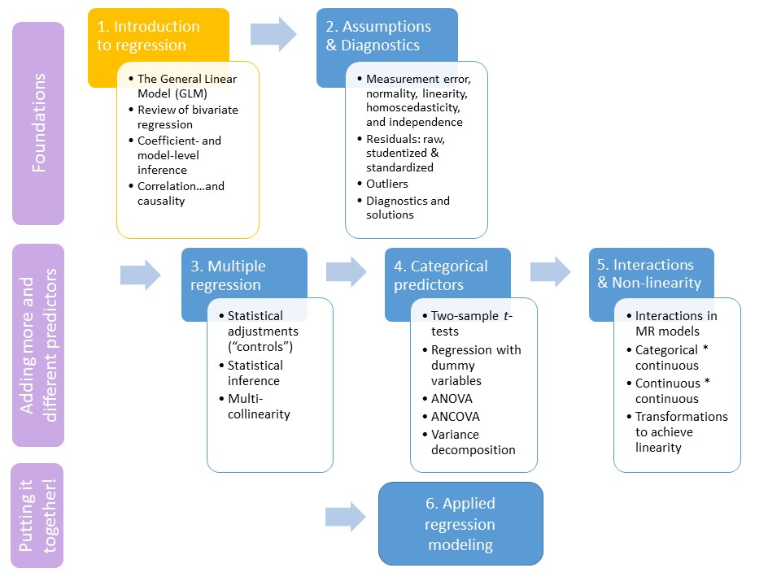

```{R, setup, include = F}
library(pacman)

p_load(here, MASS, tidyverse, ggplot2, xaringan, knitr, kableExtra, haven, broom, xaringanthemer)


i_am("slides/EDUC643_2_GLM.rmd")


red_pink <- "#e64173"
turquoise = "#20B2AA"
orange = "#FFA500"
red = "#fb6107"
blue = "#3b3b9a"
green = "#004F39"
grey_light = "#B3B3B3"
grey_mid = "#7F7F7F"
grey_dark = "grey20"
purple = "#6A5ACD"
slate = "#314f4f"

extra_css <- list(
  ".red"   = list(color = "red"),
  ".blue"  =list(color = "blue"),
  ".red-pink" = list(color= "#e64173"),
  ".orange" = list(color="orange"),
  ".green" = list(color = "#004F39"),
  ".gray" = list(color= "#B3B3B3"),
  ".purple" = list(color = "purple"),
  ".small" = list("font-size" = "90%"),
  ".large" = list("font-size" = "120%"),
  ".tiny" = list("font-size" = "70%"),
  ".tiny2" = list("font-size" = "50%"))


write_extra_css(css = extra_css, outfile = "my_custom.css")


# Knitr options
opts_chunk$set(
  comment = "#>",
  fig.align = "center",
  fig.height = 6.75,
  fig.width = 10.5,
  warning = F,
  message = F
)
opts_chunk$set(dev = "svg")
options(device = function(file, width, height) {
  svg(tempfile(), width = width, height = height)
})
options(knitr.table.format = "html")


hook_output <- knit_hooks$get("output")
knit_hooks$set(output = function(x, options) {
  lines <- options$output.lines
  if (is.null(lines)) {
    return(hook_output(x, options))  # pass to default hook
  }
  x <- unlist(strsplit(x, "\n"))
  more <- "..."
  if (length(lines)==1) {        # first n lines
    if (length(x) > lines) {
      # truncate the output, but add ....
      x <- c(head(x, lines), more)
    }
  } else {
    x <- c(more, x[lines], more)
  }
  # paste these lines together
  x <- paste(c(x, ""), collapse = "\n")
  hook_output(x, options)
})

```
# Roadmap

```{r, echo=F, out.width="90%"}

```


---
# Goals for the unit

.gray[
- Characterize a bivariate relationship along five dimensions (direction, linearity, outliers, strength and magnitude)
]

- Describe how statistical models differ from deterministic models
- Mathematically represent the population model and interpret its deterministic and stochastic components
- Formulate a linear regression model to hypothesize a population relationship
- Describe residuals and how they can describe the degree of our OLS model fit
- Explain $R^{2}$, both in terms of what it tells us and what it does not

.gray[
- Estimated a fitted regression line using Ordinary-Least Squares regression
- Conduct an inference test for a regression coefficient and our regression model
- Calculate a correlation coefficient $(r)$ and describe its relationship to $R^{2}$
- Distinguish between research designs that permit correlational associations and those that permit causal inferences
]

---
class: middle, inverse

# The General Linear Model

---
# A motivating question

Researchers (including two from the .green[**University of Oregon**]), [Nichole Kelly, Elizabeth Cotter and Claire Guidinger (2018)](https://doi.org/10.1016/j.eatbeh.2018.07.003), set out to understand the extent to which young men who exhibit overeating behaviors have weight-related medical and psychological challenges.

```{r, echo=F, out.height="80%"}
include_graphics("kelly_etal.png")
```

.small[Using real-world data (generously provided by Nichole Kelly) about the dietary habits, health, and self-appraisals of males 18-30, we are going to attempt to answer a similar question.]

.small[In particular, we are going to explore the .purple[**relationship**] between **dietary restraint behaviors** (self-reports on the extent to which participants consciously restricted/controlled their food intake) and **over-eating frequency** (participants' self-reported frequency of over-eating episodes).]


---
# A preliminary analysis

Before we get to the core question of the Kelly et al. study--how are dietary restraint behaviors related to over-eating frequency?--we are going to explore another important relationship in the data that may also be related to our main research question: the .purple[**relationship**] between .red-pink[**dietary restraint behaviors**] (self-reports on the extent to which participants consciously restricted/controlled their food intake) and .red-pink[**body-mass index (BMI)**]. In particular, we are going to operationalize this by examining the relationship in our sample of young men between our predictor variable (***EDEQ_restraint***) and their body-mass index (***BMI***). 

--

> We are examining this relationship so that we can better understand how all three of these variables (***OE_frequency***, ***EDEQ_restraint*** and ***BMI***) are related in Unit 3. Additionally, the properties of the variable ***BMI*** are pedadogically helpful in demonstrating the assumptions of OLS.

> However, we recognize that BMI has been shown to be relatively uninformative about individuals' overall health and categorizes individuals based on distributions initially derived exclusively from white Western European (French and Scottish) study participants. We use the measure for pedagogical purposes because the variable is one of the few continuous measures in one of the few datasets that our UO colleagues shared with us, while noting its problematic historical use.


---
# Reading in the data
```{r, echo=T}
do <- read_spss(here("data/male_do_eating.sav")) %>% 
    select(OE_frequency, EDEQ_restraint, EDS_total,
           BMI, age_year, income_group) %>%
    mutate(EDS_total = ifelse(EDS_total==-99, NA, EDS_total)) %>%
    drop_na()
```

---
# Bivariate relationships

Five ways to characterize them

.pull-left[
- Direction
- Linearity
- Outliers
- Strength
- Magnitude
]

.pull-right[
```{r, echo = F}
lm_plot <- ggplot(do, aes(x=EDEQ_restraint, y=BMI)) + 
  geom_point() +
  theme_minimal(base_size = 16)


lm_plot
```
]
---
# A line through our cloud

```{r, echo = F, fig.height=4}
lm_plot +
  geom_smooth(method='lm', se=F)
```
We added a line running through our data. That line is defined by the intercept (value $Y$ takes when $X=0$) and the slope (the difference in $Y$ per 1 unit difference in $X$)
> $Y = intercept + slope*X$ (you may have seen this in HS as Y = mX + b)

> We could think of this relationship, therefore, as $BMI = slope*EDEQ\_restraint + intercept$ ... In fact, that's how we described this in EDUC 641, .purple[but that's not quite right...]

---
# Mathematical representations

In addition to visual representations, we can borrow from mathematical models to construct a statistical relationship between variables. However, these are not identical.

.pull-left[
**Mathematical models**

- Are deterministic
- The area of any square is always $s^{2}$
- Once we know the rule, we can use it to fit the model to empirical data perfectly
]

.pull-right[
**Statistical models**

- Include individual variation
- Other systematic components exist that are either not measured or observable
- Outcome = Systematic component + residual
]

--

.blue[**What is wrong about describing the relationship between BMI and eating restraint as we did on the previous slide?**]

---
# Statistical model

In order to develop our statistical model (inspired by a deterministic mathematical model), we need to first determine our model's functional form.

```{r, echo=F, fig.height=4.75}
set.seed(123)
x <- seq(-25, 25)
y <- x 
y2 <- x^2
y3 <- log10(x)
form <- cbind.data.frame(x, y, y2, y3)

linear <- ggplot(form, aes(x, y)) +
  geom_point() +
  ggtitle("Linear") +
  theme_minimal(base_size=16) +
    theme(axis.title.x = element_blank(), axis.title.y = element_blank()) 

quad <- ggplot(form, aes(x, y2)) +
  geom_point() +
  ggtitle("Quadratic") +
  theme_minimal(base_size=16) +
    theme(axis.title.x = element_blank(), axis.title.y = element_blank()) 

curv <- ggplot(form, aes(x, y3)) +
  geom_point() +
  ggtitle("Curvilinear") +
  theme_minimal(base_size=16) +
    theme(axis.title.x = element_blank(), axis.title.y = element_blank()) 

gridExtra::grid.arrange(linear, quad, curv, ncol=3)
```

--

.red-pink[**All of the models we will focus on in this course are linear, but we're going to "cheat" to allow ourselves to model non-linear relationships with linear models.**]

---
# Linear models

### Why are straight lines so popular in statistics?
1. Mathematical simplicity: straight lines are one of the simplest (and consistent) ways of characterizing relationships
2. Actual linearity: many relationships are best characterized linearly; over a small enough interval, every relationship is linear

### What if my data isn't related in linear ways
1. Transformations: we will learn how to use these later to fit linear models to curvilinear data
2. Limited ranges of X may yield linearity: most things are "locally linear"

.red-pink[**In fact, linear modeling is so tractable that this is what we will spend the entire course on!**]

--

We'll learn about lots of different modeling approaches. .red-pink[**They are all part of the same family of models, known as the General Linear Model (GLM)**]. We will learn more about this GLM in Unit 4.

---
# Linear reqression equations

Okay, so once we have selected our model's functional form (which for now and the foreseeable future is going to be "linear"), we can move on to a mathematical representation. In this case, we are going to postulate a .red-pink[**linear regression**] model.

A linear regression equation borrows the mathematical framework for a line to summarize this relationship.
$$BMI = \beta_0 + \beta_1(EDEQ\_restraint)$$
---
# Regression equations

The regression line describes the mean value of Y for each possible "input" value of X.

$$BMI = \beta_0 + \beta_1(EDEQ\_restraint)$$

--
.small[Our data already provides us with observations of over-eating frequency and dietary restraint:]

```{r, echo = T}
do %>% 
  select(EDEQ_restraint, BMI) %>% 
  tail()
```

--
.small[So, we need to find the best intercept] $(\beta_0)$ .small[and slope] $(\beta_1)$ .small[to represent the relationship.]

---
## Regression equation components

$$BMI = \color{orange}{(\beta_0)} + \color{purple}{(\beta_1)}(EDEQ\_restraint)$$

.orange[Intercept] $\color{orange}{(\beta_0)}$: Predicted outcome when $x$ is equal to 0.

--

.purple[Slope] $\color{purple}{(\beta_1)}$: Predicted difference in the outcome for every one unit difference in $x$.

--

.blue[**Write out the appropriate regression equation for a line that has an intercept of 20 and a Dietary Restraint slope of 1.5.**]

--

.blue[**Interpret this equation in words, being careful to avoid making causal statements.**]

---
## Regression equation components

.orange[Intercept] $\color{orange}{(\beta_0)}$: Predicted outcome when $x$ is equal to 0.

.purple[Slope] $\color{purple}{(\beta_1)}$: Predicted difference in the outcome for every one unit difference in $x$.


$$BMI = \color{orange}{20} + \color{purple}{1.5}(EDEQ\_restraint)$$

--
.blue[**What is an individual's expected BMI given a Dietary Restraint rating of 2?**]

---
## Regression equation components

.orange[Intercept] $\color{orange}{(\beta_0)}$: Predicted outcome when $x$ is equal to 0.

.purple[Slope] $\color{purple}{(\beta_1)}$: Predicted difference in the outcome for every one unit difference in $x$.


$$BMI = \color{orange}{20} + \color{purple}{1.5}(2) = 20 + 3 = 23$$
**We predict that individuals with an observed Dietary Restraint rating of 2 will have a body-mass index of 23.**

---
# Residual (error) term
"No model is perfect, but some are useful." - George Box

```{r, echo = F, fig.height = 4.5, fig.width = 7}
lm_plot +
  geom_smooth(method='lm', se=F)
```

Is Dietary Restraint a perfect predictor of BMI? 

--
.red[**NO!**]

---
# Omitted variables
A "perfect" regression equation would probably include a lot more variables:

$$BMI = \beta_0 + \beta_1(EDEQ\_restraint) + \beta_2(\text{Meal Frequency}) + \beta_3(\text{Nutritional Habits}) + ... \beta_\infty$$
Many of these might not even be measurable!

--

Omitted variables are not a problem in themselves. Our estimates of the relationship between two (or more) variables might still be unbiased (i.e., accurately describe the nature of the relationship in the population), but they may be less precise because we have not explained all of the variation.

--

However, omitted variables often introduce bias into our estimates of the relationship. More on the problem of omitted variable bias later.

---
# Residual (error) term

In a regression model, all the variability that we can't explain with our predictor(s) is condensed into a .green[residual term] $\color{green}{\varepsilon}$.

```{r, echo = F, fig.height = 4, fig.width = 7}
fit <- lm(BMI ~ EDEQ_restraint, data=do)
do$predict <- predict(fit)
do %>% 
  sample_n(100) %>% 
  ggplot(aes(x=EDEQ_restraint, y=BMI)) + 
  geom_point() + 
  geom_point(aes(y=predict), col = "blue", alpha=0.3) +
  geom_segment(aes(xend = EDEQ_restraint, yend=predict), col = "green", alpha = 0.5) +
  geom_smooth(aes(EDEQ_restraint, predict))

```

$$BMI = \beta_0 + \beta_1(EDEQ\_restraint) + \color{green}{\varepsilon}$$
---
# The regression model

So there it is! Our full population regression model:

$$Y = \color{blue}{\beta_{0} + \beta_{1} X} + \color{green}{\varepsilon}$$
<div style= "text-align:center"> Outcome = .blue[Systematic component] + .green[residual]<sup>1</sup></div>

> $Y$: our outcome <br> <br>
$\color{blue}{\beta_{0}}$ and $\color{blue}{\beta_{1}}$: our population parameters and regression coefficients to be estimated <br> <br>
$\color{green}{\varepsilon}$: our error/residual ( $\varepsilon$ is a fancy way of writing the Greek letter "epsilon")

Also written as:

$$Y_{i} = \beta_{0} + \beta_{1} X_{i} + \varepsilon_{i}$$
where we use the subscript $i$ to emphasize that the model estimates the outcome for each of the $i$ units (students, schools, patients, etc.).

.footnote[[1] Sometimes also called deterministic and stochastic components.]

---
# A fitted model

A **fitted model** takes our population model and uses our observed data to derive estimates for the population. 
$$\hat{Y_{i}} = \hat{\beta_{0}} + \hat{\beta_{1}} X_{i}$$
We denote that we are generating estimates with "hats" above the estimated coefficients. Note that there is ***no error term*** in our fitted model. 

---
class: middle, inverse

# Residuals and model fit

---
# Residuals

For any observation, the residual is the difference between the observed and predicted value.

$$\varepsilon_i = Y_i - \hat{Y_i}$$


---
# Ordinary Least Squares (OLS)

An OLS-fitted regression would go through the "center" of the data, finding the best intercept and slope to minimize the total distance between all of the residual and itself.


```{r, echo = F, fig.height = 3.5, fig.width = 7}
fit <- lm(BMI ~ EDEQ_restraint, data=do)
do$predict <- predict(fit)
do %>% 
  sample_n(100) %>% 
  ggplot(aes(x=EDEQ_restraint, y=BMI)) + 
  geom_point() + 
  geom_point(aes(y=predict), col = "blue", alpha=0.3) +
  geom_segment(aes(xend = EDEQ_restraint, yend=predict), col = "green", alpha = 0.5) +
  geom_smooth(aes(EDEQ_restraint, predict))

```

--

For some observations we under-predict, for others we over-predict. But, across the full sample, no matter where we put our line, the residuals will always sum to zero. .blue[So how do we calculate the "best" line?]

---
# Sum of the squared residuals

For any observation, the residual is the difference between the observed and predicted value.

$$\varepsilon_i = Y_i - \hat{Y_i}$$

Squaring the residual terms $(\varepsilon_i^2)$ allows us to treat negative and positive deviations equally, and puts a greater penalty on larger deviations.

```{r, echo = F, comment = NA}
resid_table <- do %>% 
  select(BMI, predict) %>% 
  rename(predicted_BMI = predict) %>% 
  mutate(residual = BMI - predicted_BMI,
         residual_sq = residual^2) %>% 
  mutate(across(everything(), round, 2))

tail(resid_table)
```
--

The **sum of squares** is the sum of all our squared residuals:

$$\Large \Sigma(\varepsilon_i)^2$$

---
# Ordinary Least Squares (OLS)

An OLS-fitted regression finds the best intercept and slope values to **minimize the sum of squared residuals**.

.pull-left[
```{r, echo = F}
good_fit <- do %>% 
  mutate(predict = (24 + 1*EDEQ_restraint))
set.seed(100)
good_fit_plot <- good_fit %>% 
  sample_n(100) %>% 
  ggplot(aes(x=EDEQ_restraint, y=BMI)) + 
  geom_point() + 
  geom_point(aes(y=predict), col = "blue", alpha=0.3) +
  geom_segment(aes(xend = EDEQ_restraint, yend=predict), col = "green", alpha = 0.5) +
  geom_smooth(aes(EDEQ_restraint, predict))

good_fit_plot

```
]

.pull-right[
```{r, echo = F}
bad_fit <- do %>% 
  mutate(predict = (30 + 2*EDEQ_restraint))
set.seed(100)
bad_fit_plot <- bad_fit %>% 
  sample_n(100) %>% 
  ggplot(aes(x=EDEQ_restraint, y=BMI)) + 
  geom_point() + 
  geom_point(aes(y=predict), col = "blue", alpha=0.3) +
  geom_segment(aes(xend = EDEQ_restraint, yend=predict), col = "green", alpha = 0.5) +
  geom_smooth(aes(EDEQ_restraint, predict))

bad_fit_plot

```

]

Which regression line appears to be a better fit?

---
# Ordinary Least Squares (OLS)

An OLS-fitted regression finds the best intercept and slope values to minimize the sum of squared residuals.

.pull-left[
```{r, echo = F}
good_fit_plot
```
$\bf{\Sigma(e_i)^2 = 40,153}$

]

.pull-right[
```{r, echo = F}
bad_fit_plot
```
$\Sigma(e_i)^2 = 101,566$
]

The regression line on the left is a better fit because the sum of its squared errors is smaller  (40,153 < 101,566).

---
## Sum of Squared Residuals (SSR)

SSR is a bigger concept than just model predictions. It is a way of thinking about variability.

--

Our outcome's variability is simply the sum of squared deviations from its mean.

$$SSR_\text{BMI} = \sum{(Y_i - \bar{Y})^2}$$
```{r, fig.height = 3.75, fig.width = 6, echo = F}
do <- do %>% 
  mutate(participant_id = seq(1:1085))

do %>% 
  filter(participant_id <= 30) %>% 
  ggplot(aes(x = participant_id, y = BMI)) +
  geom_point() +
  geom_hline(yintercept = mean(do$BMI), color = "blue") +
  geom_segment(aes(xend = participant_id, yend=mean(do$OE_frequency)), col = "green", alpha = 0.5) +
  geom_label(x = 15, y = mean(do$BMI), label = "Mean BMI", color= "blue")

```

---
Get a feel for trying to minimize the *sum of the square of the residuals*
```{r, echo=F, fig.height=8}
include_app(c("https://daviddl.shinyapps.io/line_ss/"), height="550px")

```
---

# Partitioning variance

The goal of regression is to account for some of this variability with our model's predictors.

We can partition the outcome's total variance $(SS_{BMI})$ into:
* Model-accounted variance $(SS_\text{Model})$
* Residual variance $(SS_\text{Residual})$

$$SS_\text{BMI} = SS_\text{Model} + SS_\text{Residual}$$
--

Remember our goal with OLS regression is to find the model coefficients that minimize $SS_\text{Residual}$.


---
# Partitioning variance
$$\text{If } SS_\text{BMI} = \color{purple}{SS_\text{Model}} + {SS_\text{Residual}}$$

$\color{purple}{SS_\text{Model}}$ is the sum of squared deviations between the model predicted values $(\hat{Y})$ and the mean $(\bar{Y})$.

```{r, echo = F, fig.height = 3.75, fig.width=6}
do %>% 
  filter(participant_id <= 30) %>% 
  ggplot(aes(x = participant_id, y = BMI)) +
  geom_point() + 
  geom_point(aes(y=predict), col = "purple", alpha=0.3) +
  geom_segment(aes(xend = participant_id, y = mean(do$BMI), yend=predict), col = "purple", alpha = 0.5) +
  geom_hline(yintercept = mean(do$BMI), color = "blue")

```
$$\color{purple}{SS_\text{Model} = \sum{(\hat{Y} - \bar{Y})^2}}$$
---
# Partitioning variance
$$\text{If } SS_\text{BMI} = \color{purple}{SS_\text{Model}} + \color{green}{SS_\text{Residual}}$$

$\color{green}{SS_\text{Residual}}$ is the sum of squared deviations between the model predicted values $(\hat{Y})$ and the observed values $(Y)$.

```{r, echo = F, fig.height = 3.75, fig.width=6}
do %>% 
  filter(participant_id <= 30) %>% 
  ggplot(aes(x = participant_id, y = BMI)) +
  geom_point() + 
  geom_point(aes(y=predict), col = "purple", alpha=0.3) +
  geom_segment(aes(xend = participant_id, y = mean(do$BMI), yend=predict), col = "purple", alpha = 0.5) +
  geom_hline(yintercept = mean(do$BMI), color = "blue") +
  geom_segment(aes(xend = participant_id, y = predict, yend=BMI), col = "green", alpha = 0.5)

```
$$\color{green}{SS_\text{Model} = \sum{(Y - \hat{Y})^2}}$$

---
# $R^2$

Partitioning variance can be useful for model evaluation.

$$SS_\text{BMI} = SS_\text{Model} + SS_\text{Residual}$$
$R^2$ ("R-squared") is the proportion of variance in the outcome our model accounts for.

$$R^2 = \frac{SS_\text{Model}}{SS_\text{BMI}}$$
--
For example, if $R^2 = 0.30$, then our model accounts for 30% of our sample's variance in over-eating frequency.

--
More on this soon.

---
# Taking stock

We've developed some understanding of the formal structures of linear models (GLMs) and used some graphical representations to understand some of the components of a least-squares regression fit

.pull-left[
**Bivariate relationship characteristics:**
- Direction
- Linearity
- Outliers
- Strength
- Magnitude
]

.pull-right[
**Model fit characteristics:**
- Residuals
- Sum of Squared Residuals (SSR)
- Sum of Squared Model (SSM) 
- $R^2$
]

Next, we're going to turn to actually fitting our regression so we can say something substantive about the relationship between dietary restraint behaviors and BMI.


---
class: middle, inverse
# Synthesis and wrap-up


---
# Class goals

- Describe how statistical models differ from deterministic models
- Mathematically represent the population model and interpret its deterministic and stochastic components
- Formulate a linear regression model to hypothesize a population relationship
- Describe residuals and how they can describe the degree of our OLS model fit
- .gray[Explain] $\color{gray}{R^{2}}$.gray[, both in terms of what it tells us and what it does not]

---
# To-Dos

### Reading: 
- **By January 19 class**: LSWR Chapter 15.1 - 15.2 and 15.4 - 15.7

### Review: 
- Review EDUC 641, Unit 4 (Lectures 13 - 16)


