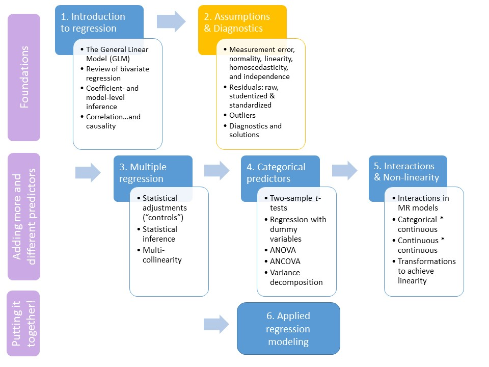

```{R, setup, include = F}
library(pacman)
p_load(here, tidyverse, ggplot2, xaringan, knitr, kableExtra, foreign, broom, xaringanthemer)

i_am("slides/EDUC643_2_assumptions.rmd")


red_pink <- "#e64173"
turquoise = "#20B2AA"
orange = "#FFA500"
red = "#fb6107"
blue = "#3b3b9a"
green = "#8bb174"
grey_light = "grey70"
grey_mid = "grey50"
grey_dark = "grey20"
purple = "#6A5ACD"
slate = "#314f4f"

extra_css <- list(
  ".red"   = list(color = "red"),
  ".blue"  =list(color = "blue"),
  ".red-pink" = list(color= "red_pink"),
  ".grey-light" = list(color= "grey_light"),
  ".purple" = list(color = "purple"),
  ".small" = list("font-size" = "90%"))

write_extra_css(css = extra_css, outfile = "my_custom.css")

# Knitr options
opts_chunk$set(
  comment = "#>",
  fig.align = "center",
  fig.height = 6.75,
  fig.width = 10.5,
  warning = F,
  message = F
)
opts_chunk$set(dev = "svg")
options(device = function(file, width, height) {
  svg(tempfile(), width = width, height = height)
})
options(knitr.table.format = "html")

```
# Roadmap

```{r, echo=F, out.width="90%"}

```
---
# A motivating question

### Reminder: 

[Nichole Kelly, Elizabeth Cotter and Claire Guidinger (2018)](https://doi.org/10.1016/j.eatbeh.2018.07.003) set out to understand the extent to which young men who exhibit overeating behaviors have weight-related medical and psychological challenges.


Using real-world data (generously provided by Nichole Kelly) about the dietary habits, health, and self-appraisals of males 18-30, we are going to attempt to answer a similar question. 

However, before answering this question, we are going to explore **the relationship between dietary restraint behaviors** (self-reports on the extent to which participants consciously restricted/controlled their food intake) **and body-mass index (BMI).**

```{r, echo=F}
do <- read.spss(here("data/male_do_eating.sav"), to.data.frame=T) %>% 
    select(Study_ID, BMI, age_year, income_group, OE_frequency, 
         EDEQ_restraint, DERS_total, DMS_mean, EDS_total, MBAS_muscularity, MBAS_height,
         SATAQ_total) %>%
        drop_na()
do <- rownames_to_column(do, "id")
do <- select(do, -c(Study_ID))

```
---
# Bivariate relationship
```{r, echo=F}
lm_plot <- ggplot(do, aes(x=EDEQ_restraint, y=BMI)) + 
  geom_point() +
  geom_smooth(method = "lm") +
  xlab("Dietary restraint index") + 
  theme_minimal(base_size = 16)

lm_plot
```

---
# Regression results

(from last Unit)

```{r, echo = T, }
fit <- lm(BMI ~ EDEQ_restraint, data=do)
  tidy(fit)
```


- Each 1 unit difference in dietary restraint behaviors (*EDEQ_RESTRAINT*) is associated with a 1.03 unit difference in Body Mass Index (*BMI*).
 + This represents 1/6th of a standard deviation of the outcome (*BMI*), or a relatively large effect
- Effect is statistically significant
 + Unlikely that in the population of 18-30 yo males that there is no relationship between dietary restraint behaviors and BMI.
- There is still a lot of residual variation

--

.blue[**So should we believe these results???**]

---
# Goals of the unit

- Articulate the assumptions of the General Linear Model broadly and least squares estimation and inference particularly
- Describe sources of assumption violation in the regression model including: measurement error, non-linearity, heteroscedasticity, non-normally distributed residuals, correlated errors, and outliers.
- Articulate properties of residuals and describe their centrality in understanding the regression model assumptions
- Conduct diagnostic tests on regression model assumption violations
- Implement a consistent screening protocol to identify regression model assumption violations
- Implement solutions to regression model assumption violations, when appropriate


---
class: middle, inverse

# Regression fundamentals: the remix

---
# Some definitions

When you conduct any kind of statistical analysis, there are three phenomenon you are interested in:
- **The estimand**: the underlying quantity you are seeking to learn about in the population 
  + "the dropout rate", "disordered eating", etc.
- **The estimator**: the method used to obtain an approximation of this quantity
  + "Ordinary Least Squares regression", "*t*-test", "LASSO", etc.)
- **The estimate(s)**: the value obtained from conducting a particular statistical test in a particular set of data
  + "38.1 scale points", "5.5 percentage points", "a log-odds ratio of 2.3", etc)

--

In estimating a model to data, you are seeking an estimator that will return a .blue[**BLUE**] estimate:
 + .blue[**B**]est
 + .blue[**L**]inear
 + .blue[**U**]nbiased
 + .blue[**E**]stimate
 
--

**If the assumptions of linear regression are met, OLS estimators are always .blue[BLUE].**

---
# Key assumptions of regression

#### In fitting these models, we assume that the relationships are characterized by:
- No measurement error
- Linearity
- Homoscedasticity (or homoskedasticity?)
- Normally distributed residuals 
- Independent errors
- No unduly influential outliers

---
# Key assumptions of regression


.pull-left[
At each value of X, there is a distribution of Y. These distributions have a mean $\mu_{Y|X}$ and a variance of $\sigma^2_{Y|X}$
1. **Measurement error**: Values of X are non-overlapping
2. **Linearity**: The mean of each X distribution $(\mu_{Y|X})$ can be joined together by a straight line
3. **Homoscedasticity**: Variance of each distribution $(\sigma^2_{Y|X})$ is identical
4. **Normality**: At each given value of X, the values of Y are normally distributed
5. **Independence**: Conditional on values of X, the values of Y are independent of each other
]

.pull-right[
```{r, echo=F}
include_graphics("reg_assumpt.png")
```
(6. **Outliers** are baked into several of above)
]

--

These assumptions are not about the sample, but are about the individual error terms *in the population*.

---
class: middle, inverse

# Regression diagnostics: measurement error

---
# Original estimates

Classical measurement error (our predictor variable is measured imprecisely) will bias our results to zero and increase residual standard error.

```{r, echo=T, highlight.output=c(12,16)}
summary(lm(BMI ~ EDEQ_restraint, data=do))
```
---
# Addding measurement error

Classical measurement error (our predictor variable is measured imprecisely) will bias our results to zero and increase residual standard error (aka, RMSE).

```{r, echo=T, highlight.output=c(12,16)}
do$EDEQ_noise <- jitter(do$EDEQ_restraint, factor = 5, amount = 1)
summary(lm(BMI ~ EDEQ_noise, data=do))
```
---
# Addressing measurement error

- Test for presence of measurement error with reliability statistics
- Solve by creating factors of underlying constructs, adjust standard errors post-hoc, SEM, get more data, improve design

#### We'll learn about reliability in EDUC 645 as well as in more advanced courses such as EDLD 667
#### We will also learn about some solutions in 633/634 (SEM) and EDLD 650 and 679 (causal inference)
#### These are generally problems that are solved by design rather than stats

---
class: middle, inverse

# Regression diagnostics: residuals

---
# Residuals

```{r, echo=F, fig.height=5}
lm_plot
```

Our fitted regression line contains the "predicted" values of *BMI* for each value of *DIETARY_RESTRAINT*. But almost all of the "actual" values of *BMI* lie off the actual line regression line.
---
# Example: Participant #1089

```{r, echo=F, fig.height=5}
fit <- lm(BMI ~ EDEQ_restraint, data=do)
do$predict <- predict(fit)
do$resid <- residuals(fit)

do1089 <- filter(do, id==1089)
 resid_c <- ggplot(do, aes(x = EDEQ_restraint, y = BMI)) + 
   geom_point() + 
   geom_smooth(method=lm, data=do) +
   geom_point(aes(x = EDEQ_restraint, y = predict), data=do1089, col = "red", alpha=0.3) +
   geom_point(data = do1089, aes(x = EDEQ_restraint, y = BMI),
                     color = 'red',
                     size = 3) +
   geom_segment(aes(xend = EDEQ_restraint, yend=predict), col = "red", alpha = 0.8, data= do1089) +
   annotate('text', label = "#1089", x = 5.7, y = 23, color = "red", size = 5) +
   xlab("Dietary restraint index") +
   theme_minimal(base_size = 16)
resid_c
```


--

.blue[*What can we say about this study participant's BMI, relative to our prediction?*]


---
# What is a "residual"?

#### The difference ("vertical distance") between the observed value of the outcome its predicted value is called the *residual*.

#### Residuals can be substantively and statistically useful:
- Represent individual deviations from average trend
- Tell us about values of the outcome after taking into account ("adjusting for") the predictor
 + In this case, tell us whether study participants have higher or lower BMI indices than predicted, given their dietary restraint behaviors

---
# Raw and studentized residuals

Raw residuals give us information on how far each observed value is from its predicted value *in the original units of the outcome*. Sometimes it may be valuable to be able to quantify residuals in more standard units. 

- **Raw residuals**: Observed minus fitted values:

$$r_{i} = y_{i} - \hat{y_{i}}$$

- **Standardized residuals**: Can transform raw residuals into standardized units by dividing by the Mean Square Error (estimate of standard deviation of the residuals).<sup>1</sup>

$$stdr_{i} = \frac{r_{i}}{\sqrt{MSE}}$$


- **Studentized residuals**: Raw residuals come from models that may be influenced by individual data points (esp. in small samples). To avoid this problem, it is helpful to estimate residuals that come from a model based on all data *except the case at hand (i)*. Here, $MSE_{i}$ is based on a regression fit without observation $i$. 

$$stur_{i} = \frac{r_{i}}{\sqrt{MSE_{-(i)}}}$$

.footnote[[1] Technically, this is an oversimplification as we usually calculate standardized and studentized residuals by also accounting for the "leverage" of observation *i* (how much does it influence the regression statistics).]


---
# Residuals as tools

Residuals can be valuable diagnostic tools to assessing the assumptions of the regression model. In addition to serving as mechanisms to test the overall model, they can point to specific observations that may warrant further inspection. This might include:

- Noticing patterns to change your theory about the correct model or functional form to use
- Inspecting particular cases to determine whether they are mis-measured or belong to a different population than the main one of your study
- Improve your research design overall

---
# Recovering residuals in R
```{r, echo=T}
fit <- lm(BMI ~ EDEQ_restraint, data=do)

# predict asks for the predicted values
do$predict <- predict(fit)

# residuals asks for the raw residual
do$resid <- residuals(fit)

# rstandard asks for the standardized residual
do$std_resid <- rstandard(fit)

# rstudent asks for the studentized residual
do$stu_resid <- rstudent(fit)
```

We can now treat these residual and predicted values as new variables in our dataset and examine using all the other univariate and multivariate analysis tools we have.

---
# Examining the residuals

```{r, echo=T}
summary(do$resid)
```

- Sample mean of the residuals is *always* exactly zero
- On a scale ranging from about 5 to 60, most of our residuals are within 6 BMI units. However, we've done a poor job of predicting BMI for some participants.

--


```{r, echo=T}
summary(do$std_resid)
```

- Compare to the standardized residuals. *How similar are they?*<sup>1</sup>
- Note the minima and maxima values. .blue[*Given a sample of ~1100 individuals, what does this make you think?*]

.footnote[[1] Our standardized and studentized residuals have means *close to* zero, but not quite because of "leverage" corrections (see slide 19)
]

---
# Examining the residuals
Standard deviation of the raw residuals can be quite useful in checking our assumptions
- .blue[*What assumption?*]

```{r, echo=T}
sd(do$resid)
```

--

How does this compare to the standardized residual?

```{r, echo=T}
sd(do$std_resid)
```

---
# Non-linearity

In addition to examining the original scatterplot to detect the presence of non-linearity...

```{r, echo=F, fig.height=5.5}
set.seed(123)
x <- seq(-100, 100)    
y <- x^3 + rnorm(length(x), 0, 200000)     
quad <- cbind.data.frame(x, y)
ggplot(quad, aes(x, y)) +
  geom_point() +
  geom_smooth(method=lm, se=F) +
  theme_minimal(base_size = 16) +
  theme(axis.title.x = element_blank(), axis.title.y = element_blank(), axis.text.y = element_blank()) 

```
---
# Non-linearity

In addition to examining the original scatterplot to detect the presence of non-linearity...

```{r, echo=F, fig.height=5.5}
ggplot(quad, aes(x, y)) +
  geom_point() +
  geom_smooth(method=lm, formula= y ~ poly(x,3), se=F) +
  theme_minimal(base_size = 16) +
  theme(axis.title.x = element_blank(), axis.title.y = element_blank(), axis.text.y = element_blank())

```

--

**We can also examine the residuals to detect non-linearity!**

---
# Non-linearity: residuals v. fitted

Plotting the residual values against their fitted values can provide **EXTREMELY** informative insights to many of our regression assumptions. 

```{r, echo=F, fig.height=5}
quadfit <- lm(y ~ x, data=quad)
quad$predict <- predict(quadfit)
quad$resid <- resid(quadfit)

ggplot(quad, aes(x = predict, y = resid)) + 
         geom_point() +
  geom_hline(yintercept = 0, color = "red", linetype="dashed") +
  ylab("Residuals") + xlab("Fitted values") +
  theme_minimal(base_size = 16) +
  theme(axis.text.y = element_blank())
```
---
# Non-linearity: residuals v. fitted

Plotting the residual values against their fitted values can provide **EXTREMELY** informative insights to many of our regression assumptions. 

```{r, echo=F, fig.height=5}
quadfit <- lm(y ~ x, data=quad)
quad$predict <- predict(quadfit)
quad$resid <- resid(quadfit)

ggplot(quad, aes(x = predict, y = resid)) + 
         geom_point() +
  geom_hline(yintercept = 0, color = "red", linetype="dashed") +
  annotate('rect', xmin = -400000, xmax = -5000, ymin = -600000, ymax = -150000, alpha = 0.3, fill = "purple") +
  annotate('rect', xmin = 1000, xmax = 350000, ymin = 230000, ymax = 850000, alpha = 0.3, fill = "purple") +
  ylab("Residuals") + xlab("Fitted values") +
  theme_minimal(base_size = 16) +
  theme(axis.text.y = element_blank())
```
---
# Non-linearity: residuals v. fitted

Let's look at this for our estimates of disordered eating:
```{r, echo=F, fig.height=5}
ggplot(do, aes(x = predict, y = resid)) + 
         geom_point() +
  geom_hline(yintercept = 0, color = "red", linetype="dashed") +
  ylab("Raw Residuals") + xlab("Fitted values") +
  theme_minimal(base_size = 16)
```

.red-pink[**What evidence do you observe of linearity or non-linearity in the residuals for our disordered eating sample?**]

---
# Heteroscedasticity

**Heteroscedasticity**: when variance of Y conditional on X $(\sigma^2_{Y|X})$ differs as a function of X

```{r, echo=F, fig.height=5.5}
set.seed(123)
x <- seq(-100, 100)    
y <- x + rnorm(length(x), 0, 100)
het <- cbind.data.frame(x, y)
het <- het %>% mutate(y2 = case_when(x<=-90 ~ y/4 - 200,
                                 x>-90 & x<=-50 ~ y/4 - 100,
                                 x>-50 & x<50 ~ y + 100,
                                 x>=50 ~ 4*y))
ggplot(het, aes(x, y2)) +
  geom_point() +
  geom_smooth(method=lm, se=F) +
  theme_minimal(base_size = 16) +
  theme(axis.title.x = element_blank(), axis.title.y = element_blank())
```
---
# Heteroscedasticity

**Heteroscedasticity**: when variance of Y conditional on X $(\sigma^2_{Y|X})$ differs as a function of X

```{r, echo=F, fig.height=5.5}
ggplot(het, aes(x, y2)) +
  geom_point() +
  geom_smooth(method=lm, se=F) +
  geom_quantile(quantiles=0.99, col="gray") +
  geom_quantile(quantiles=0.001, col="gray") +
  theme_minimal(base_size = 16) +
  theme(axis.title.x = element_blank(), axis.title.y = element_blank())
```
---
# Residual heterodscedasticity
```{r, echo=F, fig.height=5}
ggplot(do, aes(x = predict, y = resid)) + 
         geom_point() +
  geom_hline(yintercept = 0, color = "red", linetype="dashed") +
  ylab("Raw Residuals") + xlab("Fitted values") +
  theme_minimal(base_size = 16)
```

.blue[**What evidence do you observe of homoscedasticity or heteroscedastictiy in the residuals for our disordered eating sample?**]

---
# Solutions to heteroscedasticity

Heteroscedasticity biases our standard errors. The standard deviation of the estimator $\hat{\beta_{1}}$ is inconsistent for the true value of $\sigma^2_{\hat{\beta_{1}}}$ when there is heteroscedasticity. The sample-based statistic do not follow a standard normal distribution (following the CLT). This would invalidate our inferencing.

However, we generally can correct for the presence of heteroscedasticity by the computation of .red[heteroscedasticity-robust standard errors]. There are several approaches that rely on the variance-covariance matrix of the errors and a good deal of matrix algebra. 

---
# Solutions to heteroscedasticity
We won't spend time on these now, but know that if you are concerned about the presence of heteroscedasticity in your data, you will generally want to use heteroscedasticity-robust standard errors (sometimes called sandwich estimators or [Eicker-Huber-White standard errors](https://www.jstor.org/stable/1912934) ). Some R options include the `estimatr::lm_robust` command.


```{r, echo=T, highlight.output=c(5)}
tidy(lm(BMI ~ EDEQ_restraint, data=do))
```

```{r, echo=T, highlight.output=c(3)}
tidy(estimatr::lm_robust(BMI ~ EDEQ_restraint, se_type="HC1", data=do))
```

---
# Residual normality: boxplot

For the standard errors (and associated inference tests) that we conduct in the regression analysis to be correct, the residuals **must be normally distributed.** Here it makes most sense to use our *studentized residuals*. .blue[**Why?**]

```{r, echo=T, fig.height=4}
boxplot(rstudent(fit))
```

--

A few outliers, particularly in the positive direction... (means we are *under*-predicting the BMI of these folks)

---
# Residual normality: histogram

For the standard errors (and associated inference tests) that we conduct in the regression analysis to be correct, the residuals **must be normally distributed**

```{r, echo=F, fig.height=4.5}
ggplot(do, aes(x = resid)) + 
  geom_histogram(binwidth = 1) +
  theme_minimal(base_size = 16)

```

--

And this is confirmed in this histogram. .blue[What sort of skew is this distribution exhibiting?]


All in all, though, these seem roughly normally distributed.


---
# Residual normality: resid v. fitted 

For the standard errors (and associated inference tests) that we conduct in the regression analysis to be correct, the residuals **must be normally distributed**
```{r, echo=F, fig.height=4.5}
ggplot(do, aes(x = predict, y = stu_resid)) + 
         geom_point() +
  geom_hline(yintercept = 0, color = "red", linetype="dashed") +
  ylab("Studentized Residuals") + xlab("Fitted values") +
  theme_minimal(base_size = 16)
```

.blue[What would you be looking for here to assess for **normality**?]

---
# Residual normality: Q-Q plot

For the standard errors (and associated inference tests) that we conduct in the regression analysis to be correct, the residuals **must be normally distributed**. A .red-pink[**quantile-quantile (Q-Q) plot**] compares where observed values in the sample--at specified percentiles of the distribution--fall in relation to where those same percentile values would fall in a normal distribution. A straight line indicates what a precisely normal distribution would look like.

```{r, echo=F, fig.height=4.5}
ggplot(do) + 
  stat_qq(aes(sample=stu_resid)) +
  geom_abline(color=blue) +
  theme_minimal(base_size = 16)
```

--

.blue[How are we doing?]

---
# Residual independence

If observations (and residuals) are correlated (i.e., there is some feature in our data that makes some observations have correlated outcomes), then our model is mis-specified and we will have biased standard errors.

Imagine that most of the young men in our disordered eating sample lived in one of six cities. 

```{r, echo=F, fig.height=4.5}
do <- do %>% mutate(city = case_when(predict<=25 & stu_resid>0 ~ "San Francisco",
                                     predict<=25 & stu_resid<=0 ~ "Portland",
                                     predict >25 & predict <=28 & stu_resid>0 ~ "Seattle",
                                     predict >25 & predict <=28 & stu_resid<=0 ~ "Los Angeles",
                                     predict >28 & stu_resid>0 ~ "Eugene",
                                     predict >28 & stu_resid<=0 ~ "Oakland"))

lm_plot_city <- ggplot(do, aes(x=EDEQ_restraint, y=BMI, col=city)) + 
  geom_jitter() +
  xlab("Dietary restraint index") +
  theme_minimal(base_size = 16)

lm_plot_city
```
---
# Residual independence

```{r, echo=F, fig.height=4.5}
ggplot(do, aes(x = predict, y = stu_resid, col=city)) + 
         geom_point() +
  geom_hline(yintercept = 0, color = "red", linetype="dashed") +
  ylab("Studentized Residuals") + xlab("Fitted values") +
  theme_minimal(base_size = 16)

```

--

**Depending on disciplinary perspective, we can address these concerns through multi-level modeling or standard error adjustment. More on this in EDUC 645 and EDLD 628/629 (HLM)**

---
# Outliers

### Broadly defined as highly atypical and/or influential data point(s). 

These could be a result of:
 + Coding (recording) error
 + Accurate observations of a rare case
 + Observation of an individual from a different population
 
--

### We can characterize outliers on three dimensions:
1. Leverage
 + How unusual is the case in the 'X' direction?
2. Distance
 + How unusual is the case in the 'Y' direction?
3. Influence
 + How much does the relationship (regression coefficient) change in the absence of the case?
 + Influence is roughly Leverage * Distance
 
---
# Outliers

```{r, echo=F, fig.height=5}
do11 <- filter(do, id==11)

outlier <- ggplot(do, aes(x = EDEQ_restraint, y = BMI)) + 
    geom_point() + 
    geom_smooth(method=lm, se=F, data=do) +
    geom_point(aes(x = EDEQ_restraint, y = predict), data=do11, col = "red", alpha=0.3) +
    geom_point(data = do11, aes(x = EDEQ_restraint, y = BMI),
                      color = 'red',
                      size = 3) +
    annotate('text', label = "#11 (0, 57.2)", x = 0.5, y = 57, color = "red", size = 5) +
    xlab("Dietary restraint index") +
  theme_minimal(base_size = 16)
outlier
```

.blue[*How would you characterize participant #11 on leverage and distance?*]

 
---
# Outliers

```{r, echo=T, highlight.output=c(4:5)}
do_out <- filter(do, id!=11)
tidy(lm(BMI ~ EDEQ_restraint, data=do))
tidy(lm(BMI ~ EDEQ_restraint, data=do_out))
```

--

**Things don't change much in this case!**

---
# Outlier best practices

There are various tests and common "rules of thumb" you may hear to assess each of distance, leverage and influence:
 - Mahalanobis distance, studentized residuals, Cook's distance, etc.
 
*Our recommendation*: address outliers substantively rather than with a particular statistic or "rule of thumb." Some recommendations:
- The more data you have, the less relevant outliers are
- Analyze data with/without outliers to see whether results change
- Use outlier identification to identify mis-coded data and/or individuals who are substantively different than the population of interest (e.g, a student who has 24 schools of enrollment in middle school is likely from a fundamentally different population than students who have between 1 and 6 schools)

---
# Screening steps

1. **Calculate univariate and bivariate descriptive stats**
 - Check max/min and examine for outlying observations
 - Verify the type of variable (factor or numeric?)
 - Verify the observation counts match the expected numbers
2. **Create boxplots, histograms, density and scatter plots**
 - Examine for outliers and floor/ceiling effects
 - Check for linearity, skew, and normality
3. **Test assumptions using residuals**
 - Graph residuals by predicted value. Check for linearity and heteroscedasticity
 - Graph residuals by a few other variable to think about independence
 - Plot residual distribution and Q-Q plot to check for normality
 - Do not throw out data simply because it is a set number of SD away from mean

---
# Putting it all together

Ordinary Least Squares (OLS) estimators return the Best Linear Unbiased Estimate (.blue[BLUE]) *as long as certain assumptions are met*.
- Before accepting a set of results, examine these assumptions in turn to make sure they are tenable. .red[**You can't be sure the substantive interpretation of the results is correct until you have evaluated your assumptions!**]
- Residuals can be key tools in evaluating these assumptions

Linear regression models assume that:
- There is no measurement error, the relationship is linear, the variance of Y at each value of X is homoscedastic, residuals are normally distributed, errors are independent and there are no unduly influential outliers.
- Violations of these assumptions mean that either our estimates will be biased, our standard errors will be biased, or both will be.

We can conduct a series of diagnostic steps and (sometimes) corrections to ensure our assumptions are met
- Develop a set of regular best practices that you implement every time prior to fitting models to ensure the basic assumptions of regression are satisfied
- Some assumption violations can be addressed via data management and statistical tools. Others are a feature of our research design that cannot be solved *post-hoc*.

---
class: middle, inverse
# Synthesis and wrap-up


 
