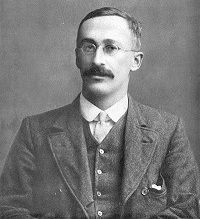

```{R, setup, include = F}
library(pacman)

p_load(here, tidyverse, xaringan, knitr, kableExtra, haven, broom, gifski, blogdown, xaringanthemer, modelsummary)

i_am("slides/EDUC643_3_inference.rmd")


red_pink <- "#e64173"
turquoise = "#20B2AA"
orange = "#FFA500"
red = "#fb6107"
blue = "#3b3b9a"
green = "#8bb174"
grey_light = "#B3B3B3"
grey_mid = "#7F7F7F"
grey_dark = "grey20"
purple = "#6A5ACD"
slate = "#314f4f"

extra_css <- list(
  ".red"   = list(color = "red"),
  ".blue"  =list(color = "blue"),
  ".red-pink" = list(color= "red_pink"),
  ".gray" = list(color= "#B3B3B3"),
  ".purple" = list(color = "purple"),
  ".small" = list("font-size" = "90%"),
  ".large" = list("font-size" = "120%"),
  ".tiny" = list("font-size" = "70%"),
  ".tiny2" = list("font-size" = "50%"))

write_extra_css(css = extra_css, outfile = "my_custom.css")

options(htmltools.dir.version = FALSE)

hook_output <- knit_hooks$get("output")
knit_hooks$set(output = function(x, options) {
  lines <- options$output.lines
  if (is.null(lines)) {
    return(hook_output(x, options))  # pass to default hook
  }
  x <- unlist(strsplit(x, "\n"))
  more <- "..."
  if (length(lines)==1) {        # first n lines
    if (length(x) > lines) {
      # truncate the output, but add ....
      x <- c(head(x, lines), more)
    }
  } else {
    x <- c(more, x[lines], more)
  }
  # paste these lines together
  x <- paste(c(x, ""), collapse = "\n")
  hook_output(x, options)
})

knitr::opts_chunk$set(warning = FALSE,
                      message = FALSE,
                      echo = FALSE,
                      fig.align = "center",
                      fig.height = 3)
```
# Roadmap

```{r, echo=F, out.width="90%"}
include_graphics("Roadmap1.jpg")
```


---
# Goals for the unit

.gray[
- Characterize a bivariate relationship along five dimensions (direction, linearity, outliers, strength and magnitude)
- Describe how statistical models differ from deterministic models
- Mathematically represent the population model and interpret its deterministic and stochastic components
- Formulate a linear regression model to hypothesize a population relationship
- Describe residuals and how they can describe the degree of our OLS model fit
]

- Explain $R^{2}$, both in terms of what it tells us and what it does not
- Estimated a fitted regression line using Ordinary-Least Squares regression
- Conduct an inference test for a regression coefficient and our regression model

.gray[
- Calculate a correlation coefficient $(r)$ and describe its relationship to $R^{2}$
- Distinguish between research designs that permit correlational associations and those that permit causal inferences
]

---
# A motivating question

Researchers (including two from the .green[**University of Oregon**]), [Nichole Kelly, Elizabeth Cotter and Claire Guidinger (2018)](https://doi.org/10.1016/j.eatbeh.2018.07.003), set out to understand the extent to which young men who exhibit overeating behaviors have weight-related medical and psychological challenges.

```{r, echo=F, out.height="80%"}
include_graphics("kelly_etal.png")
```

.small[Using real-world data (generously provided by Nichole Kelly) about the dietary habits, health, and self-appraisals of males 18-30, we are going to attempt to answer a similar question.]

.small[In particular, we are going to explore the .purple[**relationship**] between **dietary restraint behaviors** (self-reports on the extent to which participants consciously restricted/controlled their food intake) and **over-eating frequency** (participants' self-reported frequency of over-eating episodes).]


---
# A preliminary analysis

Before we get to the core question of the Kelly et al. study--how are dietary restraint behaviors related to over-eating frequency?--we are going to explore another important relationship in the data that may also be related to our main research question: the .purple[**relationship**] between .red-pink[**dietary restraint behaviors**] (self-reports on the extent to which participants consciously restricted/controlled their food intake) and .red-pink[**body-mass index (BMI)**]. In particular, we are going to operationalize this by examining the relationship in our sample of young men between our predictor variable (***EDEQ_restraint***) and their body-mass index (***BMI***). 

--

> We are examining this relationship so that we can better understand how all three of these variables (***OE_frequency***, ***EDEQ_restraint*** and ***BMI***) are related in Unit 3. Additionally, the properties of the variable ***BMI*** are pedadogically helpful in demonstrating the assumptions of OLS.

> However, we recognize that BMI has been shown to be relatively uninformative about individuals' overall health and categorizes individuals based on distributions initially derived exclusively from white Western European (French and Scottish) study participants. We use the measure for pedagogical purposes because the variable is one of the few continuous measures in one of the few datasets that our UO colleagues shared with us, while noting its problematic historical use.


```{r, echo=F}
do <- read_spss(here("data/male_do_eating.sav")) %>% 
    select(OE_frequency, EDEQ_restraint, EDS_total,
           BMI, age_year, income_group) %>%
    mutate(EDS_total = ifelse(EDS_total==-99, NA, EDS_total)) %>%
    drop_na()

```
---
# Our bivariate relationship

```{r, echo = F, fig.height=5.5, fig.width = 8}
lm_plot <- ggplot(do, aes(x=EDEQ_restraint, y=BMI)) + 
  geom_point() +
  ggtitle("BMI vs Dietary restraint") +
    theme_minimal(base_size = 16)


lm_plot  +
  geom_smooth(method='lm', se=F)
```

--

**Our linear model:**
$$BMI_{i} = \beta_0 + \beta_1 (EDEQ\_restraint_{i}) + \varepsilon_{i}$$

---
class: middle, inverse

# OLS regression

---
# Fit a regression

Let's try fitting our regression in R.

```{r, echo=T, comment = NA}
fit <- lm(BMI ~ EDEQ_restraint, data=do)
summary(fit)
```


---
## Evaluating regressions: Coefficients

.small[Here we can find our **intercept** and slope coefficients for our linear regression.]

```{r, highlight.output = c(4,5), echo = F, output.lines = -c(1:8), comment = NA}
summary(fit)

```

**The predicted BMI for a young male with a dietary restraint rating of 0 is 23.92 $(\beta_0)$.**

---
## Evaluating regressions: Coefficients

.small[Here we can find our intercept and **slope** coefficients for our linear regression.]

```{r, highlight.output = c(4,5), echo = F, output.lines = -c(1:8), comment = NA}
summary(fit)

```

--
.small[**A one unit difference in dietary restraint is positively associated with a 1.04 difference in BMI.**]

.small[Even better: **We reject the null hypothesis, and conclude that *on average, in the population* there is a relationship between dietary restraint and BMI. We estimate that young men who are one unit apart on dietary restraint index will have a BMI score 1.04 points different from each other.**]

--

.small[.blue[Why not just say "increase" or "decrease"?] Be careful of causal language! More on this next class!]

---
## Evaluating regressions: Std errors

.red-pink[**Standard errors**] represent how precisely we have estimated our regression coefficient, given our sample size, the quality of our model fit, and the variability in our predictor.

```{r, highlight.output = c(5), echo = F, output.lines = -c(1:8), comment = NA}
summary(fit)
```

--
.small[Not critical you understand the formula, but standard errors are important pieces of information that we'll examine in more detail momentarily:]

$$SE_{\hat{\beta_1}} = \sqrt{\frac{1}{n-2}*\frac{\Sigma (y_i - \hat{y_i})^2}{\Sigma (x_i - \bar{x})^2}}$$

---
## Evaluating regressions: Model fit

```{r, highlight.output = 9, echo = F, output.lines = -(1:8), comment = NA}
summary(fit)

```

The .red-pink[**residual standard error (RSE)**] is the standard deviation of the residuals. This summarizes the variability of observed values around the model-predicted values, in the original units of the outcome. 

$$RSE = 6.089$$

This means observed values vary around our model-predicted BMI with a standard deviation of 6.089. In BMI, 6 units is quite large!

---
# Degrees of freedom

Both RSE and the related measure of model fit, .red-pink[**Root Mean Square Error (RMSE)**], depend on the number of .red-pink[**degrees of freedom**] $(df)$ in your regression. Though it's not critical that you learn how to calculate RSE or RMSE, it is important to understand that is is a function of the **degrees of freedom** $(df)$ in your regression:

$$RSE = \sqrt{\frac{\text{sum of squared residuals}}{n-(\text{# of parameters estimated})_{SS}}}$$
.small[Our degrees of freedom decrease each time we use another parameter (add a predictor to our regression) to calculate the sum of squares. In a bivariate regression, our degrees of freedom (aka, the denominator) will always be] $n-2$ .small[because we are estimating two parameters] $\beta_0$ .small[and] $\beta_1$.small[. With smaller samples and many covariates, we may quickly use up our degrees of freedom.]

--

.blue[What happens to our model's precision as our degrees of freedom decreases?]

--

Use the stored model statistics to calculate RSE by hand: 
```{r, echo=T}
sqrt(sum(fit$residuals^2) / fit$df)
```

---
# Evaluating regression: $R^2$

Here is our summary of model performance.

```{r, highlight.output = 10, echo = F, output.lines = -(1:8), comment = NA}
summary(fit)

```

The R-squared value is .05. This means that our model accounts for 5% of the variance in BMI. Since our model has only one predictor, we can alternatively say Dietary Restraint accounts for 5% of the variance in BMI.

--

- The rest? Measurement error, random individual variation, other unobserved causes


---
# What does $R^2$ mean?

$R^2$ describes what proportion of the variation in the outcome the full regression model has explained.

Whether or not your model has a high or low $R^2$ is:
- Disciplinary dependent
- Entirely independent from whether or not your model accurately characterizes the relationship

$R^2$ does **NOT**:
- Imply anything about causality
- Tell us anything about whether there exists a linear or non-linear relationship (more on this soon)
- Tell us anything about the magnitude (steepness/shallowness) of the slope
---
class: middle, inverse

# Regression inference

---
# A review of inference

So far, we've been evaluating the statistics generated by models fit on our sample, but remember our primary interest is in making .purple[**an inference from the sample to the population.**]

Go back to EDUC 641 for a refresher on Null-Hypothesis Significance Testing (NHST), the Central Limit Theorem and $t$-distributions.

--

...but we're going to provide a quick review now before applying these concepts to understanding .red-pink[**standard errors**] and using them to construct .red-pink[**confidence intervals (CI)**].


---
# Basic review of NHST

Start by imagining a hypothetical world in which there is **no relationship** between $x$ and $y$ in our population. 

Last term, we formulated a set of null hypotheses about relationship between categorical data (e.g., no relationship between race of victim and death penalty sentence) or about whether a sample mean was different from a "known" population mean (e.g., life expectancy in Mediterranean countries is the same as in the full population of countries).

--

We can use the same framework to test elements of the General Linear Model and, in particular, regression coefficients. In particular, here we will test the null hypothesis that $\beta_{1} = 0$ (there is no relationship between dietary restraint behaviors and BMI).

$$\Large H_{0}: \beta_{1}= 0$$
--

Our alternative hypothesis is that there is a relationship:
$$\Large H_{1} \text{or} \Large H_{A}: \beta_{1} \neq 0$$
---
# The beauty of the CLT

We can imagine drawing samples over and over again (say...5,000 times) from this hypothetical null population. What values of $\hat{\beta_{1}}$ might we observe?


```{r, fig.height=5.75, fig.width=9, animation.hook='gifski', interval=0.9, eval=T}
library(scales)
set.seed(1234)
par(mar = c(2, 0.1, 3, 0))
pop <- 5000             #population
x <- runif(pop)
y <- rnorm(pop)
samples <- c(rep(0.006, 5000))
olslines <- list()
par(mfrow = c(1, 2))
show_examples <- c(1:10, 25, 50, 100, 500, 1000, 5000)
beta1 <- c()
for (i in seq_along(samples)) {
  sample_i <- sample(1:pop, pop * samples[i])
  ols <- lm(y[sample_i] ~ x[sample_i])
  olslines <- c(list(ols), olslines)
  beta1 <- c(beta1, coefficients(ols)[2])
  if (i %in% show_examples | i == length(samples)) {
    plot(x, y,
      col = alpha("grey", 0.1),
      pch = 19,
      #xlim = c(.05, 2.05),
      #ylim = c(.4, 2.4),
      main = paste0(
        signif(length(olslines), 3), " line fits on ",
        signif(length(olslines), 3)," samples"
      ),
      xaxt = 'n',
      yaxt = 'n'
    )
    
    for (olsold in olslines) {
      abline(
        reg = olsold,
        col = alpha("darkslategray", 1 / sqrt(sqrt(i))),
        lwd = 1.5
      )
    }
    if (i < length(samples)) {
      points(
        x[sample_i],
        y[sample_i],
        col = alpha("#e64173", 1),
        pch = 19,
        #xlim = 1 + c(-1.05, 1.05),
        #ylim = 1 + c(-1.4, 1.4)
      )
      abline(reg = ols,
             col = alpha("#e64173", 1),
             lwd = 5)
    }
    abline(
      a = 0,
      b = 0,
      lwd = 3,
      col = "black"
    )
    hist(
      beta1,
      #breaks = 0.3 + 1.4 * (0:30) / 30,
      main = paste0("Histogram of beta across ", signif(length(olslines), 3), " samples"),
      xlim = c(-3, 3),
      freq = F,
      yaxt = 'n',
      col = "darkslategray"
    )
  }
}
```


.footnote[h/t Simon Hess ([@simonhhess](https://twitter.com/simonhhess))]

---
# The beauty of the CLT

- Random sampling from the population **will return** sample means that will be asymptotically (approaching) normal in their distribution as the number of samples approaches infinity (i.e., they will take on a $Z$-distribution). This is (mathematically) what the Central Limit Theorem demonstrates.

- Because of that mathematical fact, we can conduct inference in the statistics.

- We know what the distribution of sample means from a null hypothesis will look like, so we can determine the probability of observing a sample statistic as extreme as we did

- .red-pink[**REMEMBER**]: this requires no assumptions about the shape of the sample variable(s); they do **NOT** have to be normally distributed for the CLT to hold

--

- ...but, how do we know how likely it is to have observed such an extreme sample statistic in the presence of a null relationship in the population?

---
# $p$-values

The statistic that captures the likelihood that one would observe a value of $\hat{\beta_{1}}$ of a given magnitude in a particular sample, in the presence of a null population, is called the .red-pink[***p*-value**].

Prior to interacting with our data, we set an .red-pink[**alpha threshold**]; a probability threshold, below which we will consider $p$ to be so small that it is unlikely that we would have gotten this result if the null were true, and we will reject the null hypothesis. Above this value, we will fail to reject the null.

In social science research, it is customary to (arbitrarily) set that threshold at **5 percent** $(p<0.05)$. In other words, we say that if the difference between our observed data and our expected data would have happened in fewer than 1 out of 20 randomly drawn samples, that the difference reflects a true difference in the population.

---
# What are we testing?

There are multiple inferential tests in a regression model:
* Tests of the coefficients
* Test of the model (omnibus test) 

```{r, highlight.output = c(4, 5, 11), echo = F, output.lines = -(1:8), comment = NA}
summary(fit)

```


Here, the $p$-value refers to the probability of obtaining a slope equal to or more extreme than $\beta$ assuming $H_0$ is true. 

--
.blue[But where do we get that *p*-value from?]

---
# Student's $t$-distribution

.pull-left[
- William Sealy Gosset, then a Head Experimental Brewer at Guinness Beer, wrote a pseudonymously published article in 1908 showing that estimates of $(\hat{\beta_{1}})$ divided by their standard error form a defined distribution
- This distribution is now known as Student's $t$-distribution
- Why *Student's* $t$-distribtion? Gosset's pseudonym was "Student"
]

.pull-right[
```{r, echo=F, out.height="90%"}

```
]

The $t$-statistic represents an estimate of how many standard errors $\hat{\beta_1}$ lies away from 0 in the $t$-distribution.

$$t = \frac{\hat{\beta_1} - \beta_{1}}{SE(\hat{\beta_1})}$$

- When we posit a null hypothesis, we assume that $\beta_{1}=0$

---
# $t$-distributions

* The degrees of freedom for our $t$-statistic is always *n*-1, where *n* is our sample size
* $t$-distributions with fewer degrees of freedom have "fatter" tails
* As the degrees of freedom get larger, the $t$-distribution approaches a standard normal distribution

  
  
```{r, animation.hook="gifski", interval=0.4, echo=F, eval=T}

df_seq <- tibble(df = seq(1, 30, 1))

for (i in 1:nrow(df_seq)) {
x <- ggplot(data.frame(x = c(-4, 4)), aes(x = x)) +
  stat_function(fun = dnorm,
                aes(color = "normal")) +
  stat_function(fun = dt, 
                args = list(df = df_seq$df[i]),
                color = "green") +
  ggtitle("T-Distributions",
          subtitle = paste("df =", df_seq$df[i])) +
  theme_minimal() +
  theme(plot.title = element_text(hjust = 0.5),
        plot.subtitle = element_text(hjust = 0.5))
print(x)
}
```

---
# How large is enough?

Generally, as we get to around 50 degrees of freedom, our $t$-distribution approaches a standard normal distribution, and our inferences are straightforward because the $p$-values for our $t$-test are the same as $p$-values are in the standard normal distribution.

### Critical values of $t_{\text{observed}}$

<br>

| $df$  |   **0.10**    |   **0.05**   |  **0.01** 
|-------|-----------------------------------------
|  10   |   1.81        |  2.23        | 3.17
|  20   |   1.72        |  2.09        | 2.85
|  30   |   1.70        |  2.04        | 2.75
|  50   |   1.68        |  2.01        | 2.68
|  100  |   1.66        |  1.98        | 2.63
|  $\rightarrow \infty$ | **1.64**   |  **1.96**  |  **2.58**

---
# Regression coefficients: $\hat{\beta_{0}}$

Our output shows us the significance of the intercept (typically, we are not interested in whether the intercept differs from 0).

```{r, highlight.output = c(4), echo = F, output.lines = -(1:8), comment = NA}
summary(fit)
```

---
# Regression coefficients: $\hat{\beta_{1}}$

```{r, highlight.output = c(5), echo = F, output.lines = -(1:8), comment = NA}
summary(fit)
```

$$t = \frac{\hat{\beta_1} - 0}{SE(\hat{\beta_1})} = \frac{1.0367}{0.137} = 7.57$$
$$Pr(t < -7.57 \text{ or } t > 7.57)|H_0 = 0.000000000000082 \text{ or } p <0.001$$
---
# Regression coefficients

```{r, highlight.output = c(5), echo = F, output.lines = -(1:8), comment = NA}
summary(fit)
```

Under the null hypothesis, it is extremely unlikely to obtain a Dietary Restraint slope of 1.04 (p < .001). Therefore, we can reject the null hypothesis and conclude that there is a positive relationship between Dietary Restraint rating and BMI, on average in the population.

---
# Confidence intervals (CIs)

It would be nice to say something more concrete about how accurately we have estimated this relationship.

Perhaps, we can identify a range of plausible values for $\hat{\beta_{1}}$. We may be able to use information about the quality of our model fit and the variability in our to construct intervals that offer a range of plausible values for the population parameter.

--

Let's develop some intuition around the idea of .red-pink[**confidence intervals (CIs)**].


---
# Confidence Interval intuition

```{r, echo=F, fig.height=7}
set.seed(1234)

n = 5000
x = rnorm(n, 2, 0.2)
epsilon = rnorm(n, 0, 0.2)
y = 1 + 2*x + epsilon

df = tibble(x, y)

model = lm(y ~ x, data = df)

# df %>% 
#   ggplot(aes(x = x, y = y)) +
#   geom_point(alpha=0.1, shape=21) +
#   geom_smooth(method = "lm", se = FALSE) +
#   ggpubr::stat_regline_equation() +
#   ylim(3,7) +
#   xlim(1.1, 2.7) +
#   theme_minimal(base_size=16)

ci <- augment(model, interval = "confidence")

plotdf <- tibble(
  x = ci$x,
  y = ci$y, 
  line = ci$.fitted,
  ci_lwr = ci$.lower,
  ci_upr = ci$.upper)

plot1 <- plotdf %>% 
  ggplot(aes(x = x, y = y)) +
  geom_point(alpha=0.1, shape=21) + 
  geom_line(aes(x = x, y = line), colour = "blue") +
  ylim(3,7) +
  xlim(1.2, 2.7) +
  ggpubr::stat_regline_equation() +
  geom_ribbon(aes(x = x, ymin = ci_lwr, ymax = ci_upr), fill = "gray20", alpha = 0.3) +
  labs(caption = "blue: hypothetical linear regression line on full population,
       gray: 95% CI") +
  theme_minimal(base_size=16)

plot1
```

---
# Confidence interval intuition

```{r, echo=F, fig.height=7}

n2 = 50
x2 = rnorm(n2, 2, 0.2)
nu = rnorm(n2, 0, 0.2)
y2 = 1 + 2*x2 + nu

df2 = tibble(x2, y2)

plot2 <- ggplot() +
          geom_point(data=plotdf, aes(x=x, y=y), alpha=0.1, shape=21) + 
          geom_point(data=df2, aes(x=x2, y=y2), color="orange") +
          geom_smooth(data=df2, aes(x=x2, y=y2), method='lm') + 
          ylim(3,7) +
          xlim(1.2, 2.7) +
          ggpubr::stat_regline_equation(data=df2, aes(x=x2, y=y2)) +
            labs(caption = "blue: linear regression line on random sample of 50 observations,
            gray: 95% CI on random sample estimate") +
          theme_minimal(base_size=16)
plot2
```

---
# Condidence interval intuition
```{r, echo=F, fig.height=7}
library(gganimate)
nsim = 100 ## Number of simulations
n = 50

sim_tbl <- tibble(
  x = rnorm(n*nsim, 2, sd = 0.2),
  epsilon = rnorm(n*nsim, 0, sd = 0.2),
  y = 1 + 2*x + epsilon,
  sim_num = rep(1:nsim, n)) ## This tibble puts all the simulated data in one

sim_lm_tbl <- sim_tbl %>% 
  group_by(sim_num) %>% 
  nest() %>% ## Group by simulation number and separately fit linear models
  mutate(
    lm = purrr::map(.x = data, .f = ~ lm(y ~ x, data = .x)),
    lm_tidy = purrr::map(lm, broom::tidy))

sim_coef_tbl <- sim_lm_tbl %>% 
  select(sim_num, lm_tidy) %>% 
  unnest(lm_tidy) %>% 
  select(sim_num, term, estimate) %>%
  pivot_wider(names_from = "term",
                     values_from = "estimate")

sim_conf_int <- augment(model, newdata = sim_tbl, interval = "confidence") %>% 
  select(x, y, .lower, .upper)

animation1 = ggplot() +
  geom_point(data=df, aes(x, y), alpha=0.1, shape=21) +
  geom_point(data = sim_tbl, aes(x = x, y = y), color = "orange") +
  geom_ribbon(data = sim_conf_int, aes(x = x, y = y, ymin = .lower, ymax = .upper),
              alpha = 0.5) +
  geom_abline(intercept = model$coefficients[1],
              slope = model$coefficients[2], color = "blue") +
  geom_abline(data = sim_coef_tbl,
              aes(slope = x, intercept = `(Intercept)`), 
              color = "orange") +
  ylim(3,7) +
  xlim(1.2, 2.7) +
  transition_states(sim_num, wrap=FALSE) +
  shadow_mark(color = "orange", alpha = 0.2) +
  labs(subtitle = "Simulation {closest_state}",
       caption = "blue: single estimated linear regression line,
       orange: 100 simulated linear regression lines") +
  theme_minimal(base_size=16)

animation1
```

---
## Slope $(\hat{\beta_{1}})$ sampling distribution 
We can use this same approach to construct a distribution of estimated slopes $\hat{\beta_{1}}$. Here, we imagine the "true" population slope is 1.

```{r, fig.height=5, fig.width=9, animation.hook='gifski', interval=0.9, eval=T}
library(scales)
set.seed(2)
par(mar = c(2, 0.1, 3, 0))
pop <- 5000             #population
x <- runif(pop) * 2
y <- x + rnorm(pop) / 2
samples <- c(rep(0.006, 5000))
olslines <- list()
par(mfrow = c(1, 2))
show_examples <- c(1:10, 25, 50, 100, 500, 1000, 5000)
beta1 <- c()
for (i in seq_along(samples)) {
  sample_i <- sample(1:pop, pop * samples[i])
  ols <- lm(y[sample_i] ~ x[sample_i])
  olslines <- c(list(ols), olslines)
  beta1 <- c(beta1, coefficients(ols)[2])
  if (i %in% show_examples | i == length(samples)) {
    plot(x, y,
      col = alpha("grey", 0.1),
      pch = 19,
      xlim = c(.05, 2.05),
      ylim = c(.4, 2.4),
      main = paste0(
        signif(length(olslines), 3), " line fits on ",
        signif(length(olslines), 3)," samples"
      ),
      xaxt = 'n',
      yaxt = 'n'
    )
    
    for (olsold in olslines) {
      abline(
        reg = olsold,
        col = alpha("darkslategray", 1 / sqrt(sqrt(i))),
        lwd = 1.5
      )
    }
    if (i < length(samples)) {
      points(
        x[sample_i],
        y[sample_i],
        col = alpha("#e64173", 1),
        pch = 19,
        xlim = 1 + c(-1.05, 1.05),
        ylim = 1 + c(-1.4, 1.4)
      )
      abline(reg = ols,
             col = alpha("#e64173", 1),
             lwd = 5)
    }
    abline(
      a = 0,
      b = 1,
      lwd = 3,
      col = "black"
    )
    hist(
      beta1,
      breaks = 0.3 + 1.4 * (0:30) / 30,
      main = paste0("Histogram of beta across ", signif(length(olslines), 3), " samples"),
      xlim = c(0.4, 1.6),
      freq = F,
      yaxt = 'n',
      col = "darkslategray"
    )
  }
}
```


.footnote[h/t Simon Hess ([@simonhhess](https://twitter.com/simonhhess))]

---
# Formal confidence intervals

The intuition to take from the preceding simulation is that the confidence interval corresponds to the frequency with which the underlying "true" population parameter will fall within the range of the confidence interval over repeated sampling from that population. 

For a given $\alpha$-threshold, we are positing that 90 or 95, 99 or 99.9 percent of future confidence intervals drawn from repeated samples will encompass the true value of the population parameter. 

Colloquially: "If we drew a sample over and over again and computed a 95% confidence interval for each replication, then 95% of those intervals would contain the true mean."

--

.red[**NOT**]: "there is a 95% probability that the true mean lies within the confidence interval"

--

Confidence interval for $\hat{\beta_1}$:

$$\hat{\beta_1} \pm t_{n-2}^{critical}[se(\hat{\beta_1})]$$
---
# Confidence intervals (CIs)

```{r, highlight.output = c(5), echo = F, output.lines = -(1:8), comment = NA}
summary(fit)
```
95% CIs:
$$\hat{\beta_1} \pm t_{n-2}[se(\hat{\beta_1})]$$
$$ 1.037 \pm 1.96(0.137)$$

$$[0.768, 1.306]$$

---
# Confidence intervals (CIs)

Let's do the same with R
```{r, echo=T, highlight.output=c(5)}
tidy(fit, conf.int=T)
```

--

```{r, echo = F, fig.height = 3.75}
lm_plot +  geom_smooth(method='lm')
```

---
## $F$-Distributions and omnibus tests

The omnibus test uses the $F$-distribution to test the ratio of two variances (i.e., explained vs unexplained variance). This is a different, but similar, distribution to the $t$-distribution. For now, it's not critical that you know how it differs.

Null hypothesis: The model does not account for any variance in $Y$.

If we reject the null, then the model accounts for more variance than we would expect by chance. 
---
## $F$-Distributions and omnibus tests

Just like tests with other probability distribution, we are testing the probability of obtaining a value (or more extreme value) of $F$ under the $F$-Distribution.

$$\Large F = \frac{MS_{Model}}{MS_{residual}}$$

Mean Squares (MS) are the Sums of Squares divided by their respective degrees of freedom.

---
# Interpreting the omnibus test

```{r, highlight.output = c(11), echo = F, output.lines = -(1:8), comment = NA}
summary(fit)

```

Our omnibus test is significant at an $\alpha$-threshold of 0.05 $(p < 0.001)$, therefore we can reject the null hypothesis that the full model accounts for no variability in individuals' BMI.

---
# Summarizing regression results
```{r, echo=T}
modelsummary(fit, stars=T,
  gof_omit = "Adj.|AIC|BIC|Log",
  coef_rename = c("EDEQ_restraint" = "Dietary Restraint Index (0-6)"))
```

---
# Summarizing regression results

```{r, echo=F}
modelsummary(fit, stars=T,
     gof_omit = "Adj.|AIC|BIC|Log",
     coef_rename = c("EDEQ_restraint" = "Dietary Restraint Index (0-6)"))
```


.small[We postulated a linear model which we estimated via Ordinary-Least Squares regression to assess whether there is a relationship between BMI and Dietary Restraint, on average, in the population of young adult males. At an alpha threshold of 0.05, we found that Dietary Restraint was a significant predictor of BMI and accounted for approximately 5 percent of the variance in BMI. We estimate that young men who are one unit apart on a dietary restraint index will have a BMI score 1.04 (*p*<0.001, 95% CI: 0.77, 1.31) points different from each other.]


---
## Putting it all together...so far

- **Understand your data first**
 + Summarize and visualize each variable independently
 + Start with a visual representation of the relationship between your two variables
- **Your General Linear Model represents your hypothesis about the population**
 + When you fit a regression model, you are estimating *sample* values of *population* parameters that you will not directly observe
 + The goal of classical regression inference is to understand how likely the observed data in your sample are in the presence of no relationship in the unobserved population
 + State a null hypothesis
 + Establish an alpha threshold
- **Use Ordinary Least Squares regression to estimate the relationship**
 + Interpret coefficients, standard errors, $R^2$
 + .purple[*Assess assumptions*]
 + Conduct an inference test
 + Reject (or fail to reject) the null
 + Substantively interpret

 
---
class: middle, inverse
# Synthesis and wrap-up


---
# Class goals

- Formulate a linear regression model to hypothesize a population relationship
- Explain $R^{2}$, both in terms of what it tells us and what it does not
- Estimated a fitted regression line using Ordinary-Least Squares regression
- Conduct an inference test for a regression coefficient and our regression model

---
# To-Dos

### Reading: 
- **By January 19 class**: LSWR Chapter 15.1 - 15.2 and 15.4 - 15.7
- **By January 24 class**: LSWR Chapter 5.7

### Quiz: 
- Opens 3:45 on Thursday, Jan. 19

### Assignment 1:
- Now live
- Have all information you need to complete
- Due Jan. 24, 11:59pm


