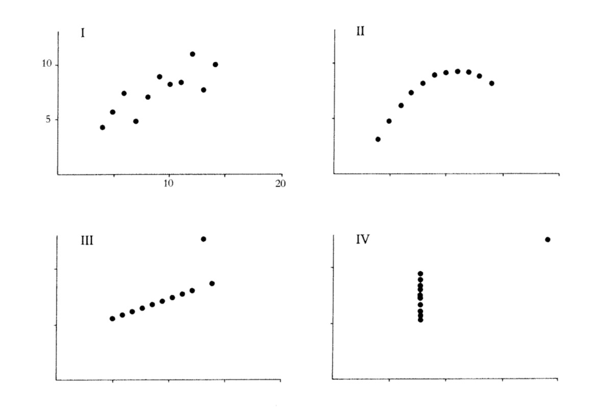
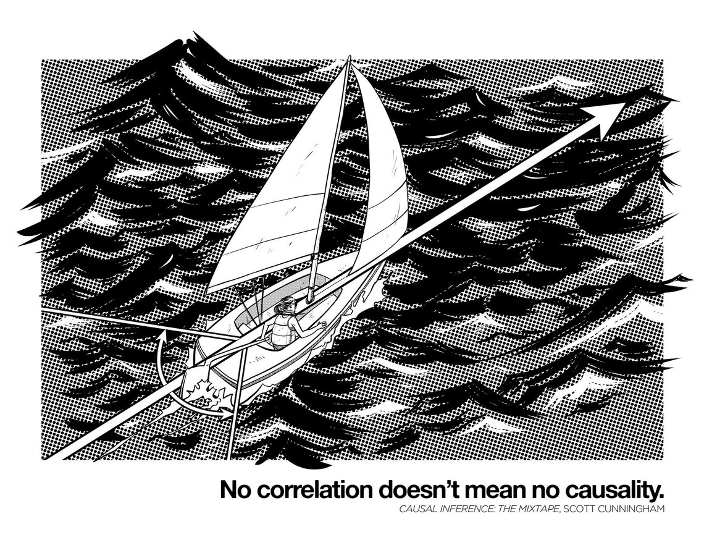

```{R, setup, include = F}
library(pacman)

p_load(here, MASS, tidyverse, ggplot2, xaringan, knitr, kableExtra, haven, broom, xaringanthemer)


i_am("slides/EDUC643_4_correlation.rmd")


red_pink <- "#e64173"
turquoise = "#20B2AA"
orange = "#FFA500"
red = "#fb6107"
blue = "#3b3b9a"
green = "#8bb174"
grey_light = "#B3B3B3"
grey_mid = "#7F7F7F"
grey_dark = "grey20"
purple = "#6A5ACD"
slate = "#314f4f"

extra_css <- list(
  ".red"   = list(color = "red"),
  ".blue"  =list(color = "blue"),
  ".red-pink" = list(color= "red_pink"),
  ".gray" = list(color= "#B3B3B3"),
  ".purple" = list(color = "purple"),
  ".small" = list("font-size" = "90%"),
  ".large" = list("font-size" = "120%"),
  ".tiny" = list("font-size" = "70%"),
  ".tiny2" = list("font-size" = "50%"))


write_extra_css(css = extra_css, outfile = "my_custom.css")


# Knitr options
opts_chunk$set(
  comment = "#>",
  fig.align = "center",
  fig.height = 6.75,
  fig.width = 10.5,
  warning = F,
  message = F
)
opts_chunk$set(dev = "svg")
options(device = function(file, width, height) {
  svg(tempfile(), width = width, height = height)
})
options(knitr.table.format = "html")


hook_output <- knit_hooks$get("output")
knit_hooks$set(output = function(x, options) {
  lines <- options$output.lines
  if (is.null(lines)) {
    return(hook_output(x, options))  # pass to default hook
  }
  x <- unlist(strsplit(x, "\n"))
  more <- "..."
  if (length(lines)==1) {        # first n lines
    if (length(x) > lines) {
      # truncate the output, but add ....
      x <- c(head(x, lines), more)
    }
  } else {
    x <- c(more, x[lines], more)
  }
  # paste these lines together
  x <- paste(c(x, ""), collapse = "\n")
  hook_output(x, options)
})

```
# Roadmap

```{r, echo=F, out.width="90%"}
include_graphics("Roadmap1.jpg")
```


---
# Goals for the unit

.gray[
- Characterize a bivariate relationship along five dimensions (direction, linearity, outliers, strength and magnitude)
- Describe how statistical models differ from deterministic models
- Mathematically represent the population model and interpret its deterministic and stochastic components
- Formulate a linear regression model to hypothesize a population relationship
- Estimated a fitted regression line using Ordinary-Least Squares regression
- Describe residuals and how they can describe the degree of our OLS model fit
- Explain $R^{2}$, both in terms of what it tells us and what it does not
- Conduct an inference test for a regression coefficient and our regression model
]
- Calculate a correlation coefficient $(r)$ and describe its relationship to $R^{2}$
- Distinguish between research designs that permit correlational associations and those that permit causal inferences


---
class: middle, inverse


---
class: middle, inverse

# Correlation ...and causality

---
# Correlations

* Correlation coefficients $(r)$ describe the **strength** of a linear relationship between two variables. 

* The concept was first developed by Karl Pearson a eugenics professor at the University College of London. He held many despicable [views](https://nautil.us/issue/92/frontiers/how-eugenics-shaped-statistics).

* He (along with Francis Galton and RA Fisher) also pioneered many of the basic tools of modern statistics, including standard deviation, $\chi^2$, goodness of fit and correlation

* Correlations are dimensionless measures that eliminate the metrics of any particular scale. To do so requires **standardizing** each variable.

---
# Standardizing variables

* Any variable can be standardized using a simple algorithm.

Each observation $(i)$ is transformed into standardized form using the following formula:

$$z_{i} = \frac{X_{i} - \mu}{\sigma}$$

* The standardized value is calculated calculated by **subtracting the mean** from each value and **dividing by the standard deviation**.

* The sample mean of the new variable is 0 and its standard deviation is 1

* The new values represent an observation's distance from the mean in standard deviation units.

* Values range from -1 to 1
  + Positive Values - higher values of Y $\rightarrow$ higher values of X (and vice-versa)
  + Negative Values - higher values of Y $\rightarrow$ lower values of X (and vice-versa)

* **Doesn't change anyone's relative rank**

* **Doesn't create a normally distributed variable**

---
# Correlations visualized
```{r, echo = F, fig.width = 10, fig.height = 6}
set.seed(5)
# create the variance covariance matrix
sigma<-rbind(c(1,-0.2,-0.9), c(-0.2,1, 0.6), c(-0.9,0.6,1))
# create the mean vector
mu<-c(10, 5, 2) 
# generate the multivariate normal distribution
df<-as.data.frame(mvrnorm(n=100, mu=mu, Sigma=sigma))

small <- ggplot(df, aes(x = V1, y = V2)) +
  geom_point() +
  geom_smooth(method = "lm", se = F) +
  theme_minimal() +
  ggtitle("Correlation = -.2")

medium <- ggplot(df, aes(x = V2, y = V3)) +
  geom_point() +
  geom_smooth(method = "lm", se = F) +
  theme_minimal() +
  ggtitle("Correlation = .6")

large <- ggplot(df, aes(x = V1, y = V3)) +
  geom_point() +
  geom_smooth(method = "lm", se = F) +
  theme_minimal() +
  ggtitle("Correlation = -.9")

gridExtra::grid.arrange(small, medium, large, nrow = 1)

```
---
# Visualize in our data
Let's transform *BMI* and *EDEQ_RESTRAINT* into standardized versions:
```{r, echo=F, fig.height=5}
do <- read_spss(here("data/male_do_eating.sav")) %>% 
    select(Study_ID, BMI, age_year, income_group, OE_frequency, 
         EDEQ_restraint, DERS_total, DMS_mean, EDS_total, 
          MBAS_muscularity, MBAS_height, SATAQ_total) %>%
        drop_na()
stdDO <- do %>% dplyr::select(BMI, EDEQ_restraint)
stdDO <- stdDO %>% mutate(BMI_s = (BMI - mean(BMI)) / sd(BMI))
stdDO <- stdDO %>% mutate(EDEQ_s = (EDEQ_restraint - mean(EDEQ_restraint)) / sd(EDEQ_restraint))

std <- ggplot(stdDO, aes(EDEQ_s, BMI_s)) +
  geom_point() +
  geom_smooth(method='lm') +
  theme_minimal(base_size=14)

std
```
Note that the scale of our variables have changed.

- The standardized regression line goes through the origin (0, 0)

---
# Visualize in our data
Let's transform *BMI* and *EDEQ_RESTRAINT* into standardized versions:
```{r, echo=F, fig.height=5}
std
```
The new fitted regression line is:

$$\hat{BMI_{std}} = 0.000 + 0.2247 * DietaryRestraint_{std}$$

Just for fun, let's multiply that 0.2247 by itself: $(0.2247)^2 = 0.0505$. .blue[**Anything familiar about 0.05?**]

---
# $r$ and $R^2$

$$r = \sqrt{R^2}$$
The coefficient on the regression of two standardized variables is called the Pearson product-moment coefficient. It is the same as the Pearson product-moment correlation (otherwise known as Pearson correlation). And it is the square root of the $R^2$. 

--

That's it, that's the slide...
---
# Anscombe's Quartet

...but, correlation is not everything. [Frank Anscombe (1973)](https://www.jstor.org/stable/2682899) first highlighted the following set of distributions, all with correlations $(r)$ of exactly 0.816.

```{r, echo=T, out.width="80%", echo=F}

```

---

# What correlation does(n't) mean

Four datasets, each with two variables with (nearly) identical means and correlations

```{r, echo=F}
datasauRus::datasaurus_dozen %>% 
  filter(dataset %in% c("circle", "h_lines", "slant_down", "dino")) %>%
  group_by(dataset) %>%
  summarise(
    mean(x),
    mean(y),
    cor(x, y))
```

.blue[What's the correlation between x and y  across these four datasets?]

--

All seem pretty similar, right? Let's take a look at their bivariate relationship...

---
# What correlation does(n't) mean

```{r, echo=F}

datasauRus::datasaurus_dozen %>% 
  filter(dataset %in% c("circle", "h_lines", "slant_down", "dino")) %>%
  ggplot(aes(x=x, y=y, colour=dataset))+
  geom_point()+
  theme_minimal(base_size=14)+
  theme(legend.position = "none")+
  facet_wrap(~dataset, ncol=2)


```


---
# Correlation $\neq$ causation

Does U.S. beef consumption cause more "beefs" between Oregonians and their spouses?
* What is the relationship between Oregon's per capita divorce rate and U.S. per capita beef consumption? 

--
```{r, echo = F, fig.height = 4, fig.width= 8}
beef <- read_csv(here::here("data/divorce_beef.csv"))

ggplot(beef, aes(divorce_rate, beef_consumption)) +
  geom_point() +
  geom_smooth(method = "lm", se = F) +
  theme_minimal() +
  ggtitle("Oregon Divorce Rate and U.S. Beef Consumption (2000-2009)")
```

There certainly seems to be a relationship! Let's fit a simple regression model.
---
# Divorce and Beef

If we regress divorce rate on beef consumption...

```{r, highlight.output = c(5), echo = F, output.lines = -(1:8), comment = NA}
m_beef <- lm(divorce_rate ~ beef_consumption, beef)
summary(m_beef)
```

Beef consumption accounts for 50% of the variance in Oregon's divorce rate!

---
# Divorce and Beef

If we regress U.S. beef consumption on Oregon's divorce rate...

```{r, highlight.output = c(5), echo = F, output.lines = -(1:8), comment = NA}
m_beef <- lm(beef_consumption ~ divorce_rate, beef)
summary(m_beef)
```

Oregon's divorce rate accounts for 50% of the variance in U.S. beef consumption!
---
# Divorce and Beef

What can we conclude? - Do increases in Oregon's divorce rate **cause** increases in U.S. beef consumption, or do increases in beef consumption **cause** increases in the divorce rate?

--

**Probably neither...**

--

We tested for a linear relationship. There is a significant linear relationship (or correlation) between divorce rate and beef consumption, but we have not established a causal relationship.

**We cannot establish causality, nor the direction of the relationship with a statistical test.**


---
# Why correlation $\neq$ causation?

```{r, echo=F, fig.height=5}
dag <- ggdag::dagify(x ~ y,
                       y ~ x,
              labels = c("x" = "Beef",
                         "y" = "Divorce"))
ggdag::ggdag(dag, layout="circle", use_labels = "label", text_size = 8) +
  theme_void()
```

---
# Spurious correlation

```{r, echo=F, fig.height=4}
dag <- ggdag::dagify(x ~ y,
                       y ~ z,
                       x ~ z,
                       y ~ z,
                     labels = c("x" = "Beef",
                         "y" = "Divorce",
                         "z" = "Winter"))
ggdag::ggdag(dag, layout="circle", use_labels = "label", text_size = 8) +
  theme_void()
```

A third variable causes changes in X and also in Y. Sometimes called a .red[*confounder*].

> .small[It is easy to prove that the wearing of tall hats and the carrying of umbrellas enlarges the chest, prolongs life, and confers comparative immunity from disease...A university degree, a daily bath, the owning of thirty pairs of trousers, a knowledge of Wagner’s music, a pew in church, anything, in short, that implies more means and better nurture…can be statistically palmed off as a magic spell conferring all sorts of privileges...The mathematician whose correlations would fill a Newton with admiration, may, in collecting and accepting data and drawing conclusions from them, fall into quite crude errors by just such popular oversights. -George Bernard Shaw (1906)]

---
# Why correlation $\neq$ causation?

Other common problems include:
- [Colliders](http://www.the100.ci/2017/03/14/that-one-weird-third-variable-problem-nobody-ever-mentions-conditioning-on-a-collider/): a third variable that is caused by both the predictor and outcome; controlling for this can make a true causal relationship disappear!
- Reverse causation: X may cause Y **or** Y may cause X
- Simpson's Paradox: a third variable may reverse the correlation
- Also, **lack** of correlation $\neq$ **lack** of causality

```{r, echo=F, out.width="40%"}

```
h/t [@causalinf](https://twitter.com/causalinf)


---
# From correlation to causality

### Five criteria for establishing causality:<sup>1</sup>

1. Cause must precede effect in time
2. Identified mechanism
3. Consistency
4. Responsiveness
5. No plausible alternative explanation

Highest priority is establishing .red[**exogeneous variation**] in exposure to some "treatment."

--

Research design is critical. So too can be [Directed Acyclical Graphs (DAGs)](https://journals.sagepub.com/doi/pdf/10.1177/2515245917745629). We have whole classes dedicated to just this topic (EDLD 650, EDLD 679).

.footnote[[1] Derived from [Shadish, Cook and Cambpell (2002)](https://books.google.com/books/about/Experimental_and_Quasi_experimental_Desi.html?id=o7jaAAAAMAAJ) and John Stuart Mill.]


---
# Turn and Talk

* Discuss science communication and how you would distinguish correlations from causal relationships to the average person.

* In what contexts might it be difficult to conduct an experimental study to establish causality?

---
class: middle, inverse

# Stay within the lines

---
# Regression as a prediction

Regression equations can be used to evaluate the relationship between variables, and to predict expected values based on particular values of our IVs.

We can ask: What is the expected BMI value for a young male with a Dietary Restraint rating of **4**?

--
$$\Large BMI = 23.94 + 1.03*(\boldsymbol{4}) = 28.1$$
The expected BMI for a Dietary Restraint of 4 is 28.1

--

Technically, there is no limit to what we can input!

---
# Predicting beyond your data

Regression equations can be used to evaluate the relationship between variables, and to predict expected values based on particular values of our IVs.

We can ask: What is the expected BMI value for a young male with a Dietary Restraint rating of **400**?

--

Using our measure, this is not a possible value of Dietary Restraint but we can still estimate BMI using our regression equation.

--
$$\Large BMI = 23.94 + 1.03*(\boldsymbol{400}) = 439.9$$
An adult would have to weigh 2,894 pounds at 5' 8" to have a BMI of 439.9.

--

**Only predict within the bounds of your data.**


---
class: middle, inverse
# Synthesis and wrap-up

