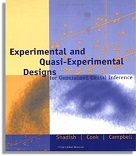

```{R, setup, include = F}
library(pacman)

p_load(here, MASS, tidyverse, ggplot2, xaringan, knitr, kableExtra, haven, xaringanthemer)


i_am("slides/EDUC643_4_correlation.rmd")


red_pink <- "#e64173"
turquoise = "#20B2AA"
orange = "#FFA500"
red = "#fb6107"
blue = "#3b3b9a"
green = "#8bb174"
grey_light = "#B3B3B3"
grey_mid = "#7F7F7F"
grey_dark = "grey20"
purple = "#6A5ACD"
slate = "#314f4f"

extra_css <- list(
  ".red"   = list(color = "red"),
  ".blue"  =list(color = "blue"),
  ".red-pink" = list(color= "red_pink"),
  ".gray" = list(color= "#B3B3B3"),
  ".purple" = list(color = "purple"),
  ".small" = list("font-size" = "90%"),
  ".large" = list("font-size" = "120%"),
  ".tiny" = list("font-size" = "70%"),
  ".tiny2" = list("font-size" = "50%"))

write_extra_css(css = extra_css, outfile = "my_custom.css")

options(htmltools.dir.version = FALSE)

hook_output <- knit_hooks$get("output")
knit_hooks$set(output = function(x, options) {
  lines <- options$output.lines
  if (is.null(lines)) {
    return(hook_output(x, options))  # pass to default hook
  }
  x <- unlist(strsplit(x, "\n"))
  more <- "..."
  if (length(lines)==1) {        # first n lines
    if (length(x) > lines) {
      # truncate the output, but add ....
      x <- c(head(x, lines), more)
    }
  } else {
    x <- c(more, x[lines], more)
  }
  # paste these lines together
  x <- paste(c(x, ""), collapse = "\n")
  hook_output(x, options)
})

knitr::opts_chunk$set(warning = FALSE,
                      message = FALSE,
                      echo = FALSE,
                      fig.align = "center",
                      fig.height = 3)

```
# Roadmap

```{r, echo=F, out.width="90%"}
include_graphics("Roadmap1.jpg")
```


---
# Goals for the unit

.gray[
- Characterize a bivariate relationship along five dimensions (direction, linearity, outliers, strength and magnitude)
- Describe how statistical models differ from deterministic models
- Mathematically represent the population model and interpret its deterministic and stochastic components
- Formulate a linear regression model to hypothesize a population relationship
- Estimated a fitted regression line using Ordinary-Least Squares regression
- Describe residuals and how they can describe the degree of our OLS model fit
- Conduct an inference test for a regression coefficient and our regression model
]
- Explain $R^{2}$, both in terms of what it tells us and what it does not
- Calculate a correlation coefficient $(r)$ and describe its relationship to $R^{2}$
- Distinguish between research designs that permit correlational associations and those that permit causal inferences


---
class: middle, inverse

# Correlation ...and causality

---
# Correlations

* Correlation coefficients $(r)$ describe the **strength** of a linear relationship between two variables. 

* The concept was first developed by Karl Pearson a eugenics professor at the University College of London. As we discussed last term, he held many despicable [views](https://nautil.us/how-eugenics-shaped-statistics-238014/).

* He (along with Francis Galton and RA Fisher) also pioneered many of the basic tools of modern statistics, including the concepts of standard deviation, $\chi^2$, goodness of fit and the correlation coefficient

* Correlations are dimensionless measures that eliminate the metrics of any particular scale. 

* To construct these dimensionless measures requires **standardizing** each variable.

---
# Standardizing variables

* Any variable can be standardized using a simple algorithm.

Each observation $(i)$ is transformed into standardized form using the following formula:

$$z_{i} = \frac{X_{i} - \mu}{\sigma}$$

* The standardized value is calculated calculated by **subtracting the mean** from each value and **dividing by the standard deviation**.

* The sample mean of the new variable is 0 and its standard deviation is 1

* The new values represent an observation's distance from the mean in standard deviation units.

--

* **Doesn't change anyone's relative rank**

* **Doesn't create a normally distributed variable**

---
# Correlations visualized
```{r, echo = F, fig.width = 10, fig.height = 6}
set.seed(5)
# create the variance covariance matrix
sigma<-rbind(c(1,-0.2,-0.9), c(-0.2,1, 0.6), c(-0.9,0.6,1))
# create the mean vector
mu<-c(10, 5, 2) 
# generate the multivariate normal distribution
df<-as.data.frame(mvrnorm(n=100, mu=mu, Sigma=sigma))

small <- ggplot(df, aes(x = V1, y = V2)) +
  geom_point() +
  geom_smooth(method = "lm", se = F) +
  theme_minimal() +
  ggtitle("Correlation = -.2")

medium <- ggplot(df, aes(x = V2, y = V3)) +
  geom_point() +
  geom_smooth(method = "lm", se = F) +
  theme_minimal() +
  ggtitle("Correlation = .6")

large <- ggplot(df, aes(x = V1, y = V3)) +
  geom_point() +
  geom_smooth(method = "lm", se = F) +
  theme_minimal() +
  ggtitle("Correlation = -.9")

gridExtra::grid.arrange(small, medium, large, nrow = 1)

```
---
# Visualize in our data
Let's transform *BMI* and *EDEQ_RESTRAINT* into standardized versions:
```{r, echo=T, fig.height=5}
# Read in the data
do <- read_spss(here("data/male_do_eating.sav")) %>% 
    select(OE_frequency, EDEQ_restraint, EDS_total,
           BMI, age_year, income_group) %>%
    mutate(EDS_total = ifelse(EDS_total==-99, NA, EDS_total)) %>%
    drop_na()

# Standardize the variables
do <- do  %>% 
      mutate(BMI_std = (BMI - mean(BMI)) / sd(BMI))
do <- do %>% 
      mutate(EDEQ_std = 
      (EDEQ_restraint - mean(EDEQ_restraint)) / sd(EDEQ_restraint))
```

---
# Visualize in our data
Let's transform *BMI* and *EDEQ_RESTRAINT* into standardized versions:
```{r, echo=F, fig.height=5}
std <- ggplot(do, aes(EDEQ_std, BMI_std)) +
  geom_point() +
  geom_smooth(method='lm', se=F) +
  theme_minimal(base_size=16)

std
```
Note that the scale of our variables have changed.

- The standardized regression line goes through the origin (0, 0)

---
# Visualize in our data
Let's transform *BMI* and *EDEQ_RESTRAINT* into standardized versions:
```{r, echo=F, fig.height=5}
std
```
The new fitted regression line is:

$$\hat{BMI_{std}} = 0.000 + 0.2241 * DietaryRestraint_{std}$$

For fun, multiply that 0.2241 by itself: $(0.2241)^2 = 0.0502$. .blue[**Anything familiar about 0.05?**]

---
# $r$ and $R^2$

$$r = \sqrt{R^2}$$
The coefficient on the regression of two standardized variables is called the .red-pink[**Pearson product-moment coefficient**]. It is the same as the .red-pink[**Pearson product-moment correlation**] (otherwise known as Pearson correlation). And it is the square root of the $R^2$. 

Correlation coefficient values range from -1 to 1
  + Positive Values: higher values of Y $\rightarrow$ higher values of X (and vice-versa)
  + Negative Values: higher values of Y $\rightarrow$ lower values of X (and vice-versa)

--

### Calculate correlation coefficient in R
```{r, echo=T}
cor(do$BMI, do$EDEQ_restraint)
```

---
# Formal correlation coefficient

.red-pink[**Covariance**]: 

$$\text{cov}_{XY} = \sigma_{XY} = \frac{1}{N-1} \sum_{i=1}^N (X_i - \bar{X})(Y_i - \bar{Y})$$
- However, units of covariance are hard to interpret, so...

--

.red-pink[**Correlation**]:

$$\text{corr}_{XY} = \rho_{XY} = \frac{\text{cov}_{XY}}{\hat{\sigma}_{X} \hat{\sigma}_{Y}}$$

- Pearson correlation divides by the standard deviation to put on a scale of -1 to 1

---
# Anscombe's Quartet

...but, correlation is not everything. [Frank Anscombe (1973)](https://www.jstor.org/stable/2682899) first highlighted the following set of distributions, all with correlations $(r)$ of exactly 0.816.

```{r, echo=T, out.width="80%", echo=F}
include_graphics("anscombe.jpg")
```

---

## What correlation does(n't) mean

.small[Here are four datasets, each with two variables with (nearly) identical means and correlations.]

```{r, echo=F}
datasauRus::datasaurus_dozen %>% 
  filter(dataset %in% c("circle", "h_lines", "slant_down", "dino")) %>%
  group_by(dataset) %>%
  summarise(
    mean(x),
    mean(y),
    cor(x, y))
```

.blue[What's the correlation between x and y  across these four datasets?]

--

All seem pretty similar, right? Let's take a look at their bivariate relationship...

---
## What correlation does(n't) mean

```{r, echo=F, fig.height=6.5}

datasauRus::datasaurus_dozen %>% 
  filter(dataset %in% c("circle", "h_lines", "slant_down", "dino")) %>%
  ggplot(aes(x=x, y=y, colour=dataset))+
  geom_point()+
  theme_minimal(base_size=14)+
  theme(legend.position = "none")+
  facet_wrap(~dataset, ncol=2)


```

---
## Correlation $\neq$ causation pt. 562

RQ: What is the relationship between Oregon's annual per capita divorce rate and the U.S. per capita annual beef consumption? 

--
```{r, echo = F, fig.height = 4, fig.width= 8}
beef <- read_csv(here::here("data/divorce_beef.csv"))

db <- ggplot(beef, aes(divorce_rate, beef_consumption, label=year)) +
  geom_point() +
  geom_smooth(method = "lm", se = F) +
  theme_minimal() +
  ggtitle("Oregon Divorce Rate and U.S. Beef Consumption (2000-2009)")

lm_eqn <- function(beef){
    m <- lm(divorce_rate ~ beef_consumption, beef);
    eq <- substitute(italic(y) == a + b %.% italic(x)*","~~italic(r)^2~"="~r2, 
         list(a = format(unname(coef(m)[1]), digits = 2),
              b = format(unname(coef(m)[2]), digits = 2),
             r2 = format(summary(m)$r.squared, digits = 3)))
    as.character(as.expression(eq));
}

db + geom_text(x = 4.5, y = 62, label = lm_eqn(beef), parse=TRUE)
```

*On the 10 o'clock news tonight: does U.S. beef consumption cause more "beefs" between Oregonians and their spouses?*

---
# Divorce and Beef

If we regress U.S. beef consumption on Oregon's divorce rate...

```{r, highlight.output = c(5, 10), echo = F, output.lines = -(1:8), comment = NA}
m_beef <- lm(beef_consumption ~ divorce_rate, beef)
summary(m_beef)
```

***The relationship between Oregon's divorce rate and U.S. beef consumption is statistically significant. In fact, Oregon's divorce rate accounts for 50% of the variance in U.S. beef consumption!***

---
# Divorce and Beef

Do increases in beef consumption in Oregon **cause** increases in the U.S. divorce rate?

--

```{r, echo = F, fig.height = 4, fig.width= 8}
db + geom_text(x = 4.5, y = 62, label = lm_eqn(beef), parse=TRUE) +
  geom_text()
```

--

This is a classic problem of a .blue[**confounder**]!<sup>1</sup>


.footnote[[1] More fun with [spurious correlations](https://www.tylervigen.com/spurious-correlations)]

---
## Directed acyclic graphs (DAGs)

[Directed Acyclical Graphs (DAGs)](https://journals.sagepub.com/doi/pdf/10.1177/2515245917745629) model causal relationships through graphical representation.


```{r, echo=F, fig.height=5}
dag <- ggdag::dagify(y ~ x,
                     exposure = "x",
                     outcome = "y",
              labels = c("x" = "Beef",
                         "y" = "Divorce"),
              coords = list(x = c(x=1, y=3),
                            y = c(x=2, y=2))
                            )
ggdag::ggdag(dag, use_labels = "label", text=F, text_size = 8) +
  ggdag::theme_dag() + 
   guides(fill = F, color=F)
```

---
# Spurious correlation

```{r, echo=F, fig.height=3.5}
dag2 <- ggdag::dagify(y ~ x + z,
                       x ~ z,
                     exposure = "x",
                     outcome = "y",
                     labels = c("x" = "Beef",
                         "y" = "Divorce",
                         "z" = "Year"),
                coords = list(x = c(x = 1, z = 2, y = 3),
                              y = c(x = 2, z = 3, y = 2))
                              )
ggdag::ggdag_status(dag2, use_labels = "label", text=F, text_size=8) +
  ggdag::theme_dag() + 
  guides(fill = F, color=F)
```

--

> .small[*It is easy to prove that the wearing of tall hats and the carrying of umbrellas enlarges the chest, prolongs life, and confers comparative immunity from disease...A university degree, a daily bath, the owning of thirty pairs of trousers, a knowledge of Wagner’s music, a pew in church, anything, in short, that implies more means and better nurture…can be statistically palmed off as a magic spell conferring all sorts of privileges...The mathematician whose correlations would fill a Newton with admiration, may, in collecting and accepting data and drawing conclusions from them, fall into quite crude errors by just such popular oversights.* -George Bernard Shaw (1906)]


---
# Why correlation $\neq$ causation?

Common barriers in attributing causality to observed co-relationships include:
- .purple[Confounders]: a third variable causes changes in X and also in Y
- [Colliders](http://www.the100.ci/2017/03/14/that-one-weird-third-variable-problem-nobody-ever-mentions-conditioning-on-a-collider/): a third variable that is caused by both the predictor and outcome; controlling for this can make a true causal relationship disappear!
- .purple[Reverse causation]: X may cause Y **or** Y may cause X
- .purple[Simpson's Paradox]: a third variable may reverse the correlation
- Also, **lack** of correlation $\neq$ **lack** of causality

```{r, echo=F, out.width="40%"}
include_graphics("causalinf.jpg")
```
h/t [@causalinf](https://twitter.com/causalinf)

---
# From correlation to causality

### Five criteria for establishing causality:<sup>1</sup>

.pull-left[
1. Cause must precede effect in time
2. Identified mechanism
3. Consistency
4. Responsiveness
5. No plausible alternative explanation
]

.pull-right[
```{r}

```
]

Highest priority is establishing .red-pink[**exogeneous variation**] in exposure to some "treatment" **OR** make an exceedingly convincing case that whether or not someone receives a "treatment" is a product of .red-pink[**selection  on observables**] (and not on any unobservables).

.footnote[[1] Derived from [Shadish, Cook and Cambpell (2002)](https://books.google.com/books/about/Experimental_and_Quasi_experimental_Desi.html?id=o7jaAAAAMAAJ) and John Stuart Mill.]

--

Research design is critical. So too can be [Directed Acyclical Graphs (DAGs)](https://journals.sagepub.com/doi/pdf/10.1177/2515245917745629). We have whole classes dedicated to just this topic (EDLD 650, EDLD 679).


---
# Turn and Talk

* Discuss science communication and how you would distinguish correlations from causal relationships to the average person.

* In what contexts might it be difficult to conduct an experimental study to establish causality?

---
class: middle, inverse

# Color within the dots

### aka, (mostly) don't predict beyond your data

---
# Regression as a prediction

Regression equations can be used to evaluate the relationship between variables, and to predict expected values based on particular values of our predictors.

We can ask: What is the expected BMI value for a young male with a Dietary Restraint rating of **4**?

--
$$\Large \hat{BMI} = 23.92 + 1.04*(\boldsymbol{4}) = 28.1$$
The expected BMI for a Dietary Restraint of 4 is 28.1

--

Technically, there is no limit to what we can input!

---
# Predicting beyond your data

Regression equations can be used to evaluate the relationship between variables, and to predict expected values based on particular values of our predictors.

We can ask: What is the expected BMI value for a young male with a Dietary Restraint rating of **400**?

--

Using our measure, this is not a possible value of Dietary Restraint but we can still estimate the predicted BMI using our regression equation.

--
$$\Large \hat{BMI} = 23.92 + 1.04*(\boldsymbol{400}) = 439.9$$
This is not a possible value for a human's BMI.

--

**Only predict within the bounds of your data.**


---
class: middle, inverse
# Synthesis and wrap-up

---
# Goals for the unit

- Characterize a bivariate relationship along five dimensions (direction, linearity, outliers, strength and magnitude)
- Describe how statistical models differ from deterministic models
- Mathematically represent the population model and interpret its deterministic and stochastic components
- Formulate a linear regression model to hypothesize a population relationship
- Estimated a fitted regression line using Ordinary-Least Squares regression
- Describe residuals and how they can describe the degree of our OLS model fit
- Conduct an inference test for a regression coefficient and our regression model
- Explain $R^{2}$, both in terms of what it tells us and what it does not
- Calculate a correlation coefficient $(r)$ and describe its relationship to $R^{2}$
- Distinguish between research designs that permit correlational associations and those that permit causal inferences


---
# To-Dos

### Reading: 
- **Finish if you have not already**: LSWR Chapter 15.1 - 15.2 and 15.4 - 15.7
- **By January 24**: LSWR Chapter 5.7

### Quiz: 
- Due by 5pm tomorrow

### Assignment 1:
- Due Jan. 24, 11:59pm

### Next week: Regression assumptions


