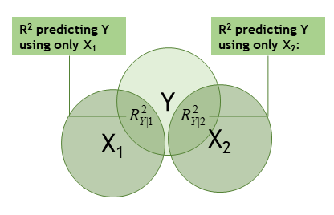
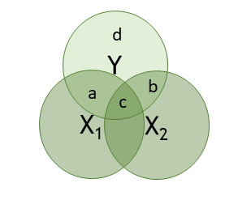
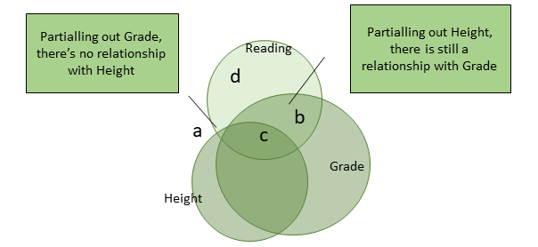

```{R, setup, include = F}
library(pacman)
p_load(here, tidyverse, xaringan, knitr, kableExtra, haven, broom, xaringanthemer, reshape2, modelsummary)

i_am("slides/EDUC643_7_mult_regression.rmd")

red_pink <- "#e64173"
turquoise = "#20B2AA"
orange = "#FFA500"
red = "#fb6107"
blue = "#3b3b9a"
green = "#8bb174"
grey_light = "#B3B3B3"
grey_mid = "#7F7F7F"
grey_dark = "grey20"
purple = "#6A5ACD"
slate = "#314f4f"

extra_css <- list(
  ".red"   = list(color = "red"),
  ".blue"  =list(color = "blue"),
  ".red-pink" = list(color= "#e64173"),
  ".gray" = list(color= "#B3B3B3"),
  ".purple" = list(color = "purple"),
  ".orange" = list(color = "#FFA500"),
  ".small" = list("font-size" = "90%"),
  ".large" = list("font-size" = "120%"),
  ".tiny" = list("font-size" = "70%"),
  ".tiny2" = list("font-size" = "50%"))


write_extra_css(css = extra_css, outfile = "my_custom.css")

options(htmltools.dir.version = FALSE)

hook_output <- knit_hooks$get("output")
knit_hooks$set(output = function(x, options) {
  lines <- options$output.lines
  if (is.null(lines)) {
    return(hook_output(x, options))  # pass to default hook
  }
  x <- unlist(strsplit(x, "\n"))
  more <- "..."
  if (length(lines)==1) {        # first n lines
    if (length(x) > lines) {
      # truncate the output, but add ....
      x <- c(head(x, lines), more)
    }
  } else {
    x <- c(more, x[lines], more)
  }
  # paste these lines together
  x <- paste(c(x, ""), collapse = "\n")
  hook_output(x, options)
})

knitr::opts_chunk$set(warning = FALSE,
                      message = FALSE,
                      echo = FALSE,
                      fig.align = "center",
                      fig.height = 6.5,
                      fig.width = 10)

```

# A motivating question

Researchers (including two from the .green[**University of Oregon**]), [Nichole Kelly, Elizabeth Cotter and Claire Guidinger (2018)](https://doi.org/10.1016/j.eatbeh.2018.07.003), set out to understand the extent to which young men who exhibit overeating behaviors have weight-related medical and psychological challenges.

```{r, echo=F, out.height="80%"}

```

.small[Using real-world data (generously provided by Nichole Kelly) about the dietary habits, health, and self-appraisals of males 18-30, we are going to attempt to answer a similar question.]

.small[After a prolonged throat clearing, we are going to explore the .purple[**relationship**] between **dietary restraint behaviors** (self-reports on the extent to which participants consciously restricted their food intake) and **over-eating frequency** (participants' self-reported frequency of over-eating episodes).]


```{r}
do <- read_spss(here("data/male_do_eating.sav")) %>% 
    select(OE_frequency, EDEQ_restraint, EDS_total,
           BMI, age_year, income_group) %>%
    mutate(EDS_total = ifelse(EDS_total==-99, NA, EDS_total)) %>%
    drop_na()
do <- rownames_to_column(do, "id")

```


---
# Goals for the unit

- Articulate the concepts of multiple regression and .red-pink["statistical adjustment"]
- Distinguish between the substantive implications of the terms .red-pink["statistical control"] and .red-pink["statistical adjustment"]
- Estimate the parameters of a multiple regression model
- Visually display the results of multiple regresion models
- State the .red-pink[main effects assumption] and what the implication would be if it were violated
- Conduct statistical inference tests of single predictors (a $t$-test) and the full model (an $F$-test) in multiple regression
- Decompose the total variance into its component parts (model and residual) and use the $R^{2}$ statistic to describe this decomposition
- Describe problems for regression associated with the phenomenon of .red-pink["multicollinearity"]
- Use visual schema (e.g., Venn diagrams) to assess regression models for the potential of multicollinearity
- Use statistical results (e.g., correlation matrices or heat maps) to assess regression models for the potential of multicollinearity
- Describe and implement some solutions to multi-collinearity

---
# Univariate statistics

We're interested in characterizing the relationship between over-eating frequency (*OE_frequency*) and dietary restraint behaviors (*EDEQ_restraint*), so we can start out by examining each of these variables independently. 
```{r, echo=T}

summary(do$OE_frequency)
sd(do$OE_frequency)

summary(do$EDEQ_restraint)

```

--

etc.
---
# Univariate displays

Now some univariate visualizations...

```{r, fig.height=5.5}
OE <- ggplot(do, aes(OE_frequency)) +
        geom_histogram() +
        theme_minimal(base_size = 16)
EDEQ <- ggplot(do, aes(EDEQ_restraint)) +
        geom_histogram() +
        theme_minimal(base_size = 16)

gridExtra::grid.arrange(OE, EDEQ, ncol=2)
```

---
# Bivariate relationship

Now some **bivariate** statistics...

```{r, echo=T}
cor(do$OE_frequency, do$EDEQ_restraint)

```

---
# Bivariate relationship

```{r, echo=F, fig.height=5.5}
lm_plot <- ggplot(do, aes(x=EDEQ_restraint, y=OE_frequency)) + 
  geom_point() +
  geom_smooth(method = "lm") +
  xlab("Dietary restraint index") +
  ylab("Overeating frequency") +
  theme_minimal(base_size = 16)

lm_plot
```

--

.small[.blue[Based on what you see here and on the previous slides, what can we say about the direction, linearity, existence of outliers, strength and magnitude of this relationship? What evidence from these visuals and statistics supports/threatens our regression assumptions?]]

---
# Regression results

```{r, echo=F, highlight.output=c(12, 16:18)}
fit <- lm(OE_frequency ~ EDEQ_restraint, data=do)
summary(fit)
```

--

.blue[**Can you interpret this relationship substantively?**]

--
.blue[**What previous value have we seen related to a number displayed above?**]

---
# Regression diagnostics

We've looked a little already at the normality and linearity of our relationship. .blue[*What else can we look at?*] 

How can we test for homoscedasticity, linearity and normality in our residuals?

```{r, echo=T}
do$predict <- predict(fit)
do$resid <- resid(fit)
do$stu_resid <- rstudent(fit)
```
---
## Regression diagnostics: normality

```{r, echo=F, fig.height=4.5}
ggplot(do, aes(x = resid)) + 
  geom_histogram(binwidth = 1) +
  theme_minimal(base_size = 16)

```

.red-pink[The bulk of our residuals are roughly normally distributed, but we clearly have a long right tail. Perhaps we would want to test the sensitivity of our models for the exclusion of these outlying values?] .blue[What is driving this long right tail?]
---
# Residuals v. fitted
```{r, echo=F, fig.height=4.5}
ggplot(do, aes(x = predict, y = stu_resid)) + 
         geom_point() +
  geom_hline(yintercept = 0, color = "red", linetype="dashed") +
  ylab("Studentized Residuals") + xlab("Fitted values") +
  theme_minimal(base_size = 16)
```

.red-pink[We are clearly under-predicting for some set of individuals. There is also some evidence of heteroscedasticity.]

.tiny[There are some orange flags in our estimates here. In fact, we are conducting a somewhat different analysis than Kelly et al. (2018). They conducted a logistic regression for the presence of *any* medical or psychological challenges. We will learn how to do that analysis in EDUC 645. However, we are going to proceed with our analysis while noting that some of our assumptions may not be fully met.]

---
# Regression results
```{r, echo=F}
summary(fit)
```

.small[Let's assume that we trust the way we've characterized this bivariate relationship. .red[**But perhaps there are other features among the participants that also influence their eating behaviors?**]]

---
# Another variable

Perhaps we should consider another variable that might also be related to overeating frequency (*OE_FREQUENCY*). 

--
What about one we already know a good deal about...*BMI*?

--

```{r, echo=F, fig.height=5.5}
oe_bmi <- ggplot(do, aes(x=BMI, y=OE_frequency)) + 
  geom_point() +
  geom_smooth(method = "lm") +
  xlab("BMI") +
  ylab("Overeating frequency") +
  theme_minimal(base_size = 16)

oe_bmi

```
---
# Another variable
Perhaps we should consider another variable that might also be related to overeating frequency (*OE_FREQUENCY*). What about one we already know a good deal about...*BMI*?

```{r, echo=T, output.lines=-c(1:4), highlight.output=c(9, 13:15)}
summary(lm(OE_frequency ~ BMI, data=do))

```


---
class: middle, inverse

# Multiple regression

## aka, statistical adjustment

---
# Multiple regression
Mathematically, we simply add additional terms to our equation like this:

$$OE\_frequency_{i} = \beta_{0} + \beta_{1}DietaryRestraint_{i} + \beta_{2}BMI_{i} + \varepsilon_{i}$$

or more generally for $k$ predictors...

$$Y_{i} = \beta_{0} + \beta{1}X_{1} + \beta_{2}X_{2} + \cdots + \beta_{k}X_{k} + \varepsilon_{i}$$

---
# Implement in R
We can estimate our postulated linear model in R as follows:

```{r, echo=T, output.lines=-c(1:2), highlight.output=c(11:12)}
summary(lm(OE_frequency ~ EDEQ_restraint + BMI, data=do))
```


---
## What does MR look like?
```{r, fig.height=7.5, fig.width=10}
library(plotly)
library(reshape2)
my_df <- mtcars

cars_lm <- lm(mpg ~ hp, data = my_df)

graph_reso <- 0.05
graph_reso2 <- 1

#Setup Axis
axis_x <- seq(min(my_df$hp), max(my_df$hp), by = graph_reso2)
axis_y <- seq(min(my_df$wt), max(my_df$wt), by = graph_reso)

#Sample points
cars_lm_surface <- expand.grid(hp = axis_x, 
                                wt = axis_y, 
                                KEEP.OUT.ATTRS = F)

cars_lm_surface$mpg <- predict.lm(cars_lm, newdata = cars_lm_surface)


cars_lm_surface <- acast(cars_lm_surface, 
                          wt ~ hp, 
                          value.var = "mpg")

my_df_2 <- my_df %>% 
  mutate(mpg = predict(cars_lm, newdata = ),
         predict = 1)

my_df <- my_df %>% 
  mutate(predict = 0)

my_df <- rbind(my_df, my_df_2) %>% 
  mutate(predict = as.numeric(predict))

cars_plot <- plot_ly(my_df, 
                     x = ~hp, 
                     y = ~wt, 
                     z = ~mpg,
                     frame = ~predict) %>% 
  animation_opts(1000, transition = 500, easing = "elastic", redraw = T)

fig <- cars_plot %>% 
  add_markers(size = 5) 
#%>% 
#  add_surface(z = cars_lm_surface,
#              x = axis_x,
#              y = axis_y,
#              opacity = 0.5)
fig

```

---
# What does MR look like?
```{r, fig.height=7.5, fig.width=10}
fig %>% 
    add_surface(z = cars_lm_surface,
              x = axis_x,
              y = axis_y,
              opacity = 0.5)
```

---
# A return to 2D-land

```{r, echo=F}
car <- lm(mpg ~ hp + wt, data=mtcars)
df2 <- margins::margins(car, at = list(wt = c(2,3,4)))

two_d <- ggplot() + 
    geom_smooth(data=df2, aes(x=hp, y=fitted, color=as.factor(wt)), method='lm', se=F) + 
    xlab("Horsepower") + ylab("Predicted MPG") +
    scale_color_discrete(name = "Weight",
                       breaks=c(2,3,4),
                       labels=c("2,000 lbs", "3,000 lbs", "4,000 lbs")) +
    theme_minimal(base_size=16)

two_d
```

--
And we could do the same for any other predictor variable (e.g., wt)!

---
## Interpreting multiple regression
.pull-left[
```{r, fig.width=6}
two_d
```
]

.pull-right[
.small[
- On average, cars with worse horsepower have worse mpg
  + This is true at various car weights
- **AND** on average, heavier cars have worse mpg
  + This is true across the distribution of cars' horsepower
- These lines are parallel (have a common slope)
  + This is only true because we have assumed them to be; aka .red-pink[**the main effects assumption**]
  + We assume the relationship between each predictor and the outcome are equivalent, independent of the levels of the other predictors
]
]

---
## Interpreting multiple regression
.pull-left[
```{r, fig.width=6}
car2 <- lm(mpg ~ hp + wt + hp:wt, data=mtcars)
df3 <- margins::margins(car2, at = list(wt = c(2,3,4)))

two_d2 <- ggplot() + 
    geom_smooth(data=df3, aes(x=hp, y=fitted, color=as.factor(wt)), method='lm', se=F) +
    xlab("Horsepower") + ylab("Predicted MPG") +
    scale_color_discrete(name = "Weight",
                       breaks=c(2,3,4),
                       labels=c("2,000 lbs","3,000 lbs","4,000 lbs")) +
    theme_minimal(base_size=16)

two_d2
```
]

.pull-right[
.small[
- On average, cars with worse horsepower have worse mpg
  + This is true at various car weights
- **AND** on average, heavier cars have worse mpg
  + This is true across the distribution of cars' horsepower
- Note that these lines are parallel (have a common slope)
  + This is only true because we have assumed them to be; aka .red-pink[**the main effects assumption**]
  + We assume the relationship between each predictor and the outcome are equivalent, independent of the levels of the other predictors
- This doesn't need to be true, and we will relax this assumption in Unit 5
]
]

---
## Multiple regression assumptions

We make **the same** assumptions as in bivariate regression, but now extended to multiple variables:

1. At each ***combination of the Xs***, there is a distribution of Y with a given mean $(\mu_{Y|X_1 ...X_k})$ and variance $(\sigma_{Y|X_1 ... X_k}^2)$
2. The relationship between the points can be correctly characterized by a ***flat plane*** through the means
3. The variances $(\sigma^2)$ of the distributions ***at the combination of the Xs*** are homoscedastic
4. Conditional on the ***combination of the Xs***, the values of Y are independent of each other
5. At each ***combination of the Xs***, the values of Y are normally distributed

---
# Interpreting our results
```{r, output.lines=-c(1:2), highlight.output=c(10)}
summary(lm(OE_frequency ~ EDEQ_restraint + BMI, data=do))
```
.small[**Interpretation of the intercept:** we estimate that individuals with a dietary restraint index=0 and BMI score=0 will have an overeating score of 0.87]

---
# Interpreting our results
```{r, output.lines=-c(1:2), highlight.output=c(11)}
summary(lm(OE_frequency ~ EDEQ_restraint + BMI, data=do))
```
.small[**Interpretation of *EDEQ_restraint*:** adjusting for individuals' BMI, we estimate that young men who score one unit apart on the dietary-restraint index will have 0.84 unit different overeating scores.]

---
# Interpreting our results
```{r, output.lines=-c(1:2), highlight.output=c(12)}
summary(lm(OE_frequency ~ EDEQ_restraint + BMI, data=do))
```
.small[**Interpretation of *BMI*:** adjusting for individuals' dietary restraint behavior, we estimate that young men who have one unit different body-mass indices will have 0.01 unit different overeating scores.]

--
.small[In fact...]

---
# Multiple regression
We can now use these regression estimates to construct our .red-pink[**fitted equation**]:

$$\hat{OE\_frequency_{i}} = 0.872 + 0.842 * DietaryRestraint_{i} + 0.010 * BMI_{i} + \varepsilon_{i}$$

--

.blue[**Looking at the results from the previous slides, has including the covariate *BMI* clarified the relationship between *OE_frequency* and *EDEQ_restraint*? Why or why not?**]

--

.blue[**What if I have more than two predictors???**]

--

We can no longer display this graphically (after all we don't live in a 11-dimensional world), but the same theoretical ***and mathematical*** principles apply. Our regression estimates the coefficient for each predictor, while adjusting for all other relationships between our other covariates and our outcome; each time collapsing the multi-dimensional relationship to a two-dimensional one.

---
class: middle, inverse

# Multiple regression:

## Affordances and limitations

---
# Power of multiple regression

Multiple regression helps us as follows:
1. Allows us to simultaneously consider many contributing factors in the relationship
2. We explain more of the variation in Y, and
3. We make more accurate predictions of Y (#2 and 3 both make our residuals smaller)
4. Provides a separate understanding of the relationship between each predictor and our outcome, adjusting for the effects of the other predictors (that is, holding the other predictors constant at their means)

.red-pink[If we are ready to believe some **very** strong assumptions, multiple regression might even be able to characterize a credibly causal relationship between two variables of interest. However, there are some important limits to what multiple regression can do. More in a bit!]


---
# Power of multiple regression
.small[Multiple regression can be a powerful tool to adjust for sample differences that depend on a variable other than the one in which we are interested and focus on the key question we have.

Take this example of a theoretical relationship between height and reading ability:]
```{r, fig.height=5}
set.seed(1234)
h <- rep(40, 1000)
g <- c("2nd", "3rd", "4th", "5th")    
grade <- rep(g, 250)
reading <- cbind.data.frame(grade, h)

reading <- reading %>% mutate(height = case_when(grade=="2nd" ~ h,
                                                        grade=="3rd" ~ h + 3,
                                                        grade=="4th" ~ h + 5,
                                                        grade=="5th" ~ h + 7))

reading <- reading %>% mutate(height = height + rnorm(length(height), 0, 4.5))

reading <- reading %>% mutate(read = rnorm(length(h)))

reading <- reading %>% mutate(read = case_when(grade=="2nd" ~ read,
                                               grade=="3rd" ~ read + .5,
                                               grade=="4th" ~ read + .8,
                                               grade=="5th" ~ read + 1.1))

reading <- reading %>% group_by(grade) %>% mutate(read = read + rnorm(length(read)))

plot <- ggplot(data=reading, aes(height, read)) + 
              geom_point() +
              theme_minimal(base_size = 16)

plot  

```
---
# Power of multiple regression
.small[Multiple regression can be a powerful tool to adjust for sample differences that depend on a variable other than the one in which we are interested and focus on the key question we have.

Take this example of a theoretical relationship between height and reading ability:]
```{r, fig.height=5}
plot +
  geom_smooth(method='lm', se=F) +
  annotate('text', label = "slope = 0.05 (0.01)", x = 28, y = 0.4, color = "blue", size = 4) +
  theme_minimal(base_size = 16)

```

--

.purple[*Do we really believe this or are there statistical adjustments we can make to reveal the true nature of the relationship?*]

---
# Power of multiple regression
.small[Multiple regression can be a powerful tool to adjust for sample differences that depend on a variable other than the one in which we are interested and focus on the key question we have.

Take this example of a theoretical relationship between height and reading ability:]
```{r, fig.height=5}
ggplot(data=reading, aes(height, read, col=grade)) + 
  geom_point() +
  geom_smooth(method='lm', se=F) +
  theme_minimal(base_size = 16)
```

--
.small[The weighted average of these slopes is the relationship between height and reading score, *after accounting for students' grade*.]

---
# Implementing in R
How to add a third variable in `ggplot`:
```{r, echo=T, fig.height=4}
ggplot(data=reading, aes(x=height, y=read, color=grade)) + 
  geom_point() +
  geom_smooth(method='lm', se=F) +
  theme_minimal(base_size = 16)
```

.small[The weighted average of these slopes is the relationship between height and reading score, *after accounting for students' grade*.]

---
# Power of multiple regression
Formally testing this:

```{r, echo=T}
summary(lm(read ~ height + grade, data=reading))
```

---
# Power of multiple regression II
.small[Multiple regression can  solve a dilemma we introduced earlier known as .red-pink[**Simpson's Paradox**].]
```{r, fig.height=6.5}
set.seed(1234)
library(MASS)
### build the g1
mu <- c(0,0)
sigma <- rbind(c(2,-0.7),c(-0.7,2) )
g1 <- as.data.frame(mvrnorm(n=1000, mu=mu, Sigma=sigma))
g1$group <- c("Hi GDP")

### build the g2
mu <- c(3,3)
sigma <- rbind(c(2,-0.7),c(-0.7,2) )
g2 <- as.data.frame(mvrnorm(n=1000, mu=mu, Sigma=sigma))
g2$group <- c("Mid GDP")
 
### build the g3
mu <- c(6,6)
sigma <- rbind(c(2,-0.7),c(-0.7,2) )
g3 <- as.data.frame(mvrnorm(n=1000, mu=mu, Sigma=sigma))
g3$group <- c("Lo GDP")
 
# the combined data of all three groups
df <- rbind(g1,g2,g3)

df <- df %>% mutate(`% GDP on Health Care` = V1 + 5.2)

df <- df %>% rename(`Early mortality` = V2)

ggplot(df, aes(`% GDP on Health Care`, `Early mortality`)) +
    geom_point() +
    geom_smooth(method='lm', se=F) +
    theme_minimal(base_size=16)

```

--
.purple[**Seems surprising, right?**]

---
# Power of multiple regression II
.small[Multiple regression can  solve a dilemma we introduced earlier known as .red-pink[**Simpson's Paradox**].]
```{r, fig.height=6.5}
ggplot(df) +
    geom_point(aes(x=`% GDP on Health Care`, y=`Early mortality`, col=group)) +
    #geom_smooth(aes(x=`% GDP on Health Care`, y=`Early mortality`, col=group), method='lm', se=F) +
    geom_smooth(aes(x=`% GDP on Health Care`, y=`Early mortality`), method='lm', se=F, color="gray") +
    theme_minimal(base_size=16) + 
    annotate('text', x=10.7, y=-3, label="Hi GDP", color="#F8766D", size=5) +
    annotate('text', x=13, y=-1, label="Mid GDP", color="#619CFF", size=5) +
    annotate('text', x=15, y=2.5, label="Low GDP", color="#00BA38", size=5) +
    theme(legend.position="none")
```

---
# Power of multiple regression II
.small[Multiple regression can  solve a dilemma we introduced earlier known as .red-pink[**Simpson's Paradox**].]
```{r, fig.height=6.5}
ggplot(df) +
    geom_point(aes(x=`% GDP on Health Care`, y=`Early mortality`, col=group)) +
    geom_smooth(aes(x=`% GDP on Health Care`, y=`Early mortality`, col=group), method='lm', se=F) +
    geom_smooth(aes(x=`% GDP on Health Care`, y=`Early mortality`), method='lm', se=F, color='gray') +
    theme_minimal(base_size=16) +
    annotate('text', x=10.7, y=-3, label="Hi GDP", color="#F8766D", size=5) +
    annotate('text', x=13, y=-1, label="Mid GDP", color="#619CFF", size=5) +
    annotate('text', x=15, y=2.5, label="Low GDP", color="#00BA38", size=5) +
    theme(legend.position="none")
```

---
# In pursuit of causality

In fact, if we can be confident that our .red-pink[**general linear model**] includes all .red-pink[**observable**] (prior score, demographics, SES) determinants for why some people receive or have higher values of a "treatment" such that there are no .red-pink[**unobservable**] characteristics (motivation, attitudes, preferences) (and our temporal precedence condition is also met), then our regression estimates for the relationship between that predictor and our outcome can be credibly interpreted as causal in nature. This is sometimes referred to as .red-pink[**"selection on observables."**]

--

.blue[**What would have to be true of our postulated model for us to be able to interpret the relationship between *dietary restraint behaviors* and *over-eating patterns* as *causal* in our context?**]

--

Again, we have whole classes dedicated to just these topics of experimental and quasi-experimental techniques (EDLD 650 & EDLD 679).

---
## The limits of multiple regression

### ...or why can't I say "control" like every other stats student everywhere?

We call the most common form of experimental research a .red-pink[**randomized controlled trial**] because the investigator/researcher can **"control"** whether individuals do or do not receive a given treatment. As a result of this design, we can be confident that all .red-pink[**observable**] and .red-pink[**unobservable**] characteristics are equivalent across the two groups.

--
This is not what we are doing in multiple regression!

--

.blue[**What are some reasons why a multiple regression with a rich set of covariates might still not "control" for reasons why some people exhibit different patterns of dietary restraint than others?**]

> Synonyms you may encounter for statistical adjustment: .red[**"controlling for,"**] .orange[**"partialling out,"**] or .green[**"holding constant"**]

We encounter a different kind of limit to the power of multiple regression in the presence of multi-collinearity...more on that next class...


---
class: middle, inverse

# Multiple regression in action

---
# Estimate in R
```{r, echo=T, output.lines=-c(1:2), highlight.output=c(11:12)}
summary(lm(OE_frequency ~ EDEQ_restraint + BMI, data=do))
```

---
# It's all the GLM...
Oh, by the way have you ever heard of partial correlations?

```{r, echo=T}
ppcor::pcor.test(x=do$OE_frequency, y=do$EDEQ_restraint, z=do$BMI)
```

--
```{r, echo=T}
partial1 <- lm(OE_frequency ~ BMI, data=do)
do$OE_partial <- resid(partial1)

partial2 <- lm(EDEQ_restraint ~ BMI, data=do)
do$EDEQ_partial <- resid(partial2)

cor(do$OE_partial, do$EDEQ_partial)
```

---
# Goodness of fit statistics
```{r, echo=T, output.lines=-c(1:4), highlight.output=c(14:15)}
summary(lm(OE_frequency ~ EDEQ_restraint + BMI, data=do))
```

--
This is a better fit (with more variance explained) than with *BMI* alone .blue[**...why?**]

--
.blue[**What does it mean that this is no better fit than with *EDEQ_restraint* alone?**]

---
# Variance decomposition in MR

Just as before:
$$SS_\text{BMI} = \color{purple}{SS_\text{Model}} + \color{green}{SS_\text{Residual}}$$

--
The sum of the squares of the model are now calculated based on the distance each observation has from the fitted regression ***plane*** (or hyper-plane):
$$\color{purple}{SS_\text{Model} = \sum{(\hat{Y} - \bar{Y})^2}}$$

--
The total sum of the squares is as before:
$$SS_{BMI}= \sum{(Y - \bar{Y})^2}$$

--
and $R^2$ is just $\frac{SS_{\text{Model}}}{SS_{\text{BMI}}}$ or more generally $\frac{SS_{\text{Model}}}{SS_{\text{Total}}}$

---
class: middle, inverse

# Inference in multiple regression

---
# Two diferent hypotheses

.pull-left[
.small[
**Omnibus $F$-test**
- Across all predictors, is any of them related to my outcome?
- $H_{0} = \beta_{1}...\beta_{k} = 0$
- $H_{A} = \text{some } \beta_{j} \neq 0$
- Name comes from distribution generated by this statistic (the $F$-distribution)
]
]

--

.pull-right[
.small[
**Individual $t$-tests**
- Is this specific predictor related to my outcome, *controlling for all other predictors*?
- $H_{0} = (\beta_{1} | X_{2} \cdots X_{k}) = 0$
- $H_{A} = (\beta_{1} | X_{2} \cdots X_{k}) \neq 0$
]
]

---
# Communicating results I

```{r}
fit2 <- lm(OE_frequency ~ EDEQ_restraint + BMI, data=do)
```

```{r, echo=T}
modelsummary(list(fit, fit2),
   stars=T,
   gof_omit = "Adj.|AIC|BIC|Log|RMSE|RSE",
   coef_rename = c("EDEQ_restraint" = "Dietary Restraint Index (0-6)"))
```

---
# Communicating results II
It can be hard to interpret for a lay reader the substantive meaning of describing a relationship, adjusting for other factors. It can be quite helpful in these instances to plot "prototypical values," allowing your reader to safely return to the land of two-dimensions.

Unfortunately, in our worked example, there is no real variation in over-eating frequency by BMI, so we'll use the toy example we looked at earlier.

---
# Communicating results II
```{r, echo=T, fig.height=5}
# Fit your regression
car <- lm(mpg ~ hp + wt, data=mtcars)
# Use the margins package and define prototypical values
df2 <- margins::margins(car, at = list(wt = c(2,3,4)))

# Use prototypical values in resulting dataset to show results
proto <-  ggplot(data=df2, aes(x=hp, y=fitted, color=as.factor(wt))) + 
   geom_smooth(method='lm', se=F) +
   xlab("Horsepower") + ylab("Predicted MPG") +
   scale_color_discrete(name = "Weight",
                       breaks=c(2,3,4),
                       labels=c("2,000 lbs","3,000 lbs","4,000 lbs")) +
   theme_minimal(base_size=16)
```

---
# Communicating results II
```{r, fig.height=6}
proto
```

---
# Communicating results III

.pull-left[
.small[
In communicating these results, we need to decide:
- Which predictor to display on the x-axis (generally the core question predictor)
- Which prototypical values to use that will be displayed
- Which (if any) prototypical values to use that won't be displayed
]
]

.pull-right[
```{r}
proto
```
]

---
# Choosing prototypical values

Examine the distribution of the other predictors and consider:

.large[
1. **Substantively interesting values**: whole numbers help
2. **A range of percentiles**: e.g., quartiles or 10th, 50th and 90th percentiles
3. **Sample mean $\pm$ 1 SD**: particularly when a symmetric distribution exists
4. **Sample mean**: typically when you are **not** displaying that particular predictor
5. **Categorical predictors**: more in Unit 4
]

---
# Putting it all together
```{r}
modelsummary(list(fit, fit2),
   stars=T,
   gof_omit = "Adj.|AIC|BIC|Log|RMSE|RSE|Std",
   vcov = "robust",
   coef_rename = c("EDEQ_restraint" = "Dietary Restraint Index (0-6)"),
   notes=c("Cells report coefficients and heteroscedastic-robust standard errors in parentheses."))
```

---
# Putting it all together
> We postulated a linear model which we estimated via Ordinary-Least Squares regression to assess whether there is a relationship between dietary-restraint and over-eating behaviors, on average, in the population of young adult males. At an alpha threshold of 0.05, we found that dietary-restraint behaviors were a significant predictor of over-eating patterns and accounted for approximately 10 percent of the overall variance in over-eating. We estimated that young men who are one unit apart on a dietary restraint index will have an over-eating score 0.85 (*p*<0.001, 95% CI: 0.74, 1.04) points different from each other (Table 1). Adjusting for individuals' body-mass index does not meaningfully alter the nature of our estimated relationship. In fact, when we hold individuals' dietary restraint behaviors constant, we fail to reject the null and conclude that there is no adjusted-relationship between BMI and over-eating, on average in the population. For parsimony, we adopt Model 1 as our preferred specification.


---
# Bivariate v. multiple regression

|                     |  Bivariate regression       |   Multiple regression
|----------------------------------------------------------------------------
| Model specification | $\hat{Y}=\hat{\beta_{0}} + \hat{\beta_{1}}\mathbf{X}_{1}$ | $\hat{Y}=\hat{\beta_{0}} + \hat{\beta_{1}}\mathbf{X}_{1} + \hat{\beta_{2}}\mathbf{X}_{2} + \cdots \hat{\beta_{k}}\mathbf{X}_{k}$
| Interpretation of $\hat{\beta_{0}}$ | Predicted value of Y when X=0 | Predicted value of Y when *all* Xs = 0
| Interpretation of $\hat{\beta_{1}}$ | Difference in Y per 1 unit of X | Difference in Y per 1 unit difference in $X_{1}$, adjusting for $X_{2} \cdots X_{k}$
| Graphical representation | Fitted line     | Fitted plane in 3D (with two Xs) <br> Plot with prototypical lines in 2D
| Residuals   | Distance between observation and fitted .red-pink[line] | Distance between observation and fitted .red-pink[plane]
| Inference: $t$-tests | $H_{0} = \beta_{1} = 0$ <br> Is there a relationship between X and Y in pop? | $H_{0} = \beta_{1} = 0$ <br> Adjusting for  $X_{2} \cdots X_{k}$ is there a relationship between $X_{1}$ and Y in the population? <br> Repeat for each X

---
# Bivariate v. multiple regression

|                     |  Bivariate regression       |   Multiple regression
|----------------------------------------------------------------------------
| Inference: $F$-test | $H_{0} = \beta_{1} = 0$ <br> same result as $t$-test |  $H_{0} = \beta_{1}...\beta_{k} = 0$ <br> Does *any* predictor (or all of them jointly) have a relationship with Y in the population?
| $R^{2}$ | $\frac{Model SS}{Total SS}$ <br> % of variation in Y explained by X | $\frac{Model SS}{Total SS}$ <br> % of variation in Y explained by $X_{1} \cdots X_{k}$ 
| Regression assumptions | See prior unit          | Same as bivariate, but *at each combination of the Xs*. <br> Main effects assumption


---
class: middle, inverse

# Multi-collinearity

---
# Limits of multiple regression
.small[While we've noted several data puzzles multiple regression ***can*** solve, multiple regression cannot uncover the accurate nature of a relationship if predictors are "too highly" correlated. For example, if women and men have unequal access to jobs of different status, adjusting for job status will not recover the relationship between gender and wages.<sup>[1]</sup>]

```{r, fig.height=4.5}
w <- seq(50001, 60000)
g <- c("Women", "Men")
gend <- rep(g, 5000)
s <- c(1, 2, 3, 4, 5, 6, 7, 8, 9, 10)
stat <- rep(s, 1000)

gender <- as.data.frame(gend)
wages <- as.data.frame(w)
status <- as.data.frame(stat)

discr <- arrange(gender, desc(gend)) %>% cbind(., wages)
discr <- arrange(status, stat) %>% cbind(., discr)

discr <- discr %>% group_by(stat) %>% mutate(wage = w + rnorm(length(w), 0, 100))
discr <- discr %>% mutate(status = stat + rnorm(length(stat), 0, 0.05))

ggplot(data=discr, aes(status, wage)) +
  geom_jitter() +
  theme_minimal(base_size = 16)
```
.footnote[[1] This was a problem many researchers identified in Google's efforts to document pay disparities in 2019: (https://www.npr.org/2019/03/05/700288695/google-pay-study-finds-its-underpaying-men-for-some-jobs).]

---
# Limits of multiple regression
.small[While we've noted several data puzzles multiple regression ***can*** solve, multiple regression cannot uncover the accurate nature of a relationship if predictors are "too highly" correlated. For example, if women and men have unequal access to jobs of different status, adjusting for job status will not recover the relationship between gender and wages.<sup>[1]</sup>]

```{r, fig.height=4.5}
ggplot(data=discr, aes(status, wage, col=gend)) +
  geom_jitter() +
  theme_minimal()
```

---
# Limits of multiple regression

On average, women have lower wages than men:
```{r, echo=T}
tidy(lm(wage ~ gend, data=discr))
```

On average, women are in lower status jobs than men:
```{r, echo=T}
tidy(lm(status ~ gend, data=discr))
```
---
# Limits of multiple regression

However, once we adjust for job status, there is no wage differential, on average in the population, between men and women:
```{r, echo=T}
tidy(lm(wage ~ gend + status, data=discr))
```

--

If two predictors are "too highly" correlated, we can't adjust for one to evaluate the effects of the other. This is known as .red-pink[**multicollinearity**]. It can also be described as a problem of .red-pink[**collider bias**].

---
# Multicollinearity

Multicollinearity occurs when predictor variables are highly related to each other.

This can be a simple relationship, such as when two of our predictors are strongly related to one another. This is usually straightforward to recognize, interpret, and correct for:
- Simple and adjusted slopes differ dramatically for two or more predictors
- Estimated adjusted slopes seem substantively wrong
- Standard errors *increase* with added predictors
- Reject omnibus $F$-test, but fail to reject individual $t$-tests

--

Sometimes multicollinearity is difficult to detect, such as when our variable of interest (e.g., $X_{1}$) is not strongly correlated with any one $X_{k}$, but the combination of the $X$s is a strong predictor of $X_{1}$.

--

**Multicollinearity biases our regression estimates and increases the standard errors of our regression coefficients.**


---
# Venn diagrams of collinearity

.pull-left[
.small[
- Totally **uncorrelated predictors** are rare (almost exclusively in experiments)
- Can compute R2 just by summing separate R2s
]
- $R_{Y|1,2}^2 = R_{Y|1}^2 + R_{Y|2}^2$
```{r}

```
]

.pull-right[
.small[
- **Correlated predictors** are very common
- Can't just sum the separate R2 because the predictors overlap
]
- $R_{Y|1,2}^2 = \frac{a+b+c}{a+b+c+d}$
```{r, out.height="80%"}

```
]

---
## How much do extra predictors help?
.pull-left[
.small[
- **Highly correlated predictors**: joint explained proportion of "c" is large; independent proportions of "a" and "b" are quite small; adding the other predictor will not help much
- **Fairly uncorrelated predictors**: jointly explained proportion of "c" is relatively small; independent proportions of "a" and "b" are independently or both fairly meaningful; addign predictors will help
]
]

.pull-right[
```{r, out.height="50%"}

```
]

--
Simple correlation: = $\sqrt{\frac{b+c}{a+b+c+d}}$

Partial correlation: = $\sqrt{\frac{b}{b+d}}$ 

So, the relationship between simple and partial correlations depends on the size of "a" and "c", relative to "b" and "d." 

--
As before, it's all the GLM...

---
# Estimates of collinearity in R

```{r, echo=F}
cordat <- do %>%
        dplyr::select(OE_frequency, EDEQ_restraint, EDS_total,
           BMI, age_year, income_group)

cordat <- cordat %>%
          rename(OE = OE_frequency,
                EDEQ = EDEQ_restraint,
                EDS = EDS_total,
                Age = age_year,
                Income=income_group)

cordat$Income = as.numeric(as.character(cordat$Income))
```

```{r, echo=T}
datasummary_correlation(cordat,
                        fmt = 3,
notes = "Notes: cells report Pearson correlation coefficients.")
```

--

We can examine these correlations for the presence of multi-collinearity in our data using a correlation matrix. .blue[**Do you see evidence of this here?**]

---
# Visual heatmap

```{r, echo=F}
cormat <- round(cor(cordat),3)
cormat[upper.tri(cormat)] <- NA

melt_corm <- melt(cormat, na.rm=T)
ggplot(data = melt_corm, aes(Var2, Var1, fill = value))+
 geom_tile(color = "white")+
 scale_fill_gradient2(low = "blue", high = "red", mid = "white", 
   midpoint = 0, limit = c(-1,1), space = "Lab", 
   name="Pearson\nCorrelation") +
  theme_minimal(base_size = 16)

```
---
# Correlation and collinearity

Perfect collinearity never happens (except in the instance of a duplicated variable). There are degrees of multicollinearity. 

***More multicollinearity = more problematic model.***

--

In practice, when we detect problems with collinearity, what we are really detecting is strongly correlated predictors. 

.small[However, not all strongly correlated predictors are "collinear." In the example of height and grade, once we partial out grade, there is no relationship between height and reading. However, after partialling out height, there is still a relationship between grade and reading. This is because there is still variation in grade at each value of height. .red[**Don't abuse the term collinear!**]]

.pull-left[
```{r}
reading <- reading %>% dplyr::select(read, height, grade)
reading <- reading %>% mutate(grade=case_when(grade=="2nd" ~ 2,
                                              grade=="3rd" ~ 3,
                                              grade=="4th" ~ 4,
                                              grade=="5th" ~ 5))
            
datasummary_correlation(reading, fmt=3)
```
]

.pull-right[
```{r}

```
]

---
## Putting multicollinearity together

1. **Statistical adjustments can help recover the "true" relationship in your data that is obscured by confounding variables.**
2. **When two variables are highly correlated, it may be impossible to adjust for one**
 - This is known as the problem of .red-pink[**multicollinearity**] (*though the term is not quite right!*)
3. **Graphical representations (such as Venn diagrams) can help you conceptualize the potential for multicollinearity**
4. **Use correlation matrices to detect for the phenomenon of highly correlated variables**
 - Consider visual representations to detect patterns more easily
5. **Solutions to multicollinearity**:
 - Increase sample size, remove a variable, create a composite or factor score (more to come in EDUC 645 and beyond!)


---
class: middle, inverse
# Synthesis and wrap-up

---
# Goals for the unit

- Articulate the concepts of multiple regression and "statistical adjustment"
- Distinguish between the substantive implications of the terms "statistical control" and "statistical adjustment"
- Estimate the parameters of a multiple regression model
- Visually display the results of multiple regresion models
- State the main effects assumption and what the implication would be if it were violated
- Conduct statistical inference tests of single predictors (a $t$-test) and the full model (an $F$-test) in multiple regression
- Decompose the total variance into its component parts (model and residual) and use the $R^{2}$ statistic to describe this decomposition
- Describe problems for regression associated with the phenomenon of .red-pink["multicollinearity"]
- Use visual schema (e.g., Venn diagrams) to assess regression models for the potential of multicollinearity
- Use statistical results (e.g., correlation matrices or heat maps) to assess regression models for the potential of multicollinearity
- Describe and implement some solutions to multi-collinearity


---
# To-Dos

### Reading: 
- **Finish by Feb. 2**: LSWR Chapter 15.3

### Quiz 2: 
- Opens 3:45 Tuesday, Jan. 31 (closes 5pm on 2/1)

### Assignment 2:
- Due Feb 3., 11:59pm (**note extension!**)

### Assignment 3:
- Due Feb. 10, 11:59pm

--

.large[.red[**Midterm SES!!!**]]