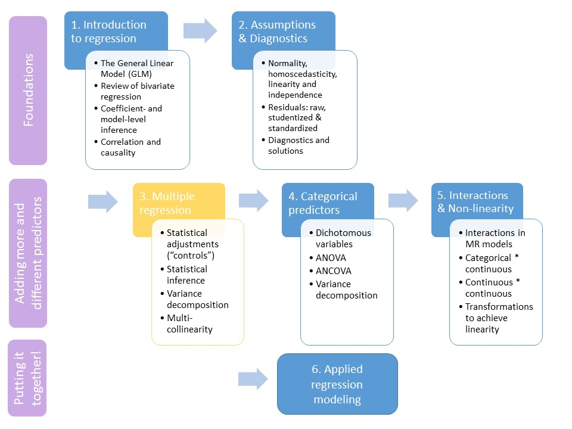

```{R, setup, include = F}
library(pacman)
p_load(here, tidyverse, ggplot2, xaringan, knitr, kableExtra, haven, broom, xaringanthemer, reshape2)

i_am("slides/EDUC643_8_mult_collinearity.rmd")

red_pink <- "#e64173"
turquoise = "#20B2AA"
orange = "#FFA500"
red = "#fb6107"
blue = "#3b3b9a"
green = "#8bb174"
grey_light = "#B3B3B3"
grey_mid = "#7F7F7F"
grey_dark = "grey20"
purple = "#6A5ACD"
slate = "#314f4f"

extra_css <- list(
  ".red"   = list(color = "red"),
  ".blue"  =list(color = "blue"),
  ".red-pink" = list(color= "red_pink"),
  ".gray" = list(color= "#B3B3B3"),
  ".purple" = list(color = "purple"),
  ".small" = list("font-size" = "90%"),
  ".large" = list("font-size" = "120%"),
  ".tiny" = list("font-size" = "70%"),
  ".tiny2" = list("font-size" = "50%"))

write_extra_css(css = extra_css, outfile = "my_custom.css")

# Knitr options
opts_chunk$set(
  comment = "#>",
  fig.align = "center",
  fig.height = 6.75,
  fig.width = 10.5,
  warning = F,
  message = F
)
opts_chunk$set(dev = "svg")
options(device = function(file, width, height) {
  svg(tempfile(), width = width, height = height)
})
options(knitr.table.format = "html")

```
# Roadmap

```{r, echo=F, out.width="90%"}

```


---
class: middle, inverse

# Multi-collinearity

---
# Power of multiple regression

Multiple regression can be a powerful tool to adjust for sample differences that depend on a variable other than the one in which we are interested and focus on the key question we have.

Take this example of a theoretical relationship between height and reading ability:
```{r, echo=F, fig.height=5}
set.seed(1234)
h <- rep(40, 1000)
g <- c("2nd", "3rd", "4th", "5th")    
grade <- rep(g, 250)
reading <- cbind.data.frame(grade, h)

reading <- reading %>% mutate(height = case_when(grade=="2nd" ~ h,
                                                        grade=="3rd" ~ h + 3,
                                                        grade=="4th" ~ h + 5,
                                                        grade=="5th" ~ h + 7))

reading <- reading %>% mutate(height = height + rnorm(length(height), 0, 4.5))

reading <- reading %>% mutate(read = rnorm(length(h)))

reading <- reading %>% mutate(read = case_when(grade=="2nd" ~ read,
                                               grade=="3rd" ~ read + .5,
                                               grade=="4th" ~ read + .8,
                                               grade=="5th" ~ read + 1.1))

reading <- reading %>% group_by(grade) %>% mutate(read = read + rnorm(length(read)))

rdplot <- ggplot(data=reading, aes(height, read)) + 
              geom_point() +
              theme_minimal(base_size = 16)

rdplot  

```
---
# Power of multiple regression

Multiple regression can be a powerful tool to adjust for sample differences that depend on a variable other than the one in which we are interested and focus on the key question we have.

Take this example of a theoretical relationship between height and reading ability:
```{r, echo=F, fig.height=5}
rdplot +
  geom_smooth(method='lm', se=F) +
  annotate('text', label = "slope = 0.05 (0.01)", x = 28, y = 0.3, color = "blue", size = 4) +
  theme_minimal(base_size = 16)

```

--

.blue[*Do we really believe this or are there statistical adjustments we can make to reveal the true nature of the relationship?*]

---
# Power of multiple regression
Multiple regression can be a powerful tool to adjust for sample differences that depend on a variable other than the one in which we are interested and focus on the key question we have.

Take this example of a theoretical relationship between height and reading ability:
```{r, echo=F, fig.height=5}
ggplot(data=reading, aes(height, read, col=grade)) + 
  geom_point() +
  geom_smooth(method='lm', se=F) +
  theme_minimal(base_size = 16)
```
---
# Power of multiple regression
Formally testing this:

```{r, echo=T}
summary(lm(read ~ height + grade, data=reading))
```
---
# Limits of multiple regression

However, sometimes, multiple regression cannot solve the problem if predictors are "too highly" correlated. For example, if women and men have unequal access to jobs of different status, adjusting for job status will not recover the relationship between gender and wages.<sup>[1]</sup>

```{r, echo=F, fig.height=4.5}
w <- seq(50001, 60000)
g <- c("Women", "Men")
gend <- rep(g, 5000)
s <- c(1, 2, 3, 4, 5, 6, 7, 8, 9, 10)
stat <- rep(s, 1000)

gender <- as.data.frame(gend)
wages <- as.data.frame(w)
status <- as.data.frame(stat)

discr <- arrange(gender, desc(gend)) %>% cbind(., wages)
discr <- arrange(status, stat) %>% cbind(., discr)

discr <- discr %>% group_by(stat) %>% mutate(wage = w + rnorm(length(w), 0, 100))
discr <- discr %>% mutate(status = stat + rnorm(length(stat), 0, 0.05))

ggplot(data=discr, aes(status, wage)) +
  geom_jitter() +
  theme_minimal(base_size = 16)
```
.footnote[[1] This was a problem many researchers identified in Google's efforts to document pay disparities in 2019: (https://www.npr.org/2019/03/05/700288695/google-pay-study-finds-its-underpaying-men-for-some-jobs).]
---
# Limits of multiple regression

However, sometimes, multiple regression cannot solve the problem if predictors are "too highly" correlated. For example, if women and men have unequal access to jobs of different status, adjusting for job status will not recover the relationship between gender and wages.
```{r, echo=F, fig.height=4.5}
ggplot(data=discr, aes(status, wage, col=gend)) +
  geom_jitter() +
  theme_minimal()
```

---
# Limits of multiple regression

On average, women have lower wages than men:
```{r, echo=T}
tidy(lm(wage ~ gend, data=discr))
```

On average, women are in lower status jobs than men:
```{r, echo=T}
tidy(lm(status ~ gend, data=discr))
```
---
# Limits of multiple regression

However, once we adjust for job status, there is no wage differential, on average in the population, between men and women:
```{r, echo=T}
tidy(lm(wage ~ gend + status, data=discr))
```

--

If two predictors are "too highly" correlated, we can't adjust for one to evaluate the effects of the other. This is known as .red[**multicollinearity**].

---
# Multicollinearity

Multicollinearity occurs when predictor variables are highly related to each other.

This can be a simple relationship, such as when two of our predictors are strongly related to one another. This is usually straightforward to recognize, interpret, and correct for.

Sometimes multicollinearity is difficult to detect, such as when our variable of interest (e.g., $X_{1}$) is not strongly correlated with any one $X_{k}$, but the combination of the $X$s is a strong predictor of $X_{1}$.

--

### Multicollinearity biases our regression estimates and increases the standard errors of our regression coefficients.


---
# Venn diagrams of collinearity

---
# Estimates of collinearity in R

```{r, echo=F}
do <- read_spss(here("data/male_do_eating.sav")) %>% 
    select(Study_ID, BMI, age_year, income_group, OE_frequency, 
         EDEQ_restraint, DERS_total, DMS_mean, EDS_total,  MBAS_muscularity, MBAS_height,
         SATAQ_total) %>%
        drop_na()
do <- rownames_to_column(do, "id")
do <- select(do, -c(Study_ID))

cordat <- do %>% select(EDS_total, OE_frequency, BMI, MBAS_muscularity, MBAS_height, DMS_mean) %>%
  rename(EDS_tot = EDS_total,
         OE_freq = OE_frequency,
         MBAS_musc = MBAS_muscularity)
```
```{r, echo=T}
cormat <- round(cor(cordat),3)
cormat[lower.tri(cormat)] <- NA
print(cormat)
```

---
# Visual heatmap

```{r, echo=F}
melt_corm <- melt(cormat, na.rm=T)
ggplot(data = melt_corm, aes(Var2, Var1, fill = value))+
 geom_tile(color = "white")+
 scale_fill_gradient2(low = "blue", high = "red", mid = "white", 
   midpoint = 0, limit = c(-1,1), space = "Lab", 
   name="Pearson\nCorrelation") +
  theme_minimal(base_size = 16)

```
---
# Correlation and collinearity

Perfect collinearity never happens (except in the instance of a duplicated variable). There are degrees of multicollinearity. 

### More multicollinearity = more problematic model.

--

In practice, when we detect problems with collinearity, what we are really detecting is strongly correlated predictors. 

Note that in the example of height and grade, once we partial out grade, there is no relationship between height and reading. However, after partialling out height, there is still a relationship between grade and reading. This is because there is still variation in grade at each value of height.  

.red[**Don't abuse the term collinear!**]

---
# Putting multicollinearity together

1. **Statistical adjustments can help recover the "true" relationship in your data that is obscured by confounding variables.**
2. **When two variables are highly correlated, it may be impossible to adjust for one**
 - This is known as the problem of .red[**multicollinearity**] (*though the term is not quite right!*)
3. **Graphical representations (such as Venn diagrams) can help you conceptualize the potential for multicollinearity**
4. **Use correlation matrices to detect for the phenomenon of highly correlated variables**
 - Consider visual representations to detect patterns more easily
5. **Solutions to multicollinearity**:
 - Increase sample size, remove a variable, create a composite or factor score (more to come in EDUC 645!)
 
---
class: middle, inverse
# Synthesis and wrap-up
